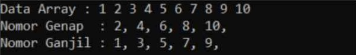
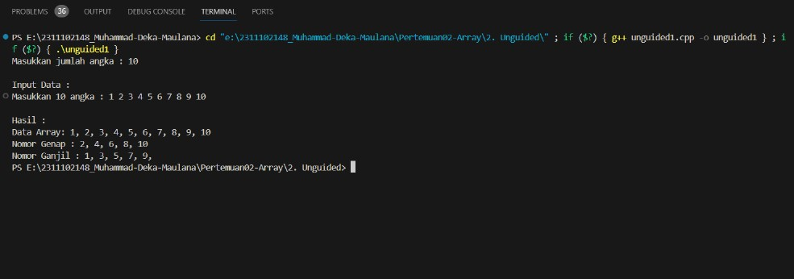
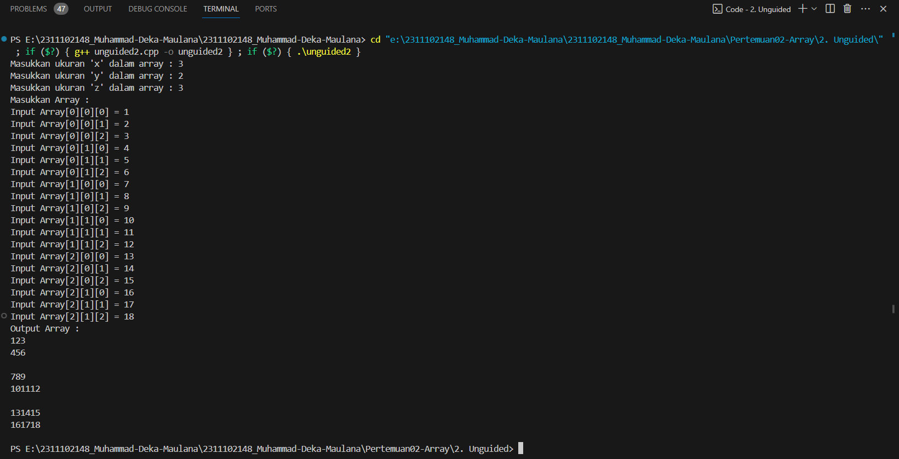
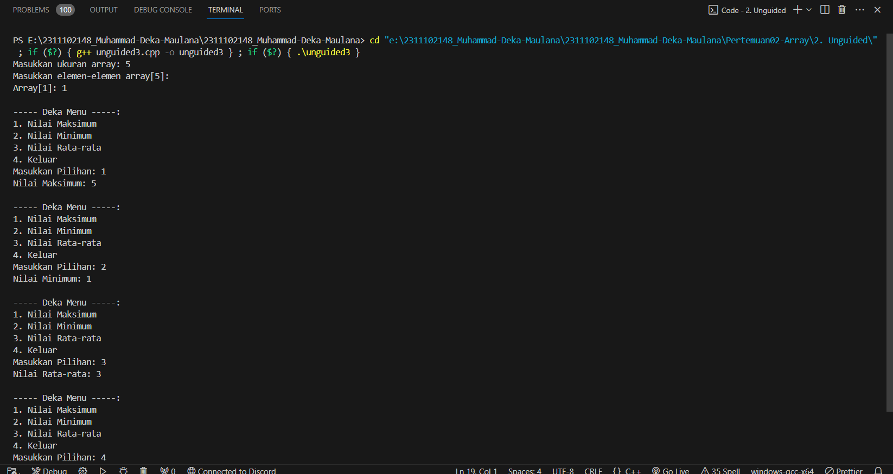

# <h1 align="center">Laporan Praktikum Modul 2 - Array</h1>
<p align="center">Muhammad Deka Maulana - 2311102148</p>

## Dasar Teori
Array merupakan kumpulan data dengan tipe data yang sama. Dalam bahasa C atau C++ Array dapat berdimensi 1, 2 atau berdimensi banyak.Penggunaan Array bertujuan untuk efektivitas dan efisiensi dalam penggunaan variabel dan memori sesuai dengan banyak data yang diperlukan. untuk inisialisasi data dalam array dapat kita lakukan secara literal ataupun dinamis sesuai dengan input yang diinginkan user. Dengan array, kita dapat menentukan banyaknya indeks yang diperlukan. Perlu diingat, dalam bahasa C ataupun C++ indeks sebuah array selalu di mulai dari indeks ke-0.  Berikut jenis-jenis tipe data array yang umum diketahui ada 3, yaitu :
1. Array Satu Dimensi<br/>
Array satu dimensi adalah sebuah daftar yang memuat beberapa variabel berelasi. Array satu dimensi biasa digunakan dalam mengurutkan bilangan. Contoh :
    - Array integer dengan jumlah elemen 5 : int arr1[5];
    - Array float dengan jumlah elemen 3 : float arr2[3];
    - Array character dengan jumlah elemen 7 : char arr3[7];
2. Array Dua Dimensi<br/>
Array dua dimensi adalah sebuah array dimana tersusun atas 2 indeks yang menandakan baris dan kolom. Seringkali array berdimensi dua disebut sebagai matriks karena mengandung baris dan kolom. Jenis data dua dimensi ini biasanya dapat menampilkan data yang terdiri dari dua jenis elemen yang berbeda. Berikut adalah contohnya :
    - Array integer dengan jumlah dan baris 2 dan jumlah kolom 3 : int arr2d[2][3];
    - Array float dengan jumlah baris 3 dan jumlah kolom 2 : float arr2f[3][2];
    - Array character dengan jumlah baris 4 dan jumlah kolom 1 : char arr2c[4][1];
3. Array Multi Dimensi<br/>
Array Multi Dimensi, array yang mempunyai lebih dari sebuah nomor indeks pada setiap elemen array. Contoh :
    - Array integer dengan jumlah dimensi 3, jumlah elemen pertama 2, jumlah elemen kedua 3, dan jumlah elemen ketiga 4 : int arr3d[2][3][4];
    - Array float dengan jumlah dimensi 4, jumlah elemen pertama 1, jumlah elemen kedua 2, jumlah elemen ketiga 3, dan jumlah elemen keempat 5 : float arr3f[1][2][3][5];
    - Array character dengan jumlah dimensi 3, jumlah elemen pertama 4, jumlah elemen kedua 2, dan jumlah elemen ketiga 1 : char arr3c[4][2][1];

## Guided 

### 1. Program Input Array Tiga Dimensi

```C++
#include <iostream>
using namespace std;

// PROGRAM INPUT ARRAY 3 DIMENSI
int main()
{

    // Deklarasi array
    int arr[2][3][3];

    // Input elemen
    for (int x = 0; x < 2; x++)
    {
        for (int y = 0; y < 3; y++)
        {
            for (int z = 0; z < 3; z++)
            {
                cout << "Input Array[" << x << "][" << y << "][" << z << "] = ";
                cin >> arr[x][y][z];
            }
        }
        cout << endl;
    }

    // Output Array
    for (int x = 0; x < 2; x++)
    {
        for (int y = 0; y < 3; y++)
        {
            for (int z = 0; z < 3; z++)
            {
                cout << "Data Array[" << x << "][" << y << "][" << z << "] = " << arr[x][y][z] << endl;
            }
        }
    }
    cout << endl;

    // Tampilan array
    for (int x = 0; x < 2; x++)
    {
        for (int y = 0; y < 3; y++)
        {
            for (int z = 0; z < 3; z++)
            {
                cout << arr[x][y][z] << ends;
            }
            cout << endl;
        }
        cout << endl;
    }
}
```

### 2. Program Mencari Nilai Maksimal pada Array

```C++
#include <iostream>
using namespace std;

// Program Mencari Nilai Maksimum pada Array

int main()
{
    int maks, a, i = 1, lokasi;
    cout << "Masukkan panjang array: ";
    cin >> a;
    int array[a];
    cout << "Masukkan " << a << " angka\n";
    for (i = 0; i < a; i++)
    {
        cout << "Array ke-" << (i) << ": ";
        cin >> array[i];
    }
    maks = array[0];
    for (i = 0; i < a; i++)
    {
        if (array[i] > maks)
        {
            maks = array[i];
            lokasi = i;
        }
    }
    cout << "Nilai maksimum adalah " << maks << " berada di Array ke " << lokasi << endl;
}
```

## Unguided 

### 1. Buatlah program untuk menampilkan output seperti berikut dengan data yang diinputkan oleh user!

```C++
#include <iostream>
using namespace std;

int main() {
    int jmlangka_148;

    cout << "Masukkan jumlah angka : ";    // meminta pengguna untuk memasukkan jumlah angka
    cin >> jmlangka_148;
    cout << endl;

    int angka[jmlangka_148];    // array untuk menyimpan data

    cout << "Input Data :" << endl;    // meminta pengguna untuk memasukkan data array
    cout << "Masukkan " << jmlangka_148 << " angka : ";
    for (int i = 0; i < jmlangka_148; i++) {
        cin >> angka[i];
    }

    cout << "\nHasil :" << endl;    // menampilkan data array
    cout << "Data Array: ";
    for (int i = 0; i < jmlangka_148; i++) {
        cout << angka[i];
        if (i < jmlangka_148 - 1) {
            cout << ", ";
        }
    }
    cout << endl;

    cout << "Nomor Genap : ";    // menampilkan nomor genap
    for (int i = 0; i < jmlangka_148; i++) {
        if (angka[i] % 2 == 0) {
            cout << angka[i];
            if (i < jmlangka_148 - 1) {
                cout << ", ";
            }
        }
    }
    cout << endl;

    cout << "Nomor Ganjil : ";    // menampilkan nomor ganjil
    for (int i = 0; i < jmlangka_148; i++) {
        if (angka[i] % 2 != 0) {
            cout << angka[i];
            if (i < jmlangka_148 - 1) {
                cout << ", ";
            }
        }
    }
    cout << endl;

    return 0;
}
```
#### Output:

Program C++ diatas merupakan sebuah program sederhana yang meminta pengguna untuk memasukkan sejumlah angka, menyimpannya dalam sebuah array, dan kemudian menampilkan seluruh angka tersebut bersama dengan pemisahan antara angka genap dan ganjil. Setelah meminta pengguna untuk memasukkan jumlah angka, program menginisialisasi sebuah array sesuai dengan jumlah angka yang dimasukkan. Setelah itu, program meminta pengguna untuk memasukkan angka-angka tersebut satu per satu. Setelah seluruh angka dimasukkan, program menampilkan kembali seluruh angka dalam array, serta memisahkan antara angka-angka genap dan ganjil menggunakan operasi modulus. Hal ini dilakukan dengan cara mengiterasi melalui array dan memeriksa apakah angka tersebut habis dibagi dua atau tidak.

### 2. Buatlah program input array tiga dimensi (seperti pada guided) tetapi jumlah atau ukuran elemennya diinputkan oleh user!

```C++
#include <iostream>
using namespace std;

int main(){

    int x, y, z;    // deklarasi variabel untuk ukuran array

    cout << "Masukkan ukuran 'x' dalam array : ";    // meminta input ukuran array dari pengguna
    cin >> x;
    cout << "Masukkan ukuran 'y' dalam array : "; 
    cin >> y;
    cout << "Masukkan ukuran 'z' dalam array : "; 
    cin >> z;

    int arr[x][y][z];   // deklarasi array tiga dimensi dengan ukuran yang telah diinputkan

    cout << "Masukkan Array :" << endl;   // meminta pengguna untuk mengisi array
    for (int i = 0; i < x; i++) 
    {
        for (int j = 0; j < y; j++) 
        {
            for (int k = 0; k < z; k++) 
            {
                cout << "Input Array[" << i << "][" << j << "][" << k << "] = ";
                cin >> arr[i][j][k];
            }
        }
    }

    cout << "Output Array :" << endl;    // menampilkan isi array
    for (int i = 0; i < x; i++) 
    {
        for (int j = 0; j < y; j++) 
        {
            for (int k = 0; k < z; k++) 
            {
                cout << arr[i][j][k];
            }
            cout << endl;
        }
        cout << endl;
    }

    return 0;
}
```
#### Output:

Program C++ di atas merupakan implementasi dari array tiga dimensi yang meminta pengguna untuk memasukkan ukuran array serta nilai-nilai di dalamnya. Setelah pengguna memasukkan ukuran array, program mengisi array dengan nilai-nilai yang dimasukkan oleh pengguna dan kemudian menampilkan isi array tersebut. Program ini memungkinkan pengguna untuk dengan mudah membuat, mengisi, dan melihat nilai-nilai dalam array tiga dimensi.

### 3. Buatlah program menu untuk mencari nilai maksimum, minimum dan nilai rata – rata dari suatu array dengan input yang dimasukkan oleh user!

```C++
#include <iostream>

using namespace std;

int main() {
    int n;
    cout << "Masukkan ukuran array: ";
    cin >> n;

    // membuat array dengan ukuran n
    int arr[n];

    // input elemen-elemen array
    cout << "Masukkan elemen-elemen array[" << n << "]:\n";
    for (int i = 0; i < n; ++i) {
        cout << "Array[" << i+1 << "]: ";
        cin >> arr[i];
    }

    char choice_148;
    do {
        // menampilkan menu
        cout << "\n----- Deka Menu -----:\n";
        cout << "1. Nilai Maksimum\n";
        cout << "2. Nilai Minimum\n";
        cout << "3. Nilai Rata-rata\n";
        cout << "4. Keluar\n";
        cout << "Masukkan Pilihan: ";
        cin >> choice_148;

        switch (choice_148) {

            case '1': {
                // mencari nilai maksimum
                int max_148 = arr[0];
                for (int i = 1; i < n; ++i) {
                    if (arr[i] > max_148) {
                        max_148 = arr[i];
                    }
                }
                cout << "Nilai Maksimum: " << max_148 << endl;
                break;
            }

            case '2': {
                // mencari nilai minimum
                int min_148 = arr[0];
                for (int i = 1; i < n; ++i) {
                    if (arr[i] < min_148) {
                        min_148 = arr[i];
                    }
                }
                cout << "Nilai Minimum: " << min_148 << endl;
                break;
            }

            case '3': {
                // menghitung nilai rata-rata
                double sum = 0.0;
                for (int i = 0; i < n; ++i) {
                    sum += arr[i];
                }
                double average = sum / n;
                cout << "Nilai Rata-rata: " << average << endl;
                break;
            }

            case '4':
                cout << "Thanks! Program selesai.\n";
                break;
            default:
                cout << "Pilihan tidak valid. Silakan pilih lagi.\n";
        }
    } while (choice_148 != '4');

    return 0;
}
```
#### Output:

Program C++ di atas memungkinkan pengguna untuk memasukkan ukuran array dan elemennya, dan kemudian menampilkan menu yang memungkinkan pengguna memilih operasi apa yang ingin dilakukan pada array tersebut. Opsi menu termasuk:<br/>
    - Mencari nilai maksimum dari elemen-elemen array.<br/>
    - Mencari nilai minimum dari elemen-elemen array.<br/>
    - Menghitung nilai rata-rata dari elemen-elemen array.<br/>
    - Keluar dari program.<br/>
Untuk menangani pilihan pengguna dan melakukan operasi yang sesuai dengan pilihan tersebut, program menggunakan switch case. Program akan terus berjalan hingga pengguna memilih opsi "4" untuk keluar.

## Kesimpulan
Array adalah struktur data yang menyimpan data dalam satu tempat dan memungkinkan akses menggunakan indeks. Umumnya, array dibagi menjadi tiga jenis utama:
    - Array Satu Dimensi : Menyimpan data dalam satu baris dengan format Data[].<br/>
    - Array Dua Dimensi : Mengatur data dalam tabel dua dimensi dengan format Data[][].<br/>
    - Array Multidimensi : Memiliki lebih dari dua dimensi, seperti format Data[][][].<br/>

## Referensi
[1] raisahrahma hutasuhut, Array 1 dimensi dan 2 dimensi. academia.edu<br/>
[2] Arrosyidi, A. (2017). In I. B. Surabaya, Buku Ajar Bahasa Pemrograman Java (p. 30). Surabaya: PT Revka Petra Media.<br/>