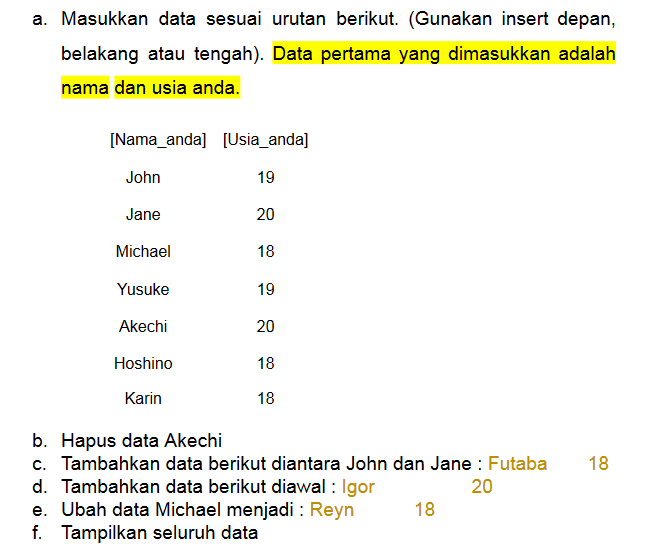
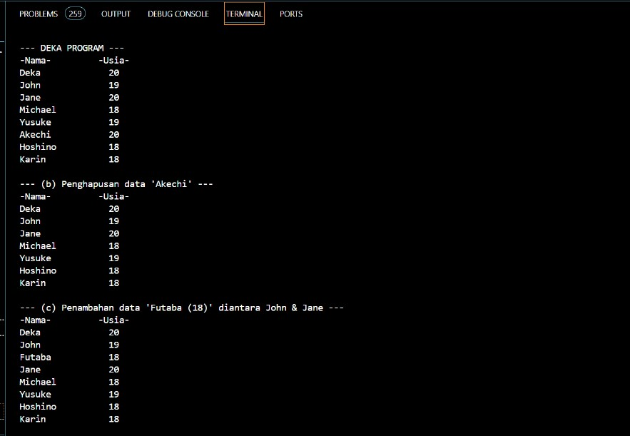
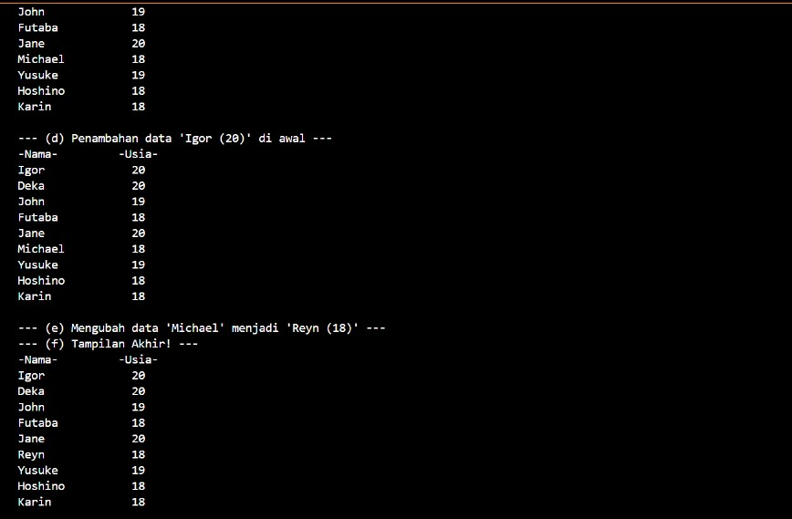
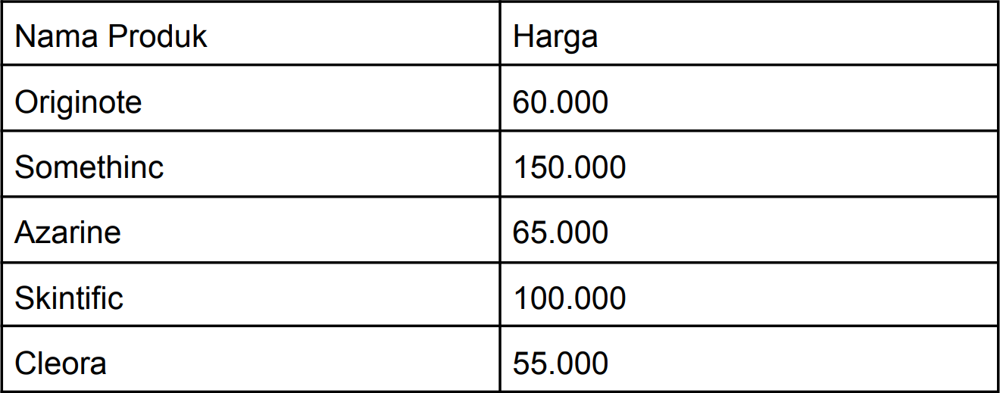
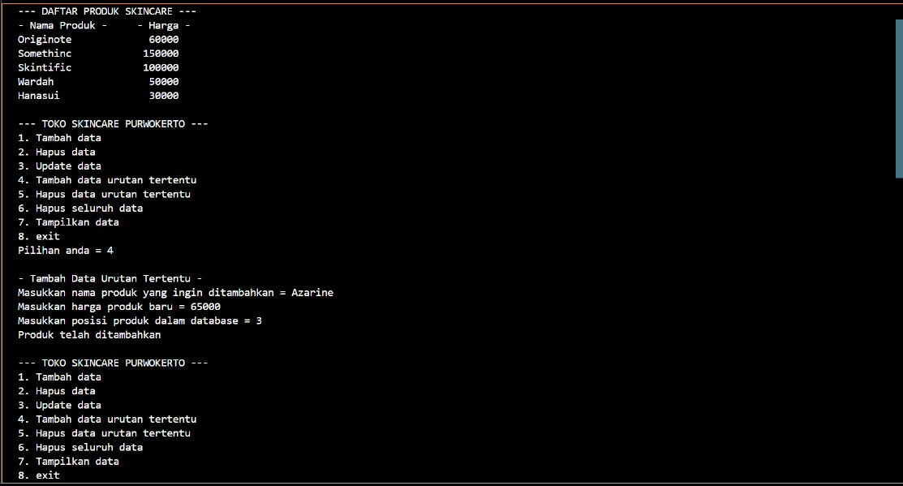
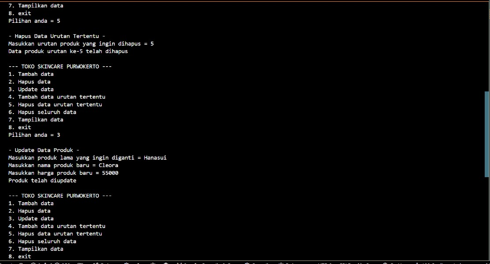
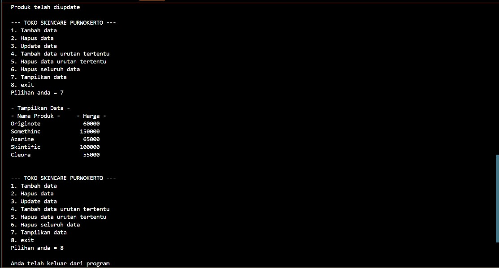

# <h1 align="center">Laporan Praktikum Modul 3 - Linked List</h1>
<p align="center">Muhammad Deka Maulana - 2311102148</p>

## Dasar Teori
<br>Linked list adalah strukur data linier berbentuk rantai simpul di mana setiap simpul menyimpan 2 item, yaitu nilai data dan pointer ke simpul elemen berikutnya. Berbeda dengan array, elemen linked list tidak ditempatkan dalam alamat memori yang berdekatan melainkan elemen ditautkan menggunakan pointer.<br/>


<br>Simpul pertama dari linked list disebut sebagai head atau simpul kepala. Apabila linked list berisi elemen kosong, maka nilai pointer dari head menunjuk ke NULL. Begitu juga untuk pointer berikutnya dari simpul terakhir atau simpul ekor akan menunjuk ke NULL.<br/>

<br>Ukuran elemen dari linked list dapat bertambah secara dinamis dan mudah untuk menyisipkan dan menghapus elemen karena tidak seperti array, kita hanya perlu mengubah pointer elemen sebelumnya dan elemen berikutnya untuk menyisipkan atau menghapus elemen.<br/>

<br>Linked list biasanya digunakan untuk membuat file system, adjacency list, dan hash table.<br/>

### 1. Single Linked List
<br>Single linked list adalah linked list unidirectional. Jadi, kita hanya dapat melintasinya dalam satu arah, yaitu dari simpul kepala ke simpul ekor.<br/>


### 2. Double Linked List
<br>Double linked list adalah linked list bidirectional. Jadi, kita bisa melintasinya secara dua arah. Tidak seperti single linked list, simpul double linked list berisi satu pointer tambahan yang disebut previous pointer. Pointer ini menunjuk ke simpul sebelumnya.<br/>


### Fungsi dan Kegunaan Linked List
- Linked list dapat digunakan untuk mengimplementasikan struktur data lain seperti stack, queue, graf dll.
- Digunakan untuk melakukan operasi aritmatika pada bilangan long integer
- Dipakai untuk representasi matriks rongga.
- Digunakan dalam alokasi file yang ditautkan.
- Membantu dalam manajemen memori.

### Kelebihan Linked List
- Struktur data dinamis : Linked list adalah himpunan dinamis sehingga dapat bertambah dan menyusut saat runtime dengan mengalokasikan dan membatalkan alokasi memori. Jadi kita tidak perlu memberikan ukuran awal dari linked list.
- Tidak boros memori : Dalam linked list, pemanfaatan memori yang efisien dapat dicapai karena ukuran linked list bertambah atau berkurang pada runtime sehingga tidak ada pemborosan memori dan tidak perlu mengalokasikan memori sebelumnya.
- Implementasi : Struktur data linier seperti stack dan queue seringkali mudah diimplementasikan menggunakan linked list.
- Operasi penyisipan dan penghapusan : Operasi penyisipan dan penghapusan cukup mudah dalam linked list. Kita tidak perlu menggeser elemen setelah operasi penyisipan atau penghapusan elemen, hanya alamat yang ada di pointer berikutnya saja yang perlu diperbarui.

### Kekurangan Linked List
- Penggunaan memori : Linked list memerlukan lebih banyak memori dibandingkan dengan array. Karena dalam linked list, pointer juga perlu menyimpan alamat elemen berikutnya dan membutuhkan memori tambahan untuk dirinya sendiri.
- Traversal : Dalam traversal, linked list lebih banyak memakan waktu dibandingkan dengan array. Akses langsung ke elemen tidak bisa dilakukan pada linked list seperti array yang dapat akses elemen berdasarkan indeks. Untuk mengakses sebuah simpul pada posisi n dari linked list, kita harus melintasi semua simpul sebelumnya.
- Reverse Traversing : Dalam single linked list, reverse traversing tidak dimungkinkan, tetapi dalam kasus double-linked list, ini dapat dimungkinkan karena berisi pointer ke node yang terhubung sebelumnya dengan setiap node. Untuk melakukannya, diperlukan memori tambahan untuk pointer sebelumnya sehingga ada pemborosan memori.
- Akses Acak : Akses acak tidak bisa dilakukan dalam linked list karena alokasi memorinya yang dinamis

## Guided 

### 1. Latihan Single Linked List

```C++
// Latihan Single Linked List

#include <iostream>
using namespace std;

///PROGRAM SINGLE LINKED LIST NON-CIRCULAR
//Deklarasi Struct Node
struct Node {
    int data;
    Node* next;
};

Node* head;
Node* tail;

//Inisialisasi Node
void init() {
    head = NULL;
    tail = NULL;
}

// Pengecekan
bool isEmpty() {
    if (head == NULL)
        return true;
    else
        return false;
}

//Tambah Depan
void insertDepan(int nilai) {
    //Buat Node baru
    Node* baru = new Node;
    baru->data = nilai;
    baru->next = NULL;

    if (isEmpty() == true) {
        head = tail = baru;
        tail->next = NULL;
    }
    else {
        baru->next = head;
        head = baru;
    }
}

//Tambah Belakang
void insertBelakang(int nilai) {
    //Buat Node baru
    Node* baru = new Node;
    baru->data = nilai;
    baru->next = NULL;

    if (isEmpty() == true) {
        head = tail = baru;
        tail->next = NULL;
    }
    else {
        tail->next = baru;
        tail = baru;
    }
}

//Hitung Jumlah List
int hitungList() {
    Node* hitung;
    hitung = head;
    int jumlah = 0;

    while (hitung != NULL) {
        jumlah++;
        hitung = hitung->next;
    }

    return jumlah;
}

//Tambah Tengah
void insertTengah(int data, int posisi) {
    if (posisi < 1 || posisi > hitungList()) {
        cout << "Posisi diluar jangkauan" << endl;
    }
    else if (posisi == 1) {
        cout << "Posisi bukan posisi tengah" << endl;
    }
    else {
        Node* baru, * bantu;
        baru = new Node();
        baru->data = data;

        // tranversing
        bantu = head;
        int nomor = 1;

        while (nomor < posisi - 1) {
            bantu = bantu->next;
            nomor++;
        }

        baru->next = bantu->next;
        bantu->next = baru;
    }
}

//Hapus Depan
void hapusDepan() {
    Node* hapus;

    if (isEmpty() == false) {
        if (head->next != NULL) {
            hapus = head;
            head = head->next;
            delete hapus;
        }
        else {
            head = tail = NULL;
        }
    }
    else {
        cout << "List kosong!" << endl;
    }
}

//Hapus Belakang
void hapusBelakang() {
    Node* hapus;
    Node* bantu;

    if (isEmpty() == false) {
        if (head != tail) {
            hapus = tail;
            bantu = head;

            while (bantu->next != tail) {
                bantu = bantu->next;
            }

            tail = bantu;
            tail->next = NULL;
            delete hapus;
        }
        else {
            head = tail = NULL;
        }
    }
    else {
        cout << "List kosong!" << endl;
    }
}

//Hapus Tengah
void hapusTengah(int posisi) {
    Node* hapus, * bantu, * bantu2;

    if (posisi < 1 || posisi > hitungList()) {
        cout << "Posisi di luar jangkauan" << endl;
    }
    else if (posisi == 1) {
        cout << "Posisi bukan posisi tengah" << endl;
    }
    else {
        int nomor = 1;
        bantu = head;

        while (nomor <= posisi) {
            if (nomor == posisi - 1) {
                bantu2 = bantu;
            }

            if (nomor == posisi) {
                hapus = bantu;
            }

            bantu = bantu->next;
            nomor++;
        }

        bantu2->next = bantu;
        delete hapus;
    }
}

//Ubah Depan
void ubahDepan(int data) {
    if (isEmpty() == false) {
        head->data = data;
    }
    else {
        cout << "List masih kosong!" << endl;
    }
}

//Ubah Tengah
void ubahTengah(int data, int posisi) {
    Node* bantu;

    if (isEmpty() == false) {
        if (posisi < 1 || posisi > hitungList()) {
            cout << "Posisi di luar jangkauan" << endl;
        }
        else if (posisi == 1) {
            cout << "Posisi bukan posisi tengah" << endl;
        }
        else {
            bantu = head;
            int nomor = 1;

            while (nomor < posisi) {
                bantu = bantu->next;
                nomor++;
            }

            bantu->data = data;
        }
    }
    else {
        cout << "List masih kosong!" << endl;
    }
}

//Ubah Belakang
void ubahBelakang(int data) {
    if (isEmpty() == false) {
        tail->data = data;
    }
    else {
        cout << "List masih kosong!" << endl;
    }
}

//Hapus List
void clearList() {
    Node* bantu, * hapus;
    bantu = head;

    while (bantu != NULL) {
        hapus = bantu;
        bantu = bantu->next;
        delete hapus;
    }

    head = tail = NULL;
    cout << "List berhasil terhapus!" << endl;
}

//Tampilkan List
void tampil() {
    Node* bantu;
    bantu = head;

    if (isEmpty() == false) {
        while (bantu != NULL) {
            cout << bantu->data << ends;
            bantu = bantu->next;
        }

        cout << endl;
    }
    else {
        cout << "List masih kosong!" << endl;
    }
}

int main() {
    init();
    insertDepan(3);
    tampil();
    insertBelakang(5);
    tampil();
    insertDepan(2);
    tampil();
    insertDepan(1);
    tampil();
    hapusDepan();
    tampil();
    hapusBelakang();
    tampil();
    insertTengah(7, 2);
    tampil();
    hapusTengah(2);
    tampil();
    ubahDepan(1);
    tampil();
    ubahBelakang(8);
    tampil();
    ubahTengah(11, 2);
    tampil();

    return 0;
}
```
Program ini memiliki beberapa fungsi untuk mengedit daftar tunggal terhubung. Fungsi ini termasuk menambah node (depan, tangah, belakang), menghapus node (depan, tengah, belakang, semua), mengubah node (depan, tengah, belakang), menghitung jumlah node atau daftar, dan menampilkan list. Selain itu, ada prosedur init untuk menginisialisasi head dan tail bernilai NULL, dan fungsi isEmpty untuk mengetahui apakah daftar terhubung kosong. Data dapat ditambahkan, diubah, dihapus, dan ditampilkan pada bagian int main().

### 2. Latihan Double Linked List

```C++
// Latihan Double Linked List
#include <iostream>
using namespace std;

class Node {
public:
    int data;
    Node* prev;
    Node* next;
};

class DoublyLinkedList {
public:
    Node* head;
    Node* tail;

    DoublyLinkedList() {
        head = nullptr;
        tail = nullptr;
    }

    void push(int data) {
        Node* newNode = new Node;
        newNode->data = data;
        newNode->prev = nullptr;
        newNode->next = head;

        if (head != nullptr) {
            head->prev = newNode;
        }
        else {
            tail = newNode;
        }

        head = newNode;
    }

    void pop() {
        if (head == nullptr) {
            return;
        }

        Node* temp = head;
        head = head->next;

        if (head != nullptr) {
            head->prev = nullptr;
        }
        else {
            tail = nullptr;
        }

        delete temp;
    }

    bool update(int oldData, int newData) {
        Node* current = head;

        while (current != nullptr) {
            if (current->data == oldData) {
                current->data = newData;
                return true;
            }
            current = current->next;
        }

        return false;
    }

    void deleteAll() {
        Node* current = head;

        while (current != nullptr) {
            Node* temp = current;
            current = current->next;
            delete temp;
        }

        head = nullptr;
        tail = nullptr;
    }

    void display() {
        Node* current = head;

        while (current != nullptr) {
            cout << current->data << " ";
            current = current->next;
        }

        cout << endl;
    }
};

int main() {
    DoublyLinkedList list;

    while (true) {
        cout << "1. Add data" << endl;
        cout << "2. Delete data" << endl;
        cout << "3. Update data" << endl;
        cout << "4. Clear data" << endl;
        cout << "5. Display data" << endl;
        cout << "6. Exit" << endl;

        int choice;
        cout << "Enter your choice: ";
        cin >> choice;

        switch (choice) {
            case 1: {
                int data;
                cout << "Enter data to add: ";
                cin >> data;
                list.push(data);
                break;
            }
            case 2: {
                list.pop();
                break;
            }
            case 3: {
                int oldData, newData;
                cout << "Enter old data: ";
                cin >> oldData;
                cout << "Enter new data: ";
                cin >> newData;

                bool updated = list.update(oldData, newData);

                if (!updated) {
                    cout << "Data not found" << endl;
                }
                break;
            }
            case 4: {
                list.deleteAll();
                break;
            }
            case 5: {
                list.display();
                break;
            }
            case 6: {
                return 0;
            }
            default: {
                cout << "Invalid choice" << endl;
                break;
            }
        }
    }

    return 0;
}
```
Kode di atas adalah program yang dapat memanipulasi daftar bersambung dua. Ini dapat menambahkan node, menghapus node, mengupdate atau mengubah data node, menghapus semua node, dan menampilkan daftar.

## Unguided 

### 1. Buatlah program menu Single Linked List Non-Circular untuk menyimpan Nama dan Usia mahasiswa, dengan menggunakan inputan dari user. Lakukan operasi berikut:


```C++
#include <iostream>
#include <iomanip>
using namespace std;

// Deklarasi Struct Node
struct Node {
    string nama_148;
    int umur_148;
    Node* next;
};

Node* head;
Node* tail;

// Inisialisasi Node
void inisialisasi_148() {
    head = NULL;
    tail = NULL;
}

// Pengecekan
bool kosong_148() {
    if (head == NULL)
        return true;
    else
        return false;
}

// Tambah Depan
void insertDepan_148(string nama, int umur) {
    // bikin node baru
    Node* baru = new Node;
    baru->nama_148 = nama;
    baru->umur_148 = umur;
    baru->next = NULL;

    if (kosong_148() == true) {
        head = tail = baru;
        tail->next = NULL;
    }
    else {
        baru->next = head;
        head = baru;
    }
}

// Tambah Belakang
void insertBelakang_148(string nama, int umur) {
    // buat node baru
    Node* baru = new Node;
    baru->nama_148 = nama;
    baru->umur_148 = umur;
    baru->next = NULL;

    if (kosong_148() == true) {
        head = tail = baru;
        tail->next = NULL;
    }
    else {
        tail->next = baru;
        tail = baru;
    }
}

//vHitung Jumlah List
int hitungList_148() {
    Node* hitung;
    hitung = head;
    int jumlah = 0;

    while (hitung != NULL) {
        jumlah++;
        hitung = hitung->next;
    }

    return jumlah;
}

// Tambah Tengah
void insertTengah_148(string nama, int umur, int posisi) {
    if (posisi < 1 || posisi > hitungList_148()) {
        cout << "Posisi diluar jangkauan!" << endl;
    }
    else if (posisi == 1) {
        cout << "Posisi yg anda masukan bukan yg tengah!" << endl;
    }
    else {
        Node* baru, * bantu;
        baru = new Node();
        baru->nama_148 = nama;
        baru->umur_148 = umur;

        // lintasan
        bantu = head;
        int nomor = 1;

        while (nomor < posisi - 1) {
            bantu = bantu->next;
            nomor++;
        }

        baru->next = bantu->next;
        bantu->next = baru;
    }
}

// Hapus Depan
void hapusDepan_148() {
    Node* hapus;

    if (kosong_148() == false) {
        if (head->next != NULL) {
            hapus = head;
            head = head->next;
            delete hapus;
        }
        else {
            head = tail = NULL;
        }
    }
    else {
        cout << "KOSONG!" << endl;
    }
}

// Hapus Belakang
void hapusBelakang_148() {
    Node* hapus;
    Node* bantu;

    if (kosong_148() == false) {
        if (head != tail) {
            hapus = tail;
            bantu = head;

            while (bantu->next != tail) {
                bantu = bantu->next;
            }

            tail = bantu;
            tail->next = NULL;
            delete hapus;
        }
        else {
            head = tail = NULL;
        }
    }
    else {
        cout << "KOSONG!" << endl;
    }
}

// Hapus Tengah
void hapusTengah_148(int posisi) {
    Node* hapus, * bantu, * bantu2;

    if (posisi < 1 || posisi > hitungList_148()) {
        cout << "Posisi diluar jangkauan!" << endl;
    }
    else if (posisi == 1) {
        cout << "Posisi yg anda masukan bukan yg tengah!" << endl;
    }
    else {
        int nomor = 1;
        bantu = head;

        while (nomor <= posisi) {
            if (nomor == posisi - 1) {
                bantu2 = bantu;
            }

            if (nomor == posisi) {
                hapus = bantu;
            }

            bantu = bantu->next;
            nomor++;
        }

        bantu2->next = bantu;
        delete hapus;
    }
}

// Ubah Depan
void gantiDepan_148(string nama, int umur) {
    if (kosong_148() == false) {
        head->nama_148 = nama;
        head->umur_148 = umur;
    }
    else {
        cout << "TIDAK ADA PERUBAHAN!" << endl;
    }
}

// Ubah Tengah
void gantiTengah_148(string nama, int umur, int posisi) {
    Node* bantu;

    if (kosong_148() == false) {
        if (posisi < 1 || posisi > hitungList_148()) {
            cout << "Posisi diluar jangkauan!" << endl;
        }
        else if (posisi == 1) {
            cout << "Posisi yg anda masukan bukan yg tengah!" << endl;
        }
        else {
            bantu = head;
            int nomor = 1;

            while (nomor < posisi) {
                bantu = bantu->next;
                nomor++;
            }

            bantu->nama_148 = nama;
            bantu->umur_148 = umur;
        }
    }
    else {
        cout << "KOSONG!" << endl;
    }
}

// Ubah Belakang
void ubahBelakang_148(string nama, int umur) {
    if (kosong_148() == false) {
        tail->nama_148 = nama;
        tail->umur_148 = umur;
    }
    else {
        cout << "KOSONG!" << endl;
    }
}

// Hapus List
void hapusList_148() {
    Node* bantu, * hapus;
    bantu = head;

    while (bantu != NULL) {
        hapus = bantu;
        bantu = bantu->next;
        delete hapus;
    }

    head = tail = NULL;
    cout << "Anda telah berhasil menghapusnya!" << endl;
}

// Tampilkan List
void reveal_148() {
    Node* bantu;
    bantu = head;

    cout << left << setw(15) << "-Nama-" << right << setw(4) << "-Usia-" << endl; // biar rapi

    if (kosong_148() == false) {
        while (bantu != NULL) {
            cout << left << setw(15) << bantu->nama_148 << right << setw(4) << bantu->umur_148 << endl; // biar lurus
            bantu = bantu->next;
        }

        cout << endl;
    }
    else {
        cout << "KOSONG!" << endl;
    }
}

int main() {
    inisialisasi_148(); // Inisialisasi Linked List
    cout << "\n--- DEKA PROGRAM ---" << endl; // Menampilkan nama dan umur awal & menjawab poin a
    insertDepan_148("Karin", 18);
    insertDepan_148("Hoshino", 18);
    insertDepan_148("Akechi", 20); 
    insertDepan_148("Yusuke", 19);
    insertDepan_148("Michael", 18);
    insertDepan_148("Jane", 20);
    insertDepan_148("John", 19);
    insertDepan_148("Deka", 20);
    reveal_148();

    // Menjawab poin b
    cout << "--- (b) Penghapusan data 'Akechi' ---" << endl;
    hapusTengah_148(6);
    reveal_148();

    // Menjawab poin c
    cout << "--- (c) Penambahan data 'Futaba (18)' diantara John & Jane ---" << endl;
    insertTengah_148("Futaba", 18, 3);
    reveal_148();

    // Menjawab poin d
    cout << "--- (d) Penambahan data 'Igor (20)' di awal ---" << endl;
    insertDepan_148("Igor", 20);
    reveal_148();

    // Menjawab poin e & f
    cout << "--- (e) Mengubah data 'Michael' menjadi 'Reyn (18)' ---" << endl;
    cout << "--- (f) Tampilan Akhir! ---" << endl;
    gantiTengah_148("Reyn", 18, 6);
    reveal_148();

    return 0;
}
```
#### Output:


<br>Program tersebut merupakan implementasi sederhana dari sebuah linked list dalam bahasa pemrograman C++. Melalui penggunaan struktur data node, program dapat menambah, menghapus, dan mengubah data pada linked list. Setiap operasi dilakukan melalui fungsi-fungsi yang telah ditentukan, seperti menambahkan simpul di depan, belakang, atau di tengah, serta menghapus simpul dari berbagai posisi. Program juga memiliki fungsi untuk menampilkan isi linked list serta memeriksa apakah linked list tersebut kosong. Dengan demikian, program tersebut dapat digunakan untuk memanipulasi dan mengelola data dalam bentuk linked list sesuai kebutuhan.<br/>

### 2. Modifikasi Guided Double Linked List dilakukan dengan penambahan operasi untuk menambah data, menghapus, dan update di tengah / di urutan tertentu yang diminta. Selain itu, buatlah agar tampilannya menampilkan Nama Produk dan Harga.
  

```C++
#include<iostream>
#include<iomanip>

using namespace std;

struct node{
    string barang_148;
    int harga_148;
    node *prev;
    node *next;
};
    node *head;
    node *tail;

// Prosedur inisiaslisasi 
void Inisialisasi_148(){
    head = nullptr;
    tail = nullptr;
}

// Prosedur tambah node
void TambahNode_148(string produk_148, int harga_148, int posisi_148){
    if(posisi_148 < 1 ){
        cout << "Node yang ingin ditambah diluar jangkauan" << endl;
    } else if(posisi_148 == 1){
        node *baru = new node;
        baru->barang_148 = produk_148;
        baru->harga_148 = harga_148;
        baru->next = head;
        baru->prev = nullptr;
        if(head != nullptr){
            head->prev = baru;
        } else {
            tail = baru;
        }
        head = baru;
    } else {
        node *current = head;
        node *baru = new node;
        baru->barang_148 = produk_148;
        baru->harga_148 = harga_148;
        baru->next = nullptr;
        baru->prev = nullptr;
        int hitung_148 = 1;
        while(hitung_148 < posisi_148 - 1){
            hitung_148++;
            current = current->next;
        }
        baru->next = current->next;
        baru->prev = current;
        if(current->next != nullptr){
            current->next->prev = baru;
        } else {
            tail = baru;
        }
        current->next = baru;
    }
}

// Prosedur hapus node
void HapusNode_148(int posisi_148){
    if(posisi_148 < 1){
        cout << "Posisi node yang ingin dihapus diluar jangkauan" << endl;
    } else if(posisi_148 == 1){
        node *current = head;  // Simpan node pertama
        head = head->next;     // Geser head ke node berikutnya
        if(head != nullptr) {
            head->prev = nullptr;  // Tetapkan nullptr ke prev dari node baru pertama
        }
        delete current;  // Hapus node pertama
    } else {
        node *current = head;
        int hitung_148 = 1;
        while(hitung_148 < posisi_148){
            hitung_148++;
            current = current->next;
        }
        current->prev->next = current->next;
        current->next->prev = current->prev;
        delete current;
    }
}

// Fungsi update data
bool UpdateData_148(string ProdukLama_148, string ProdukBaru_148, int HargaBaru_148){
    node *current = head;
    while (current != nullptr){
        if(current->barang_148 == ProdukLama_148){
            current->barang_148 = ProdukBaru_148;
            current->harga_148 = HargaBaru_148;
            return true;
        }
        current = current->next;
    }
    return false;
}

// Prosedur hapus semua data
void HapusSemua_148(){
    node *current = head;
    while(current != nullptr){
        node *temp = current;
        current = current->next;
        delete temp;
    }
    head = nullptr;
    tail = nullptr;
}

// Prosedur tampilkan data
void TampilData_148(){
    node *current = head;
    if(head != nullptr){
        cout << left << setw(20) << "- Nama Produk -" << right << setw(5) << "- Harga -" << endl; 
        while(current != nullptr){
            cout << left << setw(20) << current->barang_148 << right << setw(7) << current->harga_148 << endl; 
            current = current->next;
        }
    }
    cout << endl;
}

int main(){
    int pilih_148, HargaBaru_148, PosisiProduk_148;
    string ProdukBaru_148, ProdukLama_148;
    char yakin_148;
    Inisialisasi_148();
    cout << "--- DAFTAR PRODUK SKINCARE ---" << endl;
    TambahNode_148("Hanasui", 30000, 1 );
    TambahNode_148("Wardah", 50000, 1);
    TambahNode_148("Skintific", 100000, 1);
    TambahNode_148("Somethinc", 150000, 1);
    TambahNode_148("Originote", 60000, 1);
    TampilData_148();

    MenuUtama:
    cout << "--- TOKO SKINCARE PURWOKERTO ---" << endl;
    cout << "1. Tambah data" << endl;
    cout << "2. Hapus data" << endl;
    cout << "3. Update data" << endl;
    cout << "4. Tambah data urutan tertentu" << endl;
    cout << "5. Hapus data urutan tertentu" << endl;
    cout << "6. Hapus seluruh data" << endl;
    cout << "7. Tampilkan data" << endl;
    cout << "8. exit" << endl;
    cout << "Pilihan anda = "; cin >> pilih_148;
    cout << endl;

    switch(pilih_148){
        
        case 1 :
            cout << "- Tambah Data Produk -" << endl;
            cout << "Masukkan nama produk yang ingin ditambahkan = "; cin >> ProdukBaru_148;
            cout << "Masukkan harga produk = "; cin >> HargaBaru_148;
            TambahNode_148(ProdukBaru_148, HargaBaru_148, 1);
            cout << "Produk telah ditambahkan" << endl;
            cout << endl;
            goto MenuUtama;
            break;

        case 2 :
            cout << "- Hapus Data Produk Pertama - " << endl;
            HapusNode_148(1);
            cout << "Data produk ke-1 telah dihapus" << endl;
            cout << endl;
            goto MenuUtama;
            break;

        case 3 :
            cout << "- Update Data Produk -" << endl;
            cout << "Masukkan produk lama yang ingin diganti = ";cin >> ProdukLama_148;
            cout << "Masukkan nama produk baru = "; cin >> ProdukBaru_148;
            cout << "Masukkan harga produk baru = "; cin >> HargaBaru_148;
            UpdateData_148(ProdukLama_148, ProdukBaru_148, HargaBaru_148);
            cout << "Produk telah diupdate" << endl;
            cout << endl;
            goto MenuUtama;
            break;

        case 4 :
            cout << "- Tambah Data Urutan Tertentu -" << endl;
            cout << "Masukkan nama produk yang ingin ditambahkan = "; cin >> ProdukBaru_148;
            cout << "Masukkan harga produk baru = "; cin >> HargaBaru_148;
            cout << "Masukkan posisi produk dalam database = "; cin >> PosisiProduk_148;
            TambahNode_148(ProdukBaru_148, HargaBaru_148, PosisiProduk_148);
            cout << "Produk telah ditambahkan" << endl;
            cout << endl;
            goto MenuUtama;
            break;

        case 5 :
            cout << "- Hapus Data Urutan Tertentu -" << endl;
            cout << "Masukkan urutan produk yang ingin dihapus = "; cin >> PosisiProduk_148;
            HapusNode_148(PosisiProduk_148);
            cout << "Data produk urutan ke-" << PosisiProduk_148 << " telah dihapus" << endl;
            cout << endl;
            goto MenuUtama;
            break;

        case 6 :
            cout << "- Hapus Seluruh Data -" << endl;
            cout << "Apakah anda yakin ingin menghapus semua produk? [y/n] = "; cin >> yakin_148;
            if(yakin_148 == 'y' || yakin_148 == 'Y'){
                HapusSemua_148();
                cout << "Semua data produk telah dihapus" << endl;
            } else if(yakin_148 == 'n' || yakin_148 == 'N'){
                cout << "Aksi dibatalkan" << endl;
            }
            cout << endl;
            goto MenuUtama;
            break;

        case 7 :
            cout << "- Tampilkan Data -" << endl;
            TampilData_148();
            cout << endl;
            goto MenuUtama;
            break;

        case 8 :
            cout << "Anda telah keluar dari program" << endl;
            return 0;
        default :
            cout << "Pilihan yang anda masukkan tidak tersedia" << endl;
            cout << endl;
            goto MenuUtama;
            break;
    }    
}
```
#### Output:
 
 
 
<br>Program tersebut adalah sebuah aplikasi sederhana yang mengimplementasikan operasi dasar pada struktur data linked list untuk mengelola daftar produk skincare. Program ini memungkinkan pengguna untuk menambah, menghapus, memperbarui, dan menampilkan data produk. Setiap produk memiliki nama dan harga yang disimpan dalam node-node linked list. Pengguna dapat memilih berbagai operasi yang diinginkan melalui menu utama yang disediakan, seperti menambah, menghapus, memperbarui, atau menampilkan data produk secara keseluruhan, serta menghapus seluruh data produk jika diinginkan.<br/>

## Kesimpulan
<br>Linked list adalah struktur data yang terdiri dari sejumlah simpul atau node yang tersambung secara berurutan dengan menggunakan pointer. Terdapat dua jenis linked list, yaitu single linked list dan double linked list. Pada single linked list, setiap simpul memiliki dua bagian, yaitu nilai yang disimpan dan pointer yang menunjuk ke simpul berikutnya. Sementara pada double linked list, setiap simpul memiliki tiga bagian, yaitu nilai yang disimpan, pointer yang menunjuk ke simpul sebelumnya (prev), dan pointer yang menunjuk ke simpul berikutnya (next).<br/>

Kedua jenis linked list ini memiliki keunggulan dalam penyisipan dan penghapusan elemen yang lebih efisien dibandingkan dengan array. Namun, linked list membutuhkan lebih banyak memori karena setiap simpulnya menggunakan lebih dari satu blok memori dan memiliki akses data yang biasanya lebih lambat dibandingkan dengan array.

## Referensi
<br>[1] Trivusi, Struktur Data Linked List: Pengertian, Karakteristik, dan Jenis-jenisnya<br/>
[2] Harihayati Mardzuki, Tati. (2020). Double Linked List.
