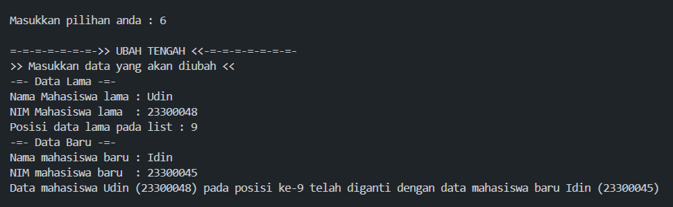
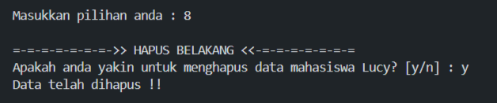

# <h1 align="center">Laporan Praktikum Modul 4 - Linked List Circular & Non-Circular</h1>
<p align="center">Muhammad Deka Maulana - 2311102148</p>

## Dasar Teori
<br>Linked list adalah struktur data yang mengandung sejumlah elemen data, di mana setiap elemen (node) terhubung satu sama lain melalui pointer. Terdapat dua jenis pointer yang umum digunakan dalam linked list, yaitu head dan tail. Head mengacu pada node pertama dalam linked list dan digunakan sebagai titik awal untuk mengakses semua data dalam struktur. Sementara itu, tail adalah node terakhir yang menunjukkan akhir dari urutan node. Ketika linked list kosong, baik head maupun tail menunjuk ke NULL.<br/>
<br>Dibandingkan dengan array, linked list memiliki fleksibilitas ukuran elemen yang dapat berubah secara dinamis dan memungkinkan untuk penyisipan dan penghapusan elemen dengan mudah. Berbeda dengan array, alokasi memori pada linked list tidak harus berurutan atau berdekatan.<br/>
<br>Linked list memiliki beberapa jenis, termasuk single linked list, double linked list, single circular linked list, dan double circular linked list. Setiap jenis memiliki karakteristik dan kegunaan yang berbeda dalam mengelola dan mengakses data.<br/>

### A. Linked List Circular
<br>Linked list circular adalah variasi dari linked list di mana elemen terakhir ditautkan kembali ke elemen pertama, membentuk lingkaran atau siklus. Dalam linked list circular, terdapat siklus di mana node terakhir menunjuk kembali ke node pertama, sehingga iterasi melalui linked list akan terus berulang mengelilingi siklus. Tidak ada elemen yang menunjuk ke NULL dalam linked list circular karena keseluruhan strukturnya membentuk siklus tertutup. Seperti halnya dengan linked list non-circular, operasi yang dapat dilakukan untuk memanipulasi linked list circular mencakup deklarasi node, inisialisasi node head dan tail, pengecekan isi node, penambahan node (di depan, di belakang, di tengah), pengubahan isi node (di depan, di belakang, di tengah), penghapusan node (di depan, di belakang, di tengah), penghapusan seluruh list, dan menampilkan list.<br/>

- Single Linked List Circular

<br>Dalam single linked list circular, setiap node terdiri dari data yang disimpan serta pointer next yang menunjuk ke node berikutnya dalam urutan. Proses ini berlanjut hingga mencapai node terakhir, yang juga disebut tail. Pointer next dari tail mengarah ke node pertama, yang juga disebut head.<br/>

- Double Linked List Circular

<br>Dalam double linked list circular, setiap node terdiri dari data yang disimpan, pointer next yang menunjuk ke node berikutnya, dan pointer prev yang menunjuk ke node sebelumnya. Pointer prev dari node pertama (head) menunjuk ke node terakhir (tail), dan pointer next dari node terakhir (tail) menunjuk ke node pertama (head).<br/>

### B. Linked List Non-Circular
<br>Linked List Non-Circular adalah struktur data yang terdiri dari sejumlah node di mana setiap node memiliki pointer ke node berikutnya dalam urutan. Node terakhir atau tail dalam linked list non-circular menunjuk ke NULL, menandakan akhir dari list. Tidak ada siklus atau lingkaran dalam linked list non-circular, yang berarti tidak ada node yang menunjuk kembali ke node sebelumnya. Proses traversing dari awal hingga akhir linked list akan mencapai node terakhir dan berakhir di sana. Operasi yang dapat dilakukan untuk memanipulasi linked list non-circular termasuk deklarasi node, inisialisasi node head dan tail, pengecekan isi node, penambahan node (di depan, di belakang, di tengah), pengubahan isi node (di depan, di belakang, di tengah), penghapusan node (di depan, di belakang, di tengah), penghapusan seluruh list, dan menampilkan list.<br/>

- Single Linked List Non-Circular


<br>Dalam single linked list non-circular, setiap node terdiri dari data yang disimpan serta pointer next yang menunjuk ke node berikutnya dalam urutan. Proses ini berlanjut sampai mencapai node terakhir, yang juga dikenal sebagai tail. Pointer next dari tail mengarah ke NULL, menandakan akhir dari linked list atau bahwa tidak ada node selanjutnya.<br/>

- Double Linked List Non-Circular


<br>Dalam double linked list non-circular, setiap node mengandung data yang disimpan, pointer next yang menunjuk ke node berikutnya, dan pointer prev yang menunjuk ke node sebelumnya. Pointer prev dari node pertama (head) menunjuk ke NULL, menandakan bahwa tidak ada node sebelumnya, sementara pointer next dari node terakhir (tail) juga menunjuk ke NULL, menandakan bahwa tidak ada node setelahnya.<br/>

### Guided 

### 1. Linked List Non Circular

```C++
#include<iostream>

using namespace std;

//PROGRAM SINGLE LINKED LIST NON-CIRCULAR

//Deklarasi Struct node
struct node{
    int data;
    node *next;
};
    node *head;
    node *tail;

//inisialisasi node head & tail
void init(){
    head = NULL;
    tail = NULL;
}

//Pengecekan isi list
bool isEmpty(){
    if(head == NULL){
        return true;
    } else {
        return false;
    }
}

//Prosedur tambah depan
void TambahDepan(int nilai){
    node *baru = new node;
    baru->data = nilai;
    baru->next = NULL;
    if(isEmpty() == true){
        head = tail = baru;
        tail->next = NULL;
    } else {
        baru->next = head;
        head = baru;
    }
}

//Prosedur tambah belakang
void TambahBelakang(int nilai){
    node *baru = new node;
    baru->data = nilai;
    baru->next = NULL;
    if(isEmpty() == true){
        head = tail = baru;
        tail->next = NULL;
    } else {
        tail->next = baru;
        tail = baru;
    }
}

//Prosedur hitung list
int HitungList(){
    node *hitung;
    hitung = head;
    int jumlah = 0;
    while(hitung != NULL){
        hitung = hitung->next;
        jumlah++;
    }
    return jumlah;
}

//Prosedur tambah tengah
void TambahTengah(int nilai, int posisi){
    if(posisi < 1 || posisi > HitungList()){
        cout << "Node yang ingin ditambahkan diluar jangkauan" << endl;
    } else if(posisi == 1){
        cout << "Node yang ingin ditambahkan bukan di tengah" << endl;
    } else {
        node *bantu;
        node *baru = new node;
        baru->data = nilai;
        //transvering
        bantu = head;
        int nomor = 1;
        while (nomor < posisi - 1){
            bantu = bantu->next;
            nomor++;
        }
        baru->next = bantu->next;
        bantu->next = baru;
    }
}

//Prosedur hapus depan
void HapusDepan(){
    node *hapus;
    if(isEmpty() == false){
        if(head->next != NULL){
            hapus = head;
            head = head->next;
            delete hapus;
        } else {
            head = tail = NULL;
        }
    } else {
        cout << "List kosong!" << endl;
    }
}

//Prosedur hapus belakang
void HapusBelakang(){
    node *hapus, *bantu;
    if(isEmpty() == false){
        if(head != tail){
            hapus = tail;
            bantu = head;
            while(bantu->next != tail){
                bantu = bantu->next;
            }
            tail = bantu;
            tail->next = NULL;
            delete hapus;
        } else {
            head = tail = NULL;
        }
    } else {
        cout << "List kosong!" << endl;
    }
}

//Prosedur Hapus tengah
void HapusTengah(int posisi){
    node *bantu, *hapus, *sebelum;
    if (posisi < 1 || posisi > HitungList()){
        cout << "Posisi diluar jangkauan" << endl;
    } else if(posisi == 1){
        cout << "Posisi bukan posisi tengah" << endl;
    } else {
        int nomor = 1;
        bantu = head;
        while(nomor <= posisi){
            if(nomor == posisi - 1){
                sebelum = bantu;
            } else if(nomor == posisi){
                hapus = bantu;
            }
            bantu = bantu->next;
            nomor++;
        }
        sebelum->next = bantu;
        delete hapus;
    }
}

//Prosedur ubah depan
void UbahDepan(int nilai){
    if(isEmpty() == 0){
        head->data = nilai;
    } else {
        cout << "List masih kosong!" << endl;
    }
}

//Prosedur ubah tengah
void UbahTengah(int nilai, int posisi){
    node *bantu;
    if(isEmpty() == false){
        if(posisi < 1 || posisi > HitungList()){
            cout << "Posisi diluar jangkauan" << endl;
        } else if(posisi == 1){
            cout << "node bukan node tengah" << endl;
        } else {
            bantu = head;
            int nomor = 1;
            while (nomor < posisi){
                bantu = bantu->next;
                nomor++;
            }
            bantu->data = nilai;
        }
    } else {
        cout << "List masih kosong!" << endl;
    }
}

//Prosedur ubah belakang
void UbahBelakang(int nilai){
    if(isEmpty() == false){
        tail->data = nilai;
    } else {
        cout << "List masih kosong!" << endl;
    }
}

//Prosedur hapus list
void Clearlist(){
    node *bantu, *hapus;
    bantu = head;
    while (bantu != NULL){
        hapus = bantu;
        bantu = bantu->next;
        delete hapus;
    }
    head = tail = NULL;
    cout << "List berhasil terhapus!" << endl;
}

//Prosedur tampilka list
void TampilList(){
    node *bantu;
    bantu = head;
    if(isEmpty() == false){
        while (bantu != NULL){
            cout << bantu->data << ends;
            bantu = bantu->next;
        }
        cout << endl;
    } else {
        cout << "List masih kosong!" << endl;
    }
}

int main(){
    init();
    TambahDepan(3);
    TampilList();
    TambahBelakang(5);
    TampilList();
    TambahDepan(2);
    TampilList();
    TambahDepan(1);
    TampilList();
    HapusDepan();
    TampilList;
    HapusBelakang();
    TampilList();
    TambahTengah(7, 2);
    TampilList();
    HapusTengah(2);
    TampilList();
    UbahDepan(1);
    TampilList();
    UbahBelakang(8);
    TampilList();
    UbahTengah(11, 2);
    TampilList();

    return 0;
}
```

#### Deskripsi Program
Program di atas mengimplementasikan sebuah single linked list non-circular menggunakan bahasa C++. Pertama, sebuah struct bernama Node dideklarasikan, yang berisi data dan pointer next. Variabel head dan tail diinisialisasi dengan NULL untuk menunjukkan bahwa linked list masih kosong. Kemudian, beberapa fungsi dibuat untuk menambahkan data di berbagai posisi dalam linked list, menghitung jumlah elemen, menghapus elemen di berbagai posisi, mengubah data di berbagai posisi, menghapus seluruh data, dan menampilkan data. Semua fungsi ini kemudian dipanggil di dalam fungsi main. Tampilan output dari program tersebut akan menampilkan operasi-operasi yang dilakukan terhadap linked list yang telah dibuat.

### 2. Linked List Circular

```C++
#include <iostream>
using namespace std;

// Deklarasi Struct Node
struct Node{
    string data;
    Node* next;
};

Node* head, * tail, * baru, * bantu, * hapus;

//Inisialisasi node head & tail
void init(){
    head = NULL;
    tail = head;
}

//Pengecekan isi list
int isEmpty(){
    if (head == NULL){
        return 1; // true
    } else {
        return 0; // false
    }
}

//Buat Node Baru
void buatNode(string data){
    baru = new Node;
    baru->data = data;
    baru->next = NULL;
}

//Hitung List
int hitungList(){
    bantu = head;
    int jumlah = 0;
    while (bantu != NULL) {
        jumlah++;
        bantu = bantu->next;
    }
    return jumlah;
}

//Tambah Depan
void insertDepan(string data){
    // Buat Node baru
    buatNode(data);

    if (isEmpty() == 1){
        head = baru;
        tail = head;
        baru->next = head;
    } else {
        while (tail->next != head){
            tail = tail->next;
        }
        baru->next = head;
        head = baru;
        tail->next = head;
    }
}

//Tambah Belakang
void insertBelakang(string data){
    // Buat Node baru
    buatNode(data);

    if (isEmpty() == 1){
        head = baru;
        tail = head;
        baru->next = head;
    } else {
        while (tail->next != head){
            tail = tail->next;
        }
        tail->next = baru;
        baru->next = head;
    }
}

//Tambah Tengah
void insertTengah(string data, int posisi){
    if (isEmpty() == 1){
        head = baru;
        tail = head;
        baru->next = head;
    } else {
        baru->data = data;
        // transversing
        int nomor = 1;
        bantu = head;
        while (nomor < posisi - 1){
            bantu = bantu->next;
            nomor++;
        }
        baru->next = bantu->next;
        bantu->next = baru;
    }
}

//Hapus Depan
void hapusDepan(){
    if (isEmpty() == 0){
        hapus = head;
        tail = head;
        if (hapus->next == head){
            head = NULL;
            tail = NULL;
            delete hapus;
        } else {
            while (tail->next != hapus){
                tail = tail->next;
            }
            head = head->next;
            tail->next = head;
            hapus->next = NULL;
            delete hapus;
        }
    } else {
        cout << "List masih kosong!" << endl;
    }
}

//Hapus Belakang
void hapusBelakang(){
    if (isEmpty() == 0){
        hapus = head;
        tail = head;
        if (hapus->next == head){
            head = NULL;
            tail = NULL;
            delete hapus;
        } else {
            while (hapus->next != head){
                hapus = hapus->next;
            }
            while (tail->next != hapus){
                tail = tail->next;
            }
            tail->next = head;
            hapus->next = NULL;
            delete hapus;
        }
    } else {
        cout << "List masih kosong!" << endl;
    }
}

// Hapus Tengah
void hapusTengah(int posisi){
    if (isEmpty() == 0){
        // transversing
        int nomor = 1;
        bantu = head;
        while (nomor < posisi - 1){
            bantu = bantu->next;
            nomor++;
        }
        hapus = bantu->next;
        bantu->next = hapus->next;
        delete hapus;
    } else {
        cout << "List masih kosong!" << endl;
    }
}

//Hapus List
void clearList(){
    if (head != NULL){
        hapus = head->next;
        while (hapus != head){
            bantu = hapus->next;
            delete hapus;
            hapus = bantu;
        }
        delete head;
        head = NULL;
    }
    cout << "List berhasil terhapus!" << endl;
}

//Tampilkan List
void tampil(){
    if (isEmpty() == 0){
        tail = head;
        do {
            cout << tail->data << ends;
            tail = tail->next;
        } while (tail != head);
        cout << endl;
    } else {
        cout << "List masih kosong!" << endl;
    }
}

int main(){
    init();
    insertDepan("Ayam");
    tampil();
    insertDepan("Bebek");
    tampil();
    insertBelakang("Cicak");
    tampil();
    insertBelakang("Domba");
    tampil();
    hapusBelakang();
    tampil();
    hapusDepan();
    tampil();
    insertTengah("Sapi", 2);
    tampil();
    hapusTengah(2);
    tampil();
    
    return 0;
}
```

#### Deskripsi Program
Program di atas merupakan implementasi dari list data menggunakan single linked list circular dalam bahasa C++. Program ini menggunakan struktur data struct Node yang menyimpan string data dan pointer next. Variabel-variabel yang dideklarasikan meliputi head, tail, baru, bantu, dan hapus yang semuanya merupakan pointer ke Node. Fungsi-fungsi yang dibuat termasuk penambahan data di berbagai posisi, penghapusan data di berbagai posisi, penghitungan jumlah data, menampilkan data, dan menghapus semua data. Semua fungsi tersebut dipanggil di dalam fungsi main.

## Unguided 
Buatlah program menu Linked List Non Circular untuk menyimpan Nama dan NIM mahasiswa, dengan menggunakan input dari user.
### 1. Buatlah menu untuk menambahkan, mengubah, menghapus, dan melihat Nama dan NIM mahasiswa, berikut contoh tampilan output dari nomor 1:


```C++
#include<iostream>
#include<iomanip>

using namespace std;

// Deklarasi struct node
struct node{
    string Nama_148;
    string NIM_148;
    node *next;
};
node *head;
node *tail;

// Inisialisasi node head & tail
void Inisialisasi_148(){
    head = NULL;
    tail = NULL;
}

// Fungsi pengecekan
bool isEmpty_148(){
    if(head == NULL){
        return true;
    } else {
        return false;
    }
}

// Prosedur hitung node
int HitungNode_148(){
    node *hitung = head;
    int jumlah_148 = 0;
    while (hitung != NULL){
        hitung = hitung->next;
        jumlah_148++;
    }
    return jumlah_148;
}

// Prosedur tambah depan
void TambahDepan_148(string Name_148, string NIM_148){
    node *baru = new node;
    baru->Nama_148 = Name_148;
    baru->NIM_148 = NIM_148;
    baru->next = NULL;
    if(isEmpty_148() == true){
        head = tail = baru;
        tail->next = NULL;
    } else {
        baru->next = head;
        head = baru;
    }
}

// Prosedur tambah belakang
void TambahBelakang_148(string Name_148, string NIM_148){
    node *baru = new node;
    baru->Nama_148 = Name_148;
    baru->NIM_148 = NIM_148;
    baru->next = NULL;
    if(isEmpty_148() == true){
        head = tail = baru;
        tail->next = NULL;
    } else {
        tail->next = baru;
        tail = baru;
    }
}

// Prosedur tambah tengah
void TambahTengah_148(string Name_148, string NIM_148, int Position_148){
    if(Position_148 < 1 || Position_148 > HitungNode_148()){
        cout << "Node yang ingin ditambah diluar jangkauan !!" << endl;
    } else if(Position_148 == 1){
        cout << "Node yang ingin ditambah bukan ditengah !!"<< endl;
    } else {
        node *bantu = head;
        node *baru = new node;
        baru->Nama_148 = Name_148;
        baru->NIM_148 = NIM_148;
        int hitung_148 = 1;
        while(hitung_148 < Position_148 - 1){
            bantu = bantu->next;
            hitung_148++;
        }
        baru->next = bantu->next;
        bantu->next = baru;
    }
}

// Prosedur hapus depan
void HapusDepan_148(){
    node *hapus;
    if(isEmpty_148() == true){
        cout << "List masih kosong !!" << endl;
    } else {
        if(head->next != NULL){
            hapus = head;
            head = head->next;
            delete hapus;
        } else {
            head = tail = NULL;
        }
    }
}

// Fungsi tampil data depan
string TampilDepan_148(){
    string NamaYangDihapus_148 = "";
    if(isEmpty_148() == false){
        NamaYangDihapus_148 = head->Nama_148;
    } else {
        cout << "List masih kosong !!" << endl;
    }
    return NamaYangDihapus_148;
}

// Prosedur hapus belakang
void HapusBelakang_148(){
    node *hapus, *bantu;
    if(isEmpty_148() == true){
        cout << "List masih kosong !!" << endl;
    } else {
        if(head != tail){
            hapus = tail;
            bantu = head;
            while(bantu->next != tail){
                bantu = bantu->next;
            }
            tail = bantu;
            tail->next = NULL;
            delete hapus;
        } else {
            head = tail = NULL;
        }
    }
}

// Fungsi tampil data belakang
string TampilBelakang_148(){
    string NamaYangDihapus_148 = "";
    if(isEmpty_148() == false){
        NamaYangDihapus_148 = tail->Nama_148;
    } else {
        cout << "List masih kosong !!" << endl;
    }
    return NamaYangDihapus_148;
}

// Prosedur hapus tengah
void HapusTengah_148(int posisi_148){
    if(posisi_148 < 1 || posisi_148 > HitungNode_148()){ 
        cout << "Posisi node yang akan dihapus offside !!" << endl;
    } else if(posisi_148 == 1){
        cout << "Node yang ingin dihapus bukan node tengah" << endl;
    } else {
        node *hapus, *bantu, *bantu2;
        bantu = head;
        int nomor_148 = 1;
        while(nomor_148 <= posisi_148){
            if(nomor_148 == posisi_148 - 1){
                bantu2 = bantu;
            } else if(nomor_148 == posisi_148){
                hapus = bantu;
            }
            bantu = bantu->next;
            nomor_148++; 
        }
        bantu2->next = bantu;
        delete hapus;
    }
}

// Fungsi tampil data tengah
string TampilTengah_148(int Position_148){
    string NamaYangDihapus_148 = "";
    node *tampil = head;
    node *bantu;
    if(isEmpty_148() == false){
        int nomor_148 = 1;
        while (nomor_148 <= Position_148 - 1){
            if(nomor_148 == Position_148 - 1){
                bantu = tampil;
            }
            tampil = tampil->next;
            nomor_148++;
        }
        bantu->next = tampil;
        NamaYangDihapus_148 = tampil->Nama_148;       
    } else {
        cout << "List masih kosong !!" << endl;
    }
    return NamaYangDihapus_148;
}

// Prosedur ubah depan
void UbahDepan_148(string NewName_148, string NewNIM_148){
    if(isEmpty_148() == true){
        cout << "List masih kosong !!" << endl;
    } else {
        head->Nama_148 = NewName_148;
        head->NIM_148 = NewNIM_148;
    }
}

// Prosedur ubah belakang
void UbahBelakang_148(string NewName_148, string NewNIM_148){
    if(isEmpty_148() == true){
        cout << "List masih kosong !!" << endl;
    } else {
        tail->Nama_148 = NewName_148;
        tail->NIM_148 = NewNIM_148;
    }
}

// Prosedur ubah tengah
void UbahTengah_148(string NewName_148, string NewNIM_148, int Position_148){
    if(isEmpty_148() == true){
        cout << "List masih kosong!" << endl;
    } else {
        if(Position_148 < 1 || Position_148 > HitungNode_148()){
            cout << "Node yang ingin diubah diluar jangkauan !!" << endl;
        } else if(Position_148 == 1){
            cout << "Node yang ingin diubah bukan ditengah !!" << endl;
        } else {
            node *bantu;
            bantu = head;
            int nomor_148 = 1;
            while(nomor_148 < Position_148){
                bantu = bantu->next;
                nomor_148++;
            }
        bantu->Nama_148 = NewName_148;
        bantu->NIM_148 = NewNIM_148;
        }
    }
}

// Prosedur hapus list
void HapusList_148(){
    node *hapus;
    node *bantu = head;
    if(isEmpty_148() == true){
        cout << "List masih kosong !!" << endl;
    } else {
        while(bantu != NULL){
            hapus = bantu;
            bantu = bantu->next;
            delete hapus;   
        }
        head = tail = NULL;
    }
}

// Prosedur tampil list
void TampilList_148(){
    node *bantu = head;
    if(isEmpty_148() == true){
        cout << "List masih kosong !!" << endl;
    } else {
        cout << "------------------------------------------" << endl;
        cout << "|         NAMA         |       NIM       |" << endl;
        cout << "------------------------------------------" << endl;
        while(bantu != NULL){
            cout << "|" << setw(22) << left << bantu->Nama_148 << "|" << setw(17) << left << bantu->NIM_148 << "|" << endl;
            bantu = bantu->next;
        }
        cout << "------------------------------------------" << endl;
    }
}

int main(){
    int Position_148, Choose_148;
    string Name_148, OldName_148, NIM_148, OldNIM_148;
    char Yakin_148;
    Inisialisasi_148();
    MenuUtama:
    cout << "-=-=-=->> PROGRAM SINGLE LINKED LIST <<-=-=-=-=" << endl;
    cout << "-=-=-=-=-=-=->> NON-CIRCULAR <<-=-=-=-=-=-=-=-=" << endl; 
    cout << "1. TAMBAH DEPAN" << endl;
    cout << "Menambahkan data pada awal list" << endl;
    cout << "2. TAMBAH BELAKANG" << endl;
    cout << "Menambahkan data pada akhir list" << endl;
    cout << "3. TAMBAH TENGAH" << endl;
    cout << "Menambahkan data pada urutan tertentu" << endl;
    cout << "4. UBAH DEPAN" << endl;
    cout << "Mengubah data pada urutan pertama" << endl;
    cout << "5. UBAH BELAKANG" << endl;
    cout << "Mengubah data pada urutan terakhir" << endl;
    cout << "6. UBAH TENGAH" << endl;
    cout << "Mengubah data pada urutan tertentu" << endl;
    cout << "7. HAPUS DEPAN" << endl;
    cout << "Menghapus data urutan pertama" << endl;
    cout << "8. HAPUS BELAKANG" << endl;
    cout << "Menghapus data urutan terakhir" << endl;
    cout << "9. HAPUS TENGAH" << endl;
    cout << "Menghapus data urutan tertentu" << endl;
    cout << "10. HAPUS LIST" << endl;
    cout << "Menghapus seluruh data" << endl;
    cout << "11. TAMPILKAN" << endl;
    cout << "Menampilkan list data yang tersimpan" << endl;
    cout << "0. KELUAR" << endl;
    cout << "Keluar dari program" << endl << endl;
    cout << "Masukkan pilihan anda : ";
    cin >> Choose_148;
    cout << endl;
    switch(Choose_148){

        case 1:
            cout << "=-=-=-=-=-=->> TAMBAH DEPAN <<-=-=-=-=-=-=" << endl;
            cout << ">> Masukkan data yang ingin ditambahkan <<" << endl;
            cout << "Nama Mahasiswa : ";
            cin >> Name_148;
            cout << "NIM Mahasiswa  : ";
            cin >> NIM_148;
            TambahDepan_148(Name_148, NIM_148);
            cout << "Data berhasil ditambahkan!!" << endl;
            cout << endl;
            goto MenuUtama;
            break;

        case 2:
            cout << "=-=-=-=-=->> TAMBAH BELAKANG <<=-=-=-=-=-=" << endl;
            cout << ">> Masukkan data yang ingin ditambahkan <<" << endl;
            cout << "Nama Mahasiswa : ";
            cin >> Name_148;
            cout << "NIM Mahasiswa  : ";
            cin >> NIM_148;
            TambahBelakang_148(Name_148, NIM_148);
            cout << "Data berhasil ditambahkan!!" << endl;
            cout << endl;
            goto MenuUtama;
            break;

        case 3:
            cout << "=-=-=-=-=-=->> TAMBAH TENGAH <<-=-=-=-=-=-" << endl;
            cout << ">> Masukkan data yang ingin ditambahkan <<" << endl;
            cout << "Nama Mahasiswa : ";
            cin >> Name_148;
            cout << "NIM Mahasiswa  : ";
            cin >> NIM_148;
            cout << "Posisi data    : ";
            cin >> Position_148;
            TambahTengah_148(Name_148, NIM_148, Position_148);
            cout << "Data berhasil ditambahkan!!" << endl;
            cout << endl;
            goto MenuUtama;
            break;

        case 4:
            cout << "=-=-=-=-=-=-=->> UBAH DEPAN <<-=-=-=-=-=-=-=" << endl;
            cout << ">> Masukkan data yang akan diubah <<" << endl;
            cout << "--- Data Lama ---" << endl;
            cout << "Nama Mahasiswa lama : ";
            cin >> OldName_148;
            cout << "NIM Mahasiswa lama  : ";
            cin >> OldNIM_148;
            cout << "-=- Data Baru -=-" << endl;
            cout << "Nama mahasiswa baru : "; 
            cin >> Name_148;
            cout << "NIM mahasiswa baru  : ";
            cin >> NIM_148;
            UbahDepan_148(Name_148, NIM_148);
            cout << "Data mahasiswa " << OldName_148 << " (" << OldNIM_148 << ") telah diganti dengan data mahasiswa baru " << Name_148 << " (" << NIM_148 << ")" << endl;
            cout << endl;
            goto MenuUtama;
            break;

        case 5:
            cout << "=-=-=-=-=-=-=->> UBAH BELAKANG <<-=-=-=-=-=-=-=" << endl;
            cout << ">> Masukkan data yang akan diubah <<" << endl;
            cout << "-=- Data Lama -=-" << endl;
            cout << "Nama Mahasiswa lama : ";
            cin >> OldName_148;
            cout << "NIM Mahasiswa lama  : ";
            cin >> OldNIM_148;
            cout << "-=- Data Baru -=-" << endl;
            cout << "Nama mahasiswa baru : "; 
            cin >> Name_148;
            cout << "NIM mahasiswa baru  : ";
            cin >> NIM_148;
            UbahBelakang_148(Name_148, NIM_148);
            cout << "Data mahasiswa " << OldName_148 << " (" << OldNIM_148 << ") telah diganti dengan data mahasiswa baru " << Name_148 << " (" << NIM_148 << ")" << endl;
            cout << endl;
            goto MenuUtama;
            break;

        case 6:
            cout << "=-=-=-=-=-=-=->> UBAH TENGAH <<-=-=-=-=-=-=-=-" << endl;
            cout << ">> Masukkan data yang akan diubah <<" << endl;
            cout << "-=- Data Lama -=-" << endl;
            cout << "Nama Mahasiswa lama : ";
            cin >> OldName_148;
            cout << "NIM Mahasiswa lama  : ";
            cin >> OldNIM_148;
            cout << "Posisi data lama pada list : ";
            cin >> Position_148;
            cout << "-=- Data Baru -=-" << endl;
            cout << "Nama mahasiswa baru : "; 
            cin >> Name_148;
            cout << "NIM mahasiswa baru  : ";
            cin >> NIM_148;
            UbahTengah_148(Name_148, NIM_148, Position_148);
            cout << "Data mahasiswa " << OldName_148 << " (" << OldNIM_148 << ") pada posisi ke-" << Position_148 << " telah diganti dengan data mahasiswa baru " << Name_148 << " (" << NIM_148 << ")" << endl;
            cout << endl;
            goto MenuUtama;
            break;

        case 7:
            cout << "=-=-=-=-=-=-=->> HAPUS DEPAN <<-=-=-=-=-=-=-=-=" << endl;
            cout << "Apakah anda yakin untuk menghapus data mahasiswa " << TampilDepan_148() << "?? [y/n] : ";
            cin >> Yakin_148;
            if(Yakin_148 == 'y' || Yakin_148 == 'Y'){
                HapusDepan_148();
                cout << "Data telah dihapus !!" << endl;
            } else if(Yakin_148 == 'n' || Yakin_148 == 'N'){
                cout << "Aksi dibatalkan" << endl;
            }
            cout << endl;
            goto MenuUtama;
            break;

        case 8:
            cout << "=-=-=-=-=-=-=->> HAPUS BELAKANG <<-=-=-=-=-=-=-=" << endl;
            cout << "Apakah anda yakin untuk menghapus data mahasiswa " << TampilBelakang_148() << "? [y/n] : ";
            cin >> Yakin_148;
            if(Yakin_148 == 'y' || Yakin_148 == 'Y'){
                HapusBelakang_148();
                cout << "Data telah dihapus !!" << endl;
            } else if(Yakin_148 == 'n' || Yakin_148 == 'N'){
                cout << "Aksi dibatalkan" << endl;
            }
            cout << endl;
            goto MenuUtama;
            break;

        case 9:
            cout << "=-=-=-=-=-=-=->> HAPUS TENGAH <<-=-=-=-=-=-=-=" << endl;
            cout << "Masukkan posisi data yang ingin dihapus : ";
            cin >> Position_148;
            cout << "Apakah anda yakin untuk menghapus data mahasiswa " << TampilTengah_148(Position_148) << "? [y/n] : ";
            cin >> Yakin_148;
            if(Yakin_148 == 'y' || Yakin_148 == 'Y'){
                HapusTengah_148(Position_148);
                cout << "Data telah dihapus !!" << endl;
            } else if(Yakin_148 == 'n' || Yakin_148 == 'N'){
                cout << "Aksi dibatalkan" << endl;
            }
            cout << endl;
            goto MenuUtama;
            break;

        case 10:
            cout << "-=-=-=-=-=-=-=->> HAPUS LIST <<=--=-=-=-=-=-=-=" << endl;
            cout << "Apakah anda yakin untuk menghapus semua data? [y/n] : ";
            cin >> Yakin_148;
            if(Yakin_148 == 'y' || Yakin_148 == 'Y'){
                HapusList_148();
                cout << "List telah terhapus !!" << endl; 
            } else if(Yakin_148 == 'n' || Yakin_148 == 'N'){
                cout << "Aksi dibatalkan" << endl;
            }
            cout << endl;
            goto MenuUtama;
            break;

        case 11:
            cout << "=-=-=-=-=-=->> TAMPIL LIST <<-=-=-=-=-=-=-=" << endl;
            TampilList_148();
            cout << endl;
            goto MenuUtama;
            break;

        case 0:
            cout << "Anda telah keluar dari program !!" << endl;
            return 0;
            break;
        default:
            cout << "Pilihan anda tidak tersedia !!" << endl;
            cout << endl;
            goto MenuUtama;
            break;
    }
}
```

#### Output :

### Output 1 (Menu Utama)


### Output 2 (Tambah Depan)


### Output 3 (Tambah Belakang)


### Output 4 (Tambah Tengah)


### Output 5 (Ubah Depan)


### Output 6 (Ubah Belakang)


### Output 7 (Ubah Tengah)


### Output 8 (Hapus Depan)


### Output 9 (Hapus Belakang)


### Output 10 (Hapus Tengah)


### Output 11 (Hapus List)


### Output 12 (Tampil List)


### Output 0 (Keluar)


### Deskripsi Program
Program di atas adalah implementasi dari single linked list non-circular yang digunakan untuk menyimpan data Nama dan NIM mahasiswa dengan input dari pengguna. Berbagai fungsi dan prosedur telah disediakan untuk memanipulasi list, termasuk untuk inisialisasi node, pengecekan apakah list kosong, menghitung jumlah node, menambah dan menghapus node dari depan, belakang, dan tengah list, serta untuk menampilkan dan mengubah data pada posisi tertentu. Fungsi utama dari setiap fungsi dan prosedur tersebut dijelaskan dalam komentar di dalam kode. Di dalam fungsi main(), terdapat sebuah percabangan switch-case yang memberikan pilihan berbagai operasi yang dapat dilakukan terhadap list, seperti menambah, menghapus, mengubah, dan menampilkan data.

### 2. Setelah membuat menu tersebut, masukkan data sesuai urutan berikut, lalu tampilkan data yang telah dimasukkan. (Gunakan insert depan, belakang atau tengah)


```C++
#include<iostream>
#include<iomanip>

using namespace std;

// Deklarasi struct node
struct node{
    string Nama_148;
    string NIM_148;
    node *next;
};
node *head;
node *tail;

// Inisialisasi node head & tail
void Inisialisasi_148(){
    head = NULL;
    tail = NULL;
}

// Fungsi pengecekan
bool isEmpty_148(){
    if(head == NULL){
        return true;
    } else {
        return false;
    }
}

// Prosedur hitung node
int HitungNode_148(){
    node *hitung = head;
    int jumlah_148 = 0;
    while (hitung != NULL){
        hitung = hitung->next;
        jumlah_148++;
    }
    return jumlah_148;
}

// Prosedur tambah depan
void TambahDepan_148(string Name_148, string NIM_148){
    node *baru = new node;
    baru->Nama_148 = Name_148;
    baru->NIM_148 = NIM_148;
    baru->next = NULL;
    if(isEmpty_148() == true){
        head = tail = baru;
        tail->next = NULL;
    } else {
        baru->next = head;
        head = baru;
    }
}

// Prosedur tambah belakang
void TambahBelakang_148(string Name_148, string NIM_148){
    node *baru = new node;
    baru->Nama_148 = Name_148;
    baru->NIM_148 = NIM_148;
    baru->next = NULL;
    if(isEmpty_148() == true){
        head = tail = baru;
        tail->next = NULL;
    } else {
        tail->next = baru;
        tail = baru;
    }
}

// Prosedur tambah tengah
void TambahTengah_148(string Name_148, string NIM_148, int Position_148){
    if(Position_148 < 1 || Position_148 > HitungNode_148()){
        cout << "Node yang ingin ditambah diluar jangkauan !!" << endl;
    } else if(Position_148 == 1){
        cout << "Node yang ingin ditambah bukan ditengah !!"<< endl;
    } else {
        node *bantu = head;
        node *baru = new node;
        baru->Nama_148 = Name_148;
        baru->NIM_148 = NIM_148;
        int hitung_148 = 1;
        while(hitung_148 < Position_148 - 1){
            bantu = bantu->next;
            hitung_148++;
        }
        baru->next = bantu->next;
        bantu->next = baru;
    }
}

// Prosedur hapus depan
void HapusDepan_148(){
    node *hapus;
    if(isEmpty_148() == true){
        cout << "List masih kosong !!" << endl;
    } else {
        if(head->next != NULL){
            hapus = head;
            head = head->next;
            delete hapus;
        } else {
            head = tail = NULL;
        }
    }
}

// Fungsi tampil data depan
string TampilDepan_148(){
    string NamaYangDihapus_148 = "";
    if(isEmpty_148() == false){
        NamaYangDihapus_148 = head->Nama_148;
    } else {
        cout << "List masih kosong !!" << endl;
    }
    return NamaYangDihapus_148;
}

// Prosedur hapus belakang
void HapusBelakang_148(){
    node *hapus, *bantu;
    if(isEmpty_148() == true){
        cout << "List masih kosong !!" << endl;
    } else {
        if(head != tail){
            hapus = tail;
            bantu = head;
            while(bantu->next != tail){
                bantu = bantu->next;
            }
            tail = bantu;
            tail->next = NULL;
            delete hapus;
        } else {
            head = tail = NULL;
        }
    }
}

// Fungsi tampil data belakang
string TampilBelakang_148(){
    string NamaYangDihapus_148 = "";
    if(isEmpty_148() == false){
        NamaYangDihapus_148 = tail->Nama_148;
    } else {
        cout << "List masih kosong !!" << endl;
    }
    return NamaYangDihapus_148;
}

// Prosedur hapus tengah
void HapusTengah_148(int posisi_148){
    if(posisi_148 < 1 || posisi_148 > HitungNode_148()){ 
        cout << "Posisi node yang akan dihapus offside !!" << endl;
    } else if(posisi_148 == 1){
        cout << "Node yang ingin dihapus bukan node tengah" << endl;
    } else {
        node *hapus, *bantu, *bantu2;
        bantu = head;
        int nomor_148 = 1;
        while(nomor_148 <= posisi_148){
            if(nomor_148 == posisi_148 - 1){
                bantu2 = bantu;
            } else if(nomor_148 == posisi_148){
                hapus = bantu;
            }
            bantu = bantu->next;
            nomor_148++; 
        }
        bantu2->next = bantu;
        delete hapus;
    }
}

// Fungsi tampil data tengah
string TampilTengah_148(int Position_148){
    string NamaYangDihapus_148 = "";
    node *tampil = head;
    node *bantu;
    if(isEmpty_148() == false){
        int nomor_148 = 1;
        while (nomor_148 <= Position_148 - 1){
            if(nomor_148 == Position_148 - 1){
                bantu = tampil;
            }
            tampil = tampil->next;
            nomor_148++;
        }
        bantu->next = tampil;
        NamaYangDihapus_148 = tampil->Nama_148;       
    } else {
        cout << "List masih kosong !!" << endl;
    }
    return NamaYangDihapus_148;
}

// Prosedur ubah depan
void UbahDepan_148(string NewName_148, string NewNIM_148){
    if(isEmpty_148() == true){
        cout << "List masih kosong !!" << endl;
    } else {
        head->Nama_148 = NewName_148;
        head->NIM_148 = NewNIM_148;
    }
}

// Prosedur ubah belakang
void UbahBelakang_148(string NewName_148, string NewNIM_148){
    if(isEmpty_148() == true){
        cout << "List masih kosong !!" << endl;
    } else {
        tail->Nama_148 = NewName_148;
        tail->NIM_148 = NewNIM_148;
    }
}

// Prosedur ubah tengah
void UbahTengah_148(string NewName_148, string NewNIM_148, int Position_148){
    if(isEmpty_148() == true){
        cout << "List masih kosong!" << endl;
    } else {
        if(Position_148 < 1 || Position_148 > HitungNode_148()){
            cout << "Node yang ingin diubah diluar jangkauan !!" << endl;
        } else if(Position_148 == 1){
            cout << "Node yang ingin diubah bukan ditengah !!" << endl;
        } else {
            node *bantu;
            bantu = head;
            int nomor_148 = 1;
            while(nomor_148 < Position_148){
                bantu = bantu->next;
                nomor_148++;
            }
        bantu->Nama_148 = NewName_148;
        bantu->NIM_148 = NewNIM_148;
        }
    }
}

// Prosedur hapus list
void HapusList_148(){
    node *hapus;
    node *bantu = head;
    if(isEmpty_148() == true){
        cout << "List masih kosong !!" << endl;
    } else {
        while(bantu != NULL){
            hapus = bantu;
            bantu = bantu->next;
            delete hapus;   
        }
        head = tail = NULL;
    }
}

// Prosedur tampil list
void TampilList_148(){
    node *bantu = head;
    if(isEmpty_148() == true){
        cout << "List masih kosong !!" << endl;
    } else {
        cout << "------------------------------------------" << endl;
        cout << "|         NAMA         |       NIM       |" << endl;
        cout << "------------------------------------------" << endl;
        while(bantu != NULL){
            cout << "|" << setw(22) << left << bantu->Nama_148 << "|" << setw(17) << left << bantu->NIM_148 << "|" << endl;
            bantu = bantu->next;
        }
        cout << "------------------------------------------" << endl;
    }
}

int main(){
    int Position_148, Choose_148;
    string Name_148, OldName_148, NIM_148, OldNIM_148;
    char Yakin_148;
    Inisialisasi_148();
    MenuUtama:
    cout << "-=-=-=->> PROGRAM SINGLE LINKED LIST <<-=-=-=-=" << endl;
    cout << "-=-=-=-=-=-=->> NON-CIRCULAR <<-=-=-=-=-=-=-=-=" << endl; 
    cout << "1. TAMBAH DEPAN" << endl;
    cout << "Menambahkan data pada awal list" << endl;
    cout << "2. TAMBAH BELAKANG" << endl;
    cout << "Menambahkan data pada akhir list" << endl;
    cout << "3. TAMBAH TENGAH" << endl;
    cout << "Menambahkan data pada urutan tertentu" << endl;
    cout << "4. UBAH DEPAN" << endl;
    cout << "Mengubah data pada urutan pertama" << endl;
    cout << "5. UBAH BELAKANG" << endl;
    cout << "Mengubah data pada urutan terakhir" << endl;
    cout << "6. UBAH TENGAH" << endl;
    cout << "Mengubah data pada urutan tertentu" << endl;
    cout << "7. HAPUS DEPAN" << endl;
    cout << "Menghapus data urutan pertama" << endl;
    cout << "8. HAPUS BELAKANG" << endl;
    cout << "Menghapus data urutan terakhir" << endl;
    cout << "9. HAPUS TENGAH" << endl;
    cout << "Menghapus data urutan tertentu" << endl;
    cout << "10. HAPUS LIST" << endl;
    cout << "Menghapus seluruh data" << endl;
    cout << "11. TAMPILKAN" << endl;
    cout << "Menampilkan list data yang tersimpan" << endl;
    cout << "0. KELUAR" << endl;
    cout << "Keluar dari program" << endl << endl;
    cout << "Masukkan pilihan anda : ";
    cin >> Choose_148;
    cout << endl;
    switch(Choose_148){

        case 1:
            cout << "=-=-=-=-=-=->> TAMBAH DEPAN <<-=-=-=-=-=-=" << endl;
            cout << ">> Masukkan data yang ingin ditambahkan <<" << endl;
            cout << "Nama Mahasiswa : ";
            cin >> Name_148;
            cout << "NIM Mahasiswa  : ";
            cin >> NIM_148;
            TambahDepan_148(Name_148, NIM_148);
            cout << "Data berhasil ditambahkan!!" << endl;
            cout << endl;
            goto MenuUtama;
            break;

        case 2:
            cout << "=-=-=-=-=->> TAMBAH BELAKANG <<=-=-=-=-=-=" << endl;
            cout << ">> Masukkan data yang ingin ditambahkan <<" << endl;
            cout << "Nama Mahasiswa : ";
            cin >> Name_148;
            cout << "NIM Mahasiswa  : ";
            cin >> NIM_148;
            TambahBelakang_148(Name_148, NIM_148);
            cout << "Data berhasil ditambahkan!!" << endl;
            cout << endl;
            goto MenuUtama;
            break;

        case 3:
            cout << "=-=-=-=-=-=->> TAMBAH TENGAH <<-=-=-=-=-=-" << endl;
            cout << ">> Masukkan data yang ingin ditambahkan <<" << endl;
            cout << "Nama Mahasiswa : ";
            cin >> Name_148;
            cout << "NIM Mahasiswa  : ";
            cin >> NIM_148;
            cout << "Posisi data    : ";
            cin >> Position_148;
            TambahTengah_148(Name_148, NIM_148, Position_148);
            cout << "Data berhasil ditambahkan!!" << endl;
            cout << endl;
            goto MenuUtama;
            break;

        case 4:
            cout << "=-=-=-=-=-=-=->> UBAH DEPAN <<-=-=-=-=-=-=-=" << endl;
            cout << ">> Masukkan data yang akan diubah <<" << endl;
            cout << "--- Data Lama ---" << endl;
            cout << "Nama Mahasiswa lama : ";
            cin >> OldName_148;
            cout << "NIM Mahasiswa lama  : ";
            cin >> OldNIM_148;
            cout << "-=- Data Baru -=-" << endl;
            cout << "Nama mahasiswa baru : "; 
            cin >> Name_148;
            cout << "NIM mahasiswa baru  : ";
            cin >> NIM_148;
            UbahDepan_148(Name_148, NIM_148);
            cout << "Data mahasiswa " << OldName_148 << " (" << OldNIM_148 << ") telah diganti dengan data mahasiswa baru " << Name_148 << " (" << NIM_148 << ")" << endl;
            cout << endl;
            goto MenuUtama;
            break;

        case 5:
            cout << "=-=-=-=-=-=-=->> UBAH BELAKANG <<-=-=-=-=-=-=-=" << endl;
            cout << ">> Masukkan data yang akan diubah <<" << endl;
            cout << "-=- Data Lama -=-" << endl;
            cout << "Nama Mahasiswa lama : ";
            cin >> OldName_148;
            cout << "NIM Mahasiswa lama  : ";
            cin >> OldNIM_148;
            cout << "-=- Data Baru -=-" << endl;
            cout << "Nama mahasiswa baru : "; 
            cin >> Name_148;
            cout << "NIM mahasiswa baru  : ";
            cin >> NIM_148;
            UbahBelakang_148(Name_148, NIM_148);
            cout << "Data mahasiswa " << OldName_148 << " (" << OldNIM_148 << ") telah diganti dengan data mahasiswa baru " << Name_148 << " (" << NIM_148 << ")" << endl;
            cout << endl;
            goto MenuUtama;
            break;

        case 6:
            cout << "=-=-=-=-=-=-=->> UBAH TENGAH <<-=-=-=-=-=-=-=-" << endl;
            cout << ">> Masukkan data yang akan diubah <<" << endl;
            cout << "-=- Data Lama -=-" << endl;
            cout << "Nama Mahasiswa lama : ";
            cin >> OldName_148;
            cout << "NIM Mahasiswa lama  : ";
            cin >> OldNIM_148;
            cout << "Posisi data lama pada list : ";
            cin >> Position_148;
            cout << "-=- Data Baru -=-" << endl;
            cout << "Nama mahasiswa baru : "; 
            cin >> Name_148;
            cout << "NIM mahasiswa baru  : ";
            cin >> NIM_148;
            UbahTengah_148(Name_148, NIM_148, Position_148);
            cout << "Data mahasiswa " << OldName_148 << " (" << OldNIM_148 << ") pada posisi ke-" << Position_148 << " telah diganti dengan data mahasiswa baru " << Name_148 << " (" << NIM_148 << ")" << endl;
            cout << endl;
            goto MenuUtama;
            break;

        case 7:
            cout << "=-=-=-=-=-=-=->> HAPUS DEPAN <<-=-=-=-=-=-=-=-=" << endl;
            cout << "Apakah anda yakin untuk menghapus data mahasiswa " << TampilDepan_148() << "?? [y/n] : ";
            cin >> Yakin_148;
            if(Yakin_148 == 'y' || Yakin_148 == 'Y'){
                HapusDepan_148();
                cout << "Data telah dihapus !!" << endl;
            } else if(Yakin_148 == 'n' || Yakin_148 == 'N'){
                cout << "Aksi dibatalkan" << endl;
            }
            cout << endl;
            goto MenuUtama;
            break;

        case 8:
            cout << "=-=-=-=-=-=-=->> HAPUS BELAKANG <<-=-=-=-=-=-=-=" << endl;
            cout << "Apakah anda yakin untuk menghapus data mahasiswa " << TampilBelakang_148() << "? [y/n] : ";
            cin >> Yakin_148;
            if(Yakin_148 == 'y' || Yakin_148 == 'Y'){
                HapusBelakang_148();
                cout << "Data telah dihapus !!" << endl;
            } else if(Yakin_148 == 'n' || Yakin_148 == 'N'){
                cout << "Aksi dibatalkan" << endl;
            }
            cout << endl;
            goto MenuUtama;
            break;

        case 9:
            cout << "=-=-=-=-=-=-=->> HAPUS TENGAH <<-=-=-=-=-=-=-=" << endl;
            cout << "Masukkan posisi data yang ingin dihapus : ";
            cin >> Position_148;
            cout << "Apakah anda yakin untuk menghapus data mahasiswa " << TampilTengah_148(Position_148) << "? [y/n] : ";
            cin >> Yakin_148;
            if(Yakin_148 == 'y' || Yakin_148 == 'Y'){
                HapusTengah_148(Position_148);
                cout << "Data telah dihapus !!" << endl;
            } else if(Yakin_148 == 'n' || Yakin_148 == 'N'){
                cout << "Aksi dibatalkan" << endl;
            }
            cout << endl;
            goto MenuUtama;
            break;

        case 10:
            cout << "-=-=-=-=-=-=-=->> HAPUS LIST <<=--=-=-=-=-=-=-=" << endl;
            cout << "Apakah anda yakin untuk menghapus semua data? [y/n] : ";
            cin >> Yakin_148;
            if(Yakin_148 == 'y' || Yakin_148 == 'Y'){
                HapusList_148();
                cout << "List telah terhapus !!" << endl; 
            } else if(Yakin_148 == 'n' || Yakin_148 == 'N'){
                cout << "Aksi dibatalkan" << endl;
            }
            cout << endl;
            goto MenuUtama;
            break;

        case 11:
            cout << "=-=-=-=-=-=->> TAMPIL LIST <<-=-=-=-=-=-=-=" << endl;
            TampilList_148();
            cout << endl;
            goto MenuUtama;
            break;

        case 0:
            cout << "Anda telah keluar dari program !!" << endl;
            return 0;
            break;
        default:
            cout << "Pilihan anda tidak tersedia !!" << endl;
            cout << endl;
            goto MenuUtama;
            break;
    }
}
```

#### Output:

### Output 1 (Tambah Jawad)


### Output 2 (Tambah Deka)


### Output 3 (Tambah Farrel)


### Output 4 (Tambah Denis)


### Output 5 (Tambah Anis)


### Output 6 (Tambah Bowo)


### Output 7 (Tambah Gahar)


### Output 8 (Tambah Udin)


### Output 9 (Tambah Ucok)


### Output 10 (Tambah Belakang)


### Output 11 (Tampil List)


### Deskripsi Program
Program yang diberikan pada unguided 2 mirip dengan program yang disajikan pada unguided 1. Pada unguided 2, mahasiswa diminta untuk menambahkan data nama dan NIM mahasiswa menggunakan prosedur TambahDepan_148(), TambahBelakang_148(), atau TambahTengah_148(). Setelah mengisi data tersebut, langkah berikutnya adalah menampilkan semua data yang telah dimasukkan dengan menggunakan prosedur TampilList_148().

### 3. Lakukan perintah berikut :


```C++
#include<iostream>
#include<iomanip>

using namespace std;

// Deklarasi struct node
struct node{
    string Nama_148;
    string NIM_148;
    node *next;
};
node *head;
node *tail;

// Inisialisasi node head & tail
void Inisialisasi_148(){
    head = NULL;
    tail = NULL;
}

// Fungsi pengecekan
bool isEmpty_148(){
    if(head == NULL){
        return true;
    } else {
        return false;
    }
}

// Prosedur hitung node
int HitungNode_148(){
    node *hitung = head;
    int jumlah_148 = 0;
    while (hitung != NULL){
        hitung = hitung->next;
        jumlah_148++;
    }
    return jumlah_148;
}

// Prosedur tambah depan
void TambahDepan_148(string Name_148, string NIM_148){
    node *baru = new node;
    baru->Nama_148 = Name_148;
    baru->NIM_148 = NIM_148;
    baru->next = NULL;
    if(isEmpty_148() == true){
        head = tail = baru;
        tail->next = NULL;
    } else {
        baru->next = head;
        head = baru;
    }
}

// Prosedur tambah belakang
void TambahBelakang_148(string Name_148, string NIM_148){
    node *baru = new node;
    baru->Nama_148 = Name_148;
    baru->NIM_148 = NIM_148;
    baru->next = NULL;
    if(isEmpty_148() == true){
        head = tail = baru;
        tail->next = NULL;
    } else {
        tail->next = baru;
        tail = baru;
    }
}

// Prosedur tambah tengah
void TambahTengah_148(string Name_148, string NIM_148, int Position_148){
    if(Position_148 < 1 || Position_148 > HitungNode_148()){
        cout << "Node yang ingin ditambah diluar jangkauan !!" << endl;
    } else if(Position_148 == 1){
        cout << "Node yang ingin ditambah bukan ditengah !!"<< endl;
    } else {
        node *bantu = head;
        node *baru = new node;
        baru->Nama_148 = Name_148;
        baru->NIM_148 = NIM_148;
        int hitung_148 = 1;
        while(hitung_148 < Position_148 - 1){
            bantu = bantu->next;
            hitung_148++;
        }
        baru->next = bantu->next;
        bantu->next = baru;
    }
}

// Prosedur hapus depan
void HapusDepan_148(){
    node *hapus;
    if(isEmpty_148() == true){
        cout << "List masih kosong !!" << endl;
    } else {
        if(head->next != NULL){
            hapus = head;
            head = head->next;
            delete hapus;
        } else {
            head = tail = NULL;
        }
    }
}

// Fungsi tampil data depan
string TampilDepan_148(){
    string NamaYangDihapus_148 = "";
    if(isEmpty_148() == false){
        NamaYangDihapus_148 = head->Nama_148;
    } else {
        cout << "List masih kosong !!" << endl;
    }
    return NamaYangDihapus_148;
}

// Prosedur hapus belakang
void HapusBelakang_148(){
    node *hapus, *bantu;
    if(isEmpty_148() == true){
        cout << "List masih kosong !!" << endl;
    } else {
        if(head != tail){
            hapus = tail;
            bantu = head;
            while(bantu->next != tail){
                bantu = bantu->next;
            }
            tail = bantu;
            tail->next = NULL;
            delete hapus;
        } else {
            head = tail = NULL;
        }
    }
}

// Fungsi tampil data belakang
string TampilBelakang_148(){
    string NamaYangDihapus_148 = "";
    if(isEmpty_148() == false){
        NamaYangDihapus_148 = tail->Nama_148;
    } else {
        cout << "List masih kosong !!" << endl;
    }
    return NamaYangDihapus_148;
}

// Prosedur hapus tengah
void HapusTengah_148(int posisi_148){
    if(posisi_148 < 1 || posisi_148 > HitungNode_148()){ 
        cout << "Posisi node yang akan dihapus offside !!" << endl;
    } else if(posisi_148 == 1){
        cout << "Node yang ingin dihapus bukan node tengah" << endl;
    } else {
        node *hapus, *bantu, *bantu2;
        bantu = head;
        int nomor_148 = 1;
        while(nomor_148 <= posisi_148){
            if(nomor_148 == posisi_148 - 1){
                bantu2 = bantu;
            } else if(nomor_148 == posisi_148){
                hapus = bantu;
            }
            bantu = bantu->next;
            nomor_148++; 
        }
        bantu2->next = bantu;
        delete hapus;
    }
}

// Fungsi tampil data tengah
string TampilTengah_148(int Position_148){
    string NamaYangDihapus_148 = "";
    node *tampil = head;
    node *bantu;
    if(isEmpty_148() == false){
        int nomor_148 = 1;
        while (nomor_148 <= Position_148 - 1){
            if(nomor_148 == Position_148 - 1){
                bantu = tampil;
            }
            tampil = tampil->next;
            nomor_148++;
        }
        bantu->next = tampil;
        NamaYangDihapus_148 = tampil->Nama_148;       
    } else {
        cout << "List masih kosong !!" << endl;
    }
    return NamaYangDihapus_148;
}

// Prosedur ubah depan
void UbahDepan_148(string NewName_148, string NewNIM_148){
    if(isEmpty_148() == true){
        cout << "List masih kosong !!" << endl;
    } else {
        head->Nama_148 = NewName_148;
        head->NIM_148 = NewNIM_148;
    }
}

// Prosedur ubah belakang
void UbahBelakang_148(string NewName_148, string NewNIM_148){
    if(isEmpty_148() == true){
        cout << "List masih kosong !!" << endl;
    } else {
        tail->Nama_148 = NewName_148;
        tail->NIM_148 = NewNIM_148;
    }
}

// Prosedur ubah tengah
void UbahTengah_148(string NewName_148, string NewNIM_148, int Position_148){
    if(isEmpty_148() == true){
        cout << "List masih kosong!" << endl;
    } else {
        if(Position_148 < 1 || Position_148 > HitungNode_148()){
            cout << "Node yang ingin diubah diluar jangkauan !!" << endl;
        } else if(Position_148 == 1){
            cout << "Node yang ingin diubah bukan ditengah !!" << endl;
        } else {
            node *bantu;
            bantu = head;
            int nomor_148 = 1;
            while(nomor_148 < Position_148){
                bantu = bantu->next;
                nomor_148++;
            }
        bantu->Nama_148 = NewName_148;
        bantu->NIM_148 = NewNIM_148;
        }
    }
}

// Prosedur hapus list
void HapusList_148(){
    node *hapus;
    node *bantu = head;
    if(isEmpty_148() == true){
        cout << "List masih kosong !!" << endl;
    } else {
        while(bantu != NULL){
            hapus = bantu;
            bantu = bantu->next;
            delete hapus;   
        }
        head = tail = NULL;
    }
}

// Prosedur tampil list
void TampilList_148(){
    node *bantu = head;
    if(isEmpty_148() == true){
        cout << "List masih kosong !!" << endl;
    } else {
        cout << "------------------------------------------" << endl;
        cout << "|         NAMA         |       NIM       |" << endl;
        cout << "------------------------------------------" << endl;
        while(bantu != NULL){
            cout << "|" << setw(22) << left << bantu->Nama_148 << "|" << setw(17) << left << bantu->NIM_148 << "|" << endl;
            bantu = bantu->next;
        }
        cout << "------------------------------------------" << endl;
    }
}

int main(){
    int Position_148, Choose_148;
    string Name_148, OldName_148, NIM_148, OldNIM_148;
    char Yakin_148;
    Inisialisasi_148();
    MenuUtama:
    cout << "-=-=-=->> PROGRAM SINGLE LINKED LIST <<-=-=-=-=" << endl;
    cout << "-=-=-=-=-=-=->> NON-CIRCULAR <<-=-=-=-=-=-=-=-=" << endl; 
    cout << "1. TAMBAH DEPAN" << endl;
    cout << "Menambahkan data pada awal list" << endl;
    cout << "2. TAMBAH BELAKANG" << endl;
    cout << "Menambahkan data pada akhir list" << endl;
    cout << "3. TAMBAH TENGAH" << endl;
    cout << "Menambahkan data pada urutan tertentu" << endl;
    cout << "4. UBAH DEPAN" << endl;
    cout << "Mengubah data pada urutan pertama" << endl;
    cout << "5. UBAH BELAKANG" << endl;
    cout << "Mengubah data pada urutan terakhir" << endl;
    cout << "6. UBAH TENGAH" << endl;
    cout << "Mengubah data pada urutan tertentu" << endl;
    cout << "7. HAPUS DEPAN" << endl;
    cout << "Menghapus data urutan pertama" << endl;
    cout << "8. HAPUS BELAKANG" << endl;
    cout << "Menghapus data urutan terakhir" << endl;
    cout << "9. HAPUS TENGAH" << endl;
    cout << "Menghapus data urutan tertentu" << endl;
    cout << "10. HAPUS LIST" << endl;
    cout << "Menghapus seluruh data" << endl;
    cout << "11. TAMPILKAN" << endl;
    cout << "Menampilkan list data yang tersimpan" << endl;
    cout << "0. KELUAR" << endl;
    cout << "Keluar dari program" << endl << endl;
    cout << "Masukkan pilihan anda : ";
    cin >> Choose_148;
    cout << endl;
    switch(Choose_148){

        case 1:
            cout << "=-=-=-=-=-=->> TAMBAH DEPAN <<-=-=-=-=-=-=" << endl;
            cout << ">> Masukkan data yang ingin ditambahkan <<" << endl;
            cout << "Nama Mahasiswa : ";
            cin >> Name_148;
            cout << "NIM Mahasiswa  : ";
            cin >> NIM_148;
            TambahDepan_148(Name_148, NIM_148);
            cout << "Data berhasil ditambahkan!!" << endl;
            cout << endl;
            goto MenuUtama;
            break;

        case 2:
            cout << "=-=-=-=-=->> TAMBAH BELAKANG <<=-=-=-=-=-=" << endl;
            cout << ">> Masukkan data yang ingin ditambahkan <<" << endl;
            cout << "Nama Mahasiswa : ";
            cin >> Name_148;
            cout << "NIM Mahasiswa  : ";
            cin >> NIM_148;
            TambahBelakang_148(Name_148, NIM_148);
            cout << "Data berhasil ditambahkan!!" << endl;
            cout << endl;
            goto MenuUtama;
            break;

        case 3:
            cout << "=-=-=-=-=-=->> TAMBAH TENGAH <<-=-=-=-=-=-" << endl;
            cout << ">> Masukkan data yang ingin ditambahkan <<" << endl;
            cout << "Nama Mahasiswa : ";
            cin >> Name_148;
            cout << "NIM Mahasiswa  : ";
            cin >> NIM_148;
            cout << "Posisi data    : ";
            cin >> Position_148;
            TambahTengah_148(Name_148, NIM_148, Position_148);
            cout << "Data berhasil ditambahkan!!" << endl;
            cout << endl;
            goto MenuUtama;
            break;

        case 4:
            cout << "=-=-=-=-=-=-=->> UBAH DEPAN <<-=-=-=-=-=-=-=" << endl;
            cout << ">> Masukkan data yang akan diubah <<" << endl;
            cout << "--- Data Lama ---" << endl;
            cout << "Nama Mahasiswa lama : ";
            cin >> OldName_148;
            cout << "NIM Mahasiswa lama  : ";
            cin >> OldNIM_148;
            cout << "-=- Data Baru -=-" << endl;
            cout << "Nama mahasiswa baru : "; 
            cin >> Name_148;
            cout << "NIM mahasiswa baru  : ";
            cin >> NIM_148;
            UbahDepan_148(Name_148, NIM_148);
            cout << "Data mahasiswa " << OldName_148 << " (" << OldNIM_148 << ") telah diganti dengan data mahasiswa baru " << Name_148 << " (" << NIM_148 << ")" << endl;
            cout << endl;
            goto MenuUtama;
            break;

        case 5:
            cout << "=-=-=-=-=-=-=->> UBAH BELAKANG <<-=-=-=-=-=-=-=" << endl;
            cout << ">> Masukkan data yang akan diubah <<" << endl;
            cout << "-=- Data Lama -=-" << endl;
            cout << "Nama Mahasiswa lama : ";
            cin >> OldName_148;
            cout << "NIM Mahasiswa lama  : ";
            cin >> OldNIM_148;
            cout << "-=- Data Baru -=-" << endl;
            cout << "Nama mahasiswa baru : "; 
            cin >> Name_148;
            cout << "NIM mahasiswa baru  : ";
            cin >> NIM_148;
            UbahBelakang_148(Name_148, NIM_148);
            cout << "Data mahasiswa " << OldName_148 << " (" << OldNIM_148 << ") telah diganti dengan data mahasiswa baru " << Name_148 << " (" << NIM_148 << ")" << endl;
            cout << endl;
            goto MenuUtama;
            break;

        case 6:
            cout << "=-=-=-=-=-=-=->> UBAH TENGAH <<-=-=-=-=-=-=-=-" << endl;
            cout << ">> Masukkan data yang akan diubah <<" << endl;
            cout << "-=- Data Lama -=-" << endl;
            cout << "Nama Mahasiswa lama : ";
            cin >> OldName_148;
            cout << "NIM Mahasiswa lama  : ";
            cin >> OldNIM_148;
            cout << "Posisi data lama pada list : ";
            cin >> Position_148;
            cout << "-=- Data Baru -=-" << endl;
            cout << "Nama mahasiswa baru : "; 
            cin >> Name_148;
            cout << "NIM mahasiswa baru  : ";
            cin >> NIM_148;
            UbahTengah_148(Name_148, NIM_148, Position_148);
            cout << "Data mahasiswa " << OldName_148 << " (" << OldNIM_148 << ") pada posisi ke-" << Position_148 << " telah diganti dengan data mahasiswa baru " << Name_148 << " (" << NIM_148 << ")" << endl;
            cout << endl;
            goto MenuUtama;
            break;

        case 7:
            cout << "=-=-=-=-=-=-=->> HAPUS DEPAN <<-=-=-=-=-=-=-=-=" << endl;
            cout << "Apakah anda yakin untuk menghapus data mahasiswa " << TampilDepan_148() << "?? [y/n] : ";
            cin >> Yakin_148;
            if(Yakin_148 == 'y' || Yakin_148 == 'Y'){
                HapusDepan_148();
                cout << "Data telah dihapus !!" << endl;
            } else if(Yakin_148 == 'n' || Yakin_148 == 'N'){
                cout << "Aksi dibatalkan" << endl;
            }
            cout << endl;
            goto MenuUtama;
            break;

        case 8:
            cout << "=-=-=-=-=-=-=->> HAPUS BELAKANG <<-=-=-=-=-=-=-=" << endl;
            cout << "Apakah anda yakin untuk menghapus data mahasiswa " << TampilBelakang_148() << "? [y/n] : ";
            cin >> Yakin_148;
            if(Yakin_148 == 'y' || Yakin_148 == 'Y'){
                HapusBelakang_148();
                cout << "Data telah dihapus !!" << endl;
            } else if(Yakin_148 == 'n' || Yakin_148 == 'N'){
                cout << "Aksi dibatalkan" << endl;
            }
            cout << endl;
            goto MenuUtama;
            break;

        case 9:
            cout << "=-=-=-=-=-=-=->> HAPUS TENGAH <<-=-=-=-=-=-=-=" << endl;
            cout << "Masukkan posisi data yang ingin dihapus : ";
            cin >> Position_148;
            cout << "Apakah anda yakin untuk menghapus data mahasiswa " << TampilTengah_148(Position_148) << "? [y/n] : ";
            cin >> Yakin_148;
            if(Yakin_148 == 'y' || Yakin_148 == 'Y'){
                HapusTengah_148(Position_148);
                cout << "Data telah dihapus !!" << endl;
            } else if(Yakin_148 == 'n' || Yakin_148 == 'N'){
                cout << "Aksi dibatalkan" << endl;
            }
            cout << endl;
            goto MenuUtama;
            break;

        case 10:
            cout << "-=-=-=-=-=-=-=->> HAPUS LIST <<=--=-=-=-=-=-=-=" << endl;
            cout << "Apakah anda yakin untuk menghapus semua data? [y/n] : ";
            cin >> Yakin_148;
            if(Yakin_148 == 'y' || Yakin_148 == 'Y'){
                HapusList_148();
                cout << "List telah terhapus !!" << endl; 
            } else if(Yakin_148 == 'n' || Yakin_148 == 'N'){
                cout << "Aksi dibatalkan" << endl;
            }
            cout << endl;
            goto MenuUtama;
            break;

        case 11:
            cout << "=-=-=-=-=-=->> TAMPIL LIST <<-=-=-=-=-=-=-=" << endl;
            TampilList_148();
            cout << endl;
            goto MenuUtama;
            break;

        case 0:
            cout << "Anda telah keluar dari program !!" << endl;
            return 0;
            break;
        default:
            cout << "Pilihan anda tidak tersedia !!" << endl;
            cout << endl;
            goto MenuUtama;
            break;
    }
}
```

### Output:

### Output 1 (Tambah Data Wati Diantara Farrel dan Denis)


### Output 2 (Hapus Data Denis)


### Output 3 (Tambah Data Owi Diawal)


### Output 4 (Tambah Data David Diakhir)


### Output 5 (Ubah Data Udin Menjadi Idin)


### Output 6 (Ubah Data Terakhir Mnejadi Lucy)


### Output 7 (Hapus Data Awal)


### Output 8 (Ubah Data Awal Menjadi Bagas)


### Output 9 (Hapus Data Akhir)


### Output 10 (Tampilkan Seluruh Data)


### Deskripsi Program

Program yang diberikan pada unguided 3 memiliki kesamaan dengan program yang ada pada unguided 1. Setelah pengguna memasukkan data nama mahasiswa dan NIM pada unguided 2, kali ini praktikan diminta untuk melakukan serangkaian operasi tertentu. Operasi-operasi tersebut meliputi penambahan data baru di antara data yang sudah ada, penghapusan data tertentu, pengubahan data, serta menampilkan seluruh data yang telah tersimpan. Dengan demikian, praktikan akan berinteraksi dengan berbagai fungsi dan prosedur yang telah disediakan untuk memanipulasi list sesuai dengan kebutuhan yang diberikan.

## Kesimpulan

## Referensi
<br>[1]Santoso, Joseph Teguh. 2021. "Struktur Data dan Algoritma : Bagian 1". Semarang : Yayasan Prima Agus Teknik.<br/>
<br>[2] Sihombing, Johnson & Ganesha, Politeknik & Gatot, Jl & No, Soebroto & Bandung,. (2020). PENERAPAN STACK DAN QUEUE PADA ARRAY DAN LINKED LIST DALAM JAVA.<br/>
[3] Triase, 2020. "Diktat Edisi Revisi : STRUKTUR DATA". Medan: UNIVERSTAS ISLAM NEGERI SUMATERA UTARA MEDAN.