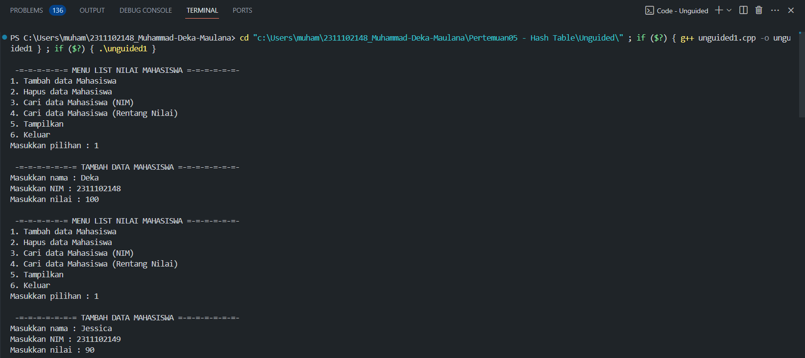
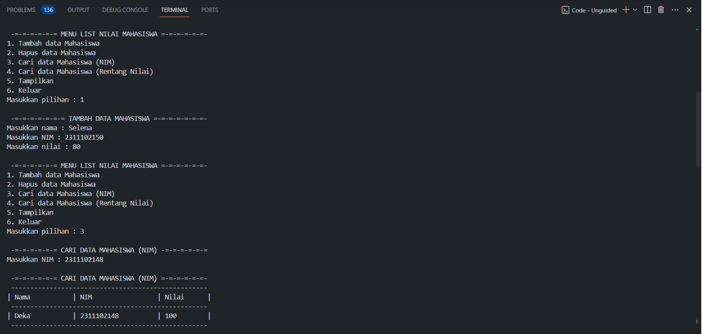
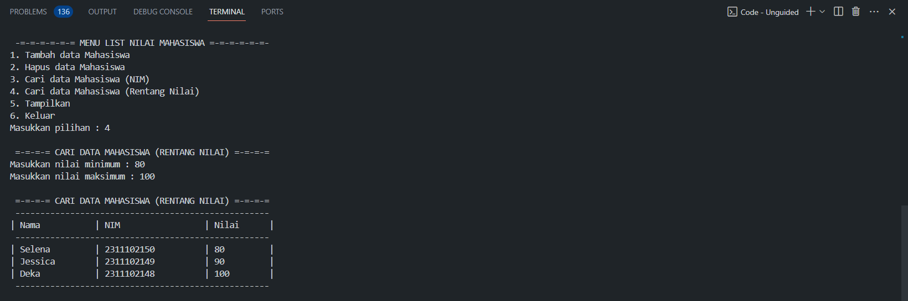
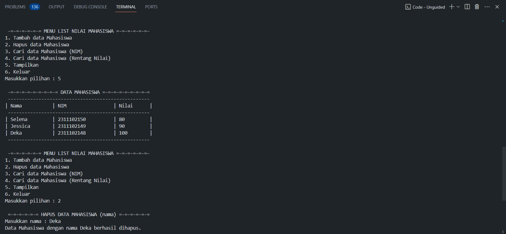
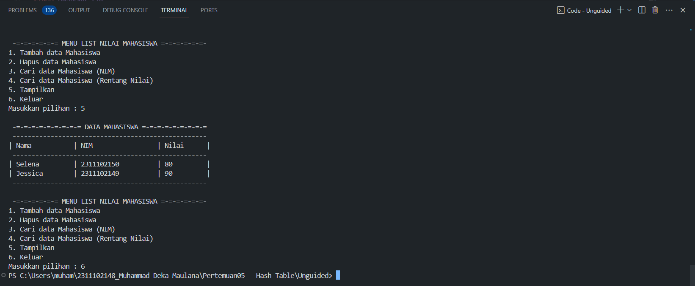

# <h1 align="center">Laporan Praktikum Modul 5 - Hash Table</h1>
<p align="center">Muhammad Deka Maulana - 2311102148</p>

## Dasar Teori

### Hashing 
Hashing adalah teknik untuk mengubah data atau informasi menjadi data yang lebih kecil, lebih mudah diterima, dan lebih mudah diterima. Tabel hashing adalah sebuah data structure yang menggunakan fungsi hash untuk menyimpan dan mengambil data. Fungsi hash itu sendiri adalah sebuah fungsi yang menerima kunci sebagai input dan menghasilkan indeks komponen dalam array yang dikenal sebagai tabel hash. Indeks ini disebut sebagai indeks hash. Tabel hash mengacu pada model data yang menghubungkan kunci ke nilai melalui fungsi hash. Hash menyimpan data secara asosiatif dalam array dengan indeks unik untuk setiap nilai data.<br/>

### Hash Table<br/>

Hash Table adalah sebuah struktur data yang terdiri atas sebuah tabel dan fungsi yang bertujuan untuk memetakan nilai kunci yang unik untuk setiap record (baris) menjadi angka (hash) lokasi record tersebut dalam sebuah tabel.<br/>

Tabel hashing digunakan untuk menyimpan dan mengelola data dengan cepat dan efisien. Dalam penggunaan praktis, tabel hash dapat digunakan untuk membuat pencarian data lebih cepat, seperti pencarian kata sandi dalam sistem pengelolaan kata sandi. Tabel hash dapat juga digunakan untuk mengelola data yang berubah-ubah, seperti daftar kontak yang sering diubah.<br/>
Tabel hashing memiliki beberapa kendala, yaitu tabrakan. Tabrakan terjadi ketika fungsi hash mengembalikan sama indeks untuk dua atau lebih kunci. Untuk mengatasi kendala tabrakan, ada beberapa metode yang dapat digunakan, seperti chaining, closed hashing, dan probing.<br/>

<p>
Dalam penerapannya, terdapat dua metode yang sering digunakan untuk menangani kolisi saat menggunakan tabel hash :<br/>

1. Open Hashing (Chaining)
Open Hashing (Chaining) adalah strategi untuk mencegah tabrakan. Dengan hashing berantai, setiap slot dalam tabel hash berfungsi sebagai simpul utama untuk data, yang akan dimasukkan setelahnya. Konsekuensinya, jika node kosong, data ditambahkan ke root node. Sebaliknya, jika data sudah ada, data yang masuk dilampirkan atau disisipkan setelah node kepala yang ada.<br/>

2. Closed Hashing
Closed hashing adalah teknik yang digunakan untuk menyelesaikan tabrakan dalam tabel hash. Pendekatan ini menyelesaikan tabrakan hash dengan menjelajahi (atau memindai) posisi alternatif di dalam larik (urutan probe). Probing ini dapat terjadi dalam bentuk :<br/>
- Probing linier, di mana interval antar probe biasanya ditentukan pada 1 unit.
- Probing kuadrat, di mana jarak antara probe bertambah secara kuadrat (sebagaimana digariskan oleh fungsi kuadrat).
- Pencirian ganda, di mana interval di antara probe ditentukan untuk setiap catatan tetapi dihitung menggunakan algoritme hash lain, seperti yang dibahas di atas.
<p/>

<p>
Berikut adalah berbagai jenis operasi yang dapat dilakukan pada Hash Table :

1. Pencarian (Search): Mencari elemen atau data dalam Hash Table dengan menggunakan kunci atau indeksnya. Ini melibatkan penggunaan fungsi hash untuk menemukan lokasi elemen yang dicari.
2. Penyisipan (Insertion): Menambahkan elemen atau data baru ke dalam Hash Table. Elemen baru akan ditempatkan pada indeks yang dihasilkan oleh fungsi hash.
3. Penghapusan (Deletion): Menghapus elemen atau data dari Hash Table berdasarkan kunci atau indeksnya. Elemen yang dihapus akan dihilangkan dari lokasi yang dihasilkan oleh fungsi hash.
4. Pembaruan (Update): Mengganti nilai elemen atau data yang sudah ada dalam Hash Table. Nilai elemen dapat diperbarui berdasarkan kunci atau indeksnya.
5. Penanganan Kolisi (Collision Handling): Kolisi terjadi ketika dua atau lebih elemen memiliki indeks yang sama setelah melalui fungsi hash. Operasi ini bertujuan untuk menangani kolisi dan memastikan bahwa elemen-elemen dengan indeks yang sama dapat disimpan dan diakses dengan benar.
6. Pengubahan Ukuran (Resize): Merubah ukuran Hash Table jika jumlah elemen atau data yang disimpan melebihi kapasitas yang ditentukan. Pengubahan ukuran dilakukan untuk menjaga efisiensi dan kinerja Hash Table.
7. Iterasi: Melakukan akses dan pemrosesan semua elemen atau data yang ada dalam Hash Table secara berurutan.
<p/> <br/>

<p>
Berikut adalah langkah-langkah dalam membuat Hash Table :

1. Tentukan Ukuran Tabel : Langkah awal adalah menetapkan ukuran tabel hash yang sesuai. Pastikan ukuran tabel merupakan bilangan prima untuk mengurangi tabrakan hash dan mendistribusikan data secara merata.
2. Buat Struktur Data : Buatlah struktur data yang dapat menyimpan pasangan kunci-nilai dalam tabel hash. Ini bisa berupa array, linked list, atau struktur data lainnya, tergantung pada bahasa pemrograman yang digunakan.
3. Definisikan Fungsi Hash : Buat fungsi hash yang dapat mengonversi kunci menjadi indeks dalam tabel hash. Fungsi hash harus memberikan hasil yang unik dan merata untuk setiap kunci, mengurangi kemungkinan terjadinya tabrakan hash.
4. Penanganan Tabrakan : Tentukan dan implementasikan metode penanganan tabrakan hash. Jika dua kunci menghasilkan indeks yang sama, pilih cara untuk menangani tabrakan tersebut. Salah satu pendekatan umum adalah menggunakan teknik chaining, di mana beberapa nilai disimpan dalam satu slot tabel hash menggunakan struktur data seperti linked list atau array.
5. Operasi Pencarian, Penyisipan, dan Penghapusan: Implementasikan fungsi-fungsi untuk melakukan operasi pencarian, penyisipan, dan penghapusan data dalam tabel hash. Pastikan operasi tersebut efisien dan menggunakan fungsi hash serta metode penanganan tabrakan yang telah ditentukan sebelumnya.
6. Uji Coba dan Optimasi : Setelah implementasi selesai, uji coba Hash Table untuk memastikan kinerjanya sesuai dengan yang diharapkan. Lakukan optimasi jika diperlukan, seperti memilih ukuran tabel yang lebih optimal atau meningkatkan performa fungsi hash.
<p/>

### Tujuan Hash Table
- Mendapatkan posisi (lokasi, alamat) record secara langsung (immediate, direct) pada waktu dicari.
- Mempercepat pencarian kembali dari banyak data yang disimpan.
- Dapat memotong banyak biaya pencarian direktori. (memasukkan berkas,menghapus data juga lebih mudah dan cepat)
- Mempercepat table look-up, atau untuk membandingkan data (misalnya mencari data tertentu dalam sebuah basis data, mendeteksi data yang terduplikasi dalam sebuah file berukuran besar, dan sebagainya).
- Proses menyimpan dan mencari data lebih cepat

### Kelebihan Hash Table
- Waktu aksesnya yang cukup cepat, jika record yang dicari langsung berada pada angka hash lokasi penyimpanannya.
- Hashing relatif lebih cepat
- Kecepatan dalam insertions, deletions, maupun searching relatif sama
- Cocok untuk merepresentasikan data dengan frekuensi insert, delete dan search yang tinggi

### Kekurangan Hash Table
- Sering sekali ditemukan hash table yang recordrecordnya mempunyai angka hash yang sama (bertabrakan).
- Sulit (tidak efficient) untuk mencetak seluruh elemen pada hash table
- Tidak efficient untuk mencari elemen minimum or maximum

## Guided 

### 1. Latihan Hash Table Sederhana

```C++
// Guided 1

#include <iostream>
using namespace std;

const int MAX_SIZE = 10;

// Fungsi hash sederhana
int hash_func(int key) {
    return key % MAX_SIZE;
}

// Struktur data untuk setiap node
struct Node {
    int key;
    int value;
    Node* next;
    Node(int key, int value) : key(key), value(value), next(nullptr) {}
};

// Class hash table
class HashTable {
private:
    Node** table;

public:
    HashTable() {
        table = new Node*[MAX_SIZE]();
    }

    ~HashTable() {
        for (int i = 0; i < MAX_SIZE; i++) {
            Node* current = table[i];
            while (current != nullptr) {
                Node* temp = current;
                current = current->next;
                delete temp;
            }
        }
        delete[] table;
    }

    // Insertion
    void insert(int key, int value) {
        int index = hash_func(key);
        Node* current = table[index];
        while (current != nullptr) {
            if (current->key == key) {
                current->value = value;
                return;
            }
            current = current->next;
        }
        Node* node = new Node(key, value);
        node->next = table[index];
        table[index] = node;
    }

    // Searching
    int get(int key) {
        int index = hash_func(key);
        Node* current = table[index];
        while (current != nullptr) {
            if (current->key == key) {
                return current->value;
            }
            current = current->next;
        }
        return -1;
    }

    // Deletion
    void remove(int key) {
        int index = hash_func(key);
        Node* current = table[index];
        Node* prev = nullptr;
        while (current != nullptr) {
            if (current->key == key) {
                if (prev == nullptr) {
                    table[index] = current->next;
                } else {
                    prev->next = current->next;
                }
                delete current;
                return;
            }
            prev = current;
            current = current->next;
        }
    }

    // Traversal
    void traverse() {
        for (int i = 0; i < MAX_SIZE; i++) {
            Node* current = table[i];
            while (current != nullptr) {
                cout << current->key << ": " << current->value << endl;
                current = current->next;
            }
        }
    }
};

int main() {
    HashTable ht;

    // Insertion
    ht.insert(1, 10);
    ht.insert(2, 20);
    ht.insert(3, 30);

    // Searching
    cout << "Get key 1: " << ht.get(1) << endl;
    cout << "Get key 4: " << ht.get(4) << endl;

    // Deletion
    ht.remove(4);

    // Traversal
    ht.traverse();

    return 0;
}
```
Program di atas merupakan implementasi hash table dalam bahasa C++. Pertama, ukuran tabel hash ditentukan, yaitu 10. Fungsi hash_func digunakan untuk menghitung indeks dari key yang akan dimasukkan ke dalam tabel hash dengan menggunakan operasi modulo dengan MAX_SIZE.<br/>
Struktur data Node dibuat, yang berisi key, value, dan pointer next. Node ini digunakan untuk menyimpan data yang akan dimasukkan ke dalam tabel hash.<br/>
Kemudian, class HashTable dibuat, yang berisi fungsi-fungsi untuk mengelola tabel hash, antara lain:<br/>

1. Fungsi insert digunakan untuk memasukkan data ke dalam tabel hash.
2. Fungsi get digunakan untuk mencari data berdasarkan key yang diinputkan.
3. Fungsi remove digunakan untuk menghapus data berdasarkan key yang diinputkan.<br/>

Hasil output dari program tersebut menunjukkan bahwa nilai dari key 1 adalah 10, sementara key 4 tidak ditemukan sehingga mengembalikan nilai -1. Selanjutnya, key 4 berhasil dihapus dari tabel hash, dan data yang tersisa di dalam tabel hash ditampilkan, yaitu:
```
3 : 30
2 : 20
1 : 10
```

### 2. Latihan Hash Table dengan Node

```C++
// Guided 2

#include <iostream>
#include <string>
#include <vector>

using namespace std;

const int TABLE_SIZE = 11;

string name;
string phone_number;
class HashNode{
    public:
    string name;
    string phone_number;

    HashNode(string name, string phone_number){
        this->name = name;
        this->phone_number = phone_number;
    }
};

class HashMap{
    private:
    vector<HashNode*> table[TABLE_SIZE];
    public:
    int hashFunc(string key){
        int hash_val = 0;
        for(char c : key){
            hash_val += c;
        }
    return hash_val % TABLE_SIZE;
    }

    void insert(string name, string phone_number){
        int hash_val = hashFunc(name);

        for(auto node : table[hash_val]){
            if(node->name == name){
                node->phone_number = phone_number;
                return;
            }
        }
        table[hash_val].push_back(new HashNode(name, phone_number));
    }

    void remove(string name){
        int hash_val = hashFunc(name);

        for(auto it = table[hash_val].begin(); it != table[hash_val].end(); it++){
            if((*it)->name == name){
                table[hash_val].erase(it);
                return;
            }
        }
    }

    string searchByName(string name){
        int hash_val = hashFunc(name);
        for(auto node : table[hash_val]){
            if(node->name == name){
                return node->phone_number;
            }
        }
        return "";
    }

    void print(){
        for(int i = 0; i < TABLE_SIZE; i++){
            cout << i << ": ";
            for(auto pair : table[i]){
                if(pair != nullptr){
                    cout << "[" << pair->name << ", " << pair->phone_number << "]";
                }
            }
            cout << endl;
        }
    }
};

int main(){
    HashMap employee_map;

    employee_map.insert("Mistah", "1234");
    employee_map.insert("Pastah", "5678");
    employee_map.insert("Ghana", "91011");

    cout << "Nomor HP Mistah : " << employee_map.searchByName("Mistah") << endl;
    cout << "Nomor HP Pastah : " << employee_map.searchByName("Pastah") << endl;

    employee_map.remove("Mistah");

    cout << "Nomor HP Mistah setelah dihapus : " << employee_map.searchByName("Mistah") << endl << endl;

    employee_map.print();

    return 0;
}
```

Program tersebut merupakan implementasi dari sebuah hash table yang menggunakan node untuk menyimpan nama dan nomor telepon. Hash table memiliki tiga fungsi utama, yaitu insert, remove, dan searchByName. Pertama, program membuat tabel hash dengan ukuran 11. Setiap node pada tabel hash berisi nama dan nomor telepon. Kelas HashMap dibuat untuk menyimpan array dari pointer ke HashNode dengan ukuran yang telah ditentukan. Fungsi hashFunc digunakan untuk menghasilkan nilai hash dari sebuah nama. Selanjutnya, program mengimplementasikan fungsi-fungsi seperti insert, remove, searchByName, dan print.<br/>

Pada fungsi main, objek employee_map dari kelas HashMap dibuat untuk menyimpan data nama dan nomor telepon. Data "Mistah", "Pastah", dan "Ghana" dimasukkan ke dalam hash table menggunakan fungsi insert. Selanjutnya, nomor telepon dicari berdasarkan nama menggunakan fungsi searchByName. Data kemudian dihapus menggunakan fungsi remove. Terakhir, hash table dicetak menggunakan fungsi print.<br/>

Hasil dari program menunjukkan bahwa data berhasil dimasukkan ke dalam hash table, pencarian berdasarkan nama dilakukan dengan sukses, penghapusan data berhasil, dan hash table berhasil dicetak.<br/>

## Unguided

1. Implementasikan hash table untuk menyimpan data mahasiswa. Setiap mahasiswa
memiliki NIM dan nilai. Implementasikan fungsi untuk menambahkan data baru,
menghapus data, mencari data berdasarkan NIM, dan mencari data berdasarkan
nilai. Dengan ketentuan :<br/>
a. Setiap mahasiswa memiliki NIM dan nilai.<br/>
b. Program memiliki tampilan pilihan menu berisi poin C.<br/>
c. Implementasikan fungsi untuk menambahkan data baru, menghapus data, mencari data berdasarkan NIM, dan mencari data berdasarkan rentang nilai (80 – 90).


```C++
#include <iostream>
#include <string>
#include <vector>
#include <iomanip>

using namespace std;

const int TABLE_SIZE_148 = 100; // deklarasi variabel TABLE_SIZE_148 dengan nilai 100

// Struktur data mahasiswa
struct Mahasiswa_148
{
    string nama_148;
    string nim_148;
    int nilai_148;
};

// Struktur data untuk setiap node
class HashNode_148
{
    // deklarasi variabel name_148, nim_148, dan nilai_148
public:
    string name_148;
    string nim_148;
    int nilai_148;

    HashNode_148(string name_148, string nim_148, int nilai_148)
    {
        this->name_148 = name_148;
        this->nim_148 = nim_148;
        this->nilai_148 = nilai_148;
    }
};

// Class HashMap_148
class HashMap_148
{
private:
    // deklarasi vector table_148 dengan ukuran TABLE_SIZE_148
    vector<HashNode_148 *> table_148[TABLE_SIZE_148];

public:
    // Fungsi Hash Sederhana
    int hashFunc_148(string key_148)
    {
        int hash_val_148 = 0;
        for (char c_148 : key_148)
        {
            hash_val_148 += c_148;
        }
        return hash_val_148 % TABLE_SIZE_148;
    }

    // Tambah data
    void insert_148(string name_148, string nim_148, int nilai_148)
    {
        int hash_val_148 = hashFunc_148(name_148);
        for (auto node_148 : table_148[hash_val_148])
        {
            if (node_148->name_148 == name_148)
            {
                node_148->nim_148 = nim_148;
                node_148->nilai_148 = nilai_148;
                cout << "Data Mahasiswa dengan Nama " << name_148 << " berhasil ditambahkan." << endl;
                return;
            }
        }
        table_148[hash_val_148].push_back(new HashNode_148(name_148, nim_148, nilai_148));
    }

    // Hapus data
    void remove_148(string name_148)
    {
        int hash_val_148 = hashFunc_148(name_148);
        for (auto it_148 = table_148[hash_val_148].begin(); it_148 != table_148[hash_val_148].end(); ++it_148)
        {
            if ((*it_148)->name_148 == name_148)
            {
                delete *it_148;
                table_148[hash_val_148].erase(it_148);
                cout << "Data Mahasiswa dengan nama " << name_148 << " berhasil dihapus." << endl;
                return;
            }
        }
    }

    // Cari data berdasarkan NIM
    void searchByNIM_148(string nim_148)
    {
        bool found_148 = false;
        for (int i_148 = 0; i_148 < TABLE_SIZE_148; ++i_148)
        {
            for (auto node_148 : table_148[i_148])
            {
                if (node_148->nim_148 == nim_148)
                {
                    // Menampilkan data mahasiswa pakai setw agar rapi
                    cout << "\n -=-=-=-=-=-= CARI DATA MAHASISWA (NIM) =-=-=-=-=-=-" << endl;
                    cout << " ---------------------------------------------------" << endl;
                    cout << left << "| " << setw(15) << "Nama"
                        << "| " << setw(20) << "NIM"
                        << "| " << setw(10) << "Nilai"
                        << " |" << endl;
                    cout << " ---------------------------------------------------" << endl;
                    cout << "| " << left << setw(15) << node_148->name_148
                        << "| " << left << setw(20) << node_148->nim_148
                        << "| " << left << setw(10) << node_148->nilai_148 << " |" << endl;
                    cout << " ---------------------------------------------------" << endl;
                    found_148 = true;
                    return;
                }
            }
        }
        if (!found_148)
        {
            cout << "Mahasiswa dengan NIM " << nim_148 << " tidak ditemukan." << endl;
        }
    }

    // Cari data berdasarkan rentang nilai
    void CariRentangNilai_148(int NilaiMin_148, int NilaiMax_148)
    {
        bool found_148 = false;

        // Menampilkan data mahasiswa pakai setw agar rapi
        cout << "\n =-=-=-= CARI DATA MAHASISWA (RENTANG NILAI) =-=-=-=" << endl;
        cout << " ---------------------------------------------------" << endl;
        cout << left << "| " << setw(15) << "Nama"
            << "| " << setw(20) << "NIM"
            << "| " << setw(10) << "Nilai"
            << " |" << endl;
        cout << " ---------------------------------------------------" << endl;
        for (int i_148 = 0; i_148 < TABLE_SIZE_148; ++i_148)
        {
            for (auto node_148 : table_148[i_148])
            {
                if (node_148->nilai_148 >= NilaiMin_148 && node_148->nilai_148 <= NilaiMax_148)
                {
                    cout << "| " << left << setw(15) << node_148->name_148
                        << "| " << left << setw(20) << node_148->nim_148
                        << "| " << left << setw(10) << node_148->nilai_148 << " |" << endl;
                    found_148 = true;
                }
            }
        }
        if (!found_148)
        {
            cout << "Tidak ada data Mahasiswa dengan nilai antara " << NilaiMin_148 << " dan " << NilaiMax_148 << "." << endl;
        }
        cout << " ---------------------------------------------------" << endl;
    }

    // Tampilkan data
    void print_148()
    {
        // Menampilkan data mahasiswa pakai setw agar rapi
        cout << "\n -=-=-=-=-=-=-=-=-= DATA MAHASISWA =-=-=-=-=-=-=-=-=" << endl;
        cout << " ---------------------------------------------------" << endl;
        cout << left << "| " << setw(15) << "Nama"
            << "| " << setw(20) << "NIM"
            << "| " << setw(10) << "Nilai"
            << " |" << endl;
        cout << " ---------------------------------------------------" << endl;
        for (int i_148 = 0; i_148 < TABLE_SIZE_148; ++i_148)
        {
            for (auto pair_148 : table_148[i_148])
            {
                cout << "| " << left << setw(15) << pair_148->name_148
                    << "| " << left << setw(20) << pair_148->nim_148
                    << "| " << left << setw(10) << pair_148->nilai_148 << " |" << endl;
            }
        }
        cout << " ---------------------------------------------------" << endl;
    }
};

int main()
{
    HashMap_148 map_148;
    int choice_148;
    string name_148;
    string nim_148;
    int nilai_148;
    int search1_148, search2_148;
    do
    {
        // Menampilkan menu
        cout << "\n -=-=-=-=-=-= MENU LIST NILAI MAHASISWA =-=-=-=-=-=-" << endl;
        cout << "1. Tambah data Mahasiswa" << endl;
        cout << "2. Hapus data Mahasiswa" << endl;
        cout << "3. Cari data Mahasiswa (NIM)" << endl;
        cout << "4. Cari data Mahasiswa (Rentang Nilai)" << endl;
        cout << "5. Tampilkan" << endl;
        cout << "6. Keluar" << endl;
        cout << "Masukkan pilihan : ";
        cin >> choice_148;
        switch (choice_148)
        {

        // Pilihan 1: Tambah data Mahasiswa
        case 1:
            cout << "\n -=-=-=-=-=-=-= TAMBAH DATA MAHASISWA =-=-=-=-=-=-=-" << endl;
            cout << "Masukkan nama : ";
            cin >> name_148;
            cout << "Masukkan NIM : ";
            cin >> nim_148;
            cout << "Masukkan nilai : ";
            cin >> nilai_148;
            map_148.insert_148(name_148, nim_148, nilai_148);
            break;

        // Pilihan 2: Hapus data Mahasiswa
        case 2:
            cout << "\n =-=-=-=-=-= HAPUS DATA MAHASISWA (nama) =-=-=-=-=-=" << endl;
            cout << "Masukkan nama : ";
            cin >> name_148;
            map_148.remove_148(name_148);
            break;

        // Pilihan 3: Cari data Mahasiswa (NIM)
        case 3:
            cout << "\n -=-=-=-=-=-= CARI DATA MAHASISWA (NIM) -=-=-=-=-=-=" << endl;
            cout << "Masukkan NIM : ";
            cin >> nim_148;
            map_148.searchByNIM_148(nim_148);
            break;

        // Pilihan 4: Cari data Mahasiswa (Rentang Nilai)
        case 4:
            cout << "\n =-=-=-= CARI DATA MAHASISWA (RENTANG NILAI) =-=-=-=" << endl;
            cout << "Masukkan nilai minimum : ";
            cin >> search1_148;
            cout << "Masukkan nilai maksimum : ";
            cin >> search2_148;
            map_148.CariRentangNilai_148(search1_148, search2_148);
            break;

        // Pilihan 5: Tampilkan data
        case 5:
            map_148.print_148();
            break;

        // Pilihan 6: Keluar
        case 6:
            break;

        // Pilihan tidak tersedia
        default:
            cout << "Pilihan tidak tersedia!!" << endl;
        }
    } while (choice_148 != 6);

    return 0;
}

```
#### Output Unguided 1 :







## Kesimpulan


## Referensi
[1] Annisa Puspa Kirana, S.Kom, M.Kom, 2019, "TABEL HASH (HASH TABLE)". https://www.scribd.com/document/407460664/TABEL-HASH-HASH-TABLE-pdf<br/>
[2] Annisa, September 19, 2023, "Struktur Data Hash Table: Pengertian, Cara Kerja dan Operasi Hash Table".<br/>
[3] Jasson Prestiliano, 2007, "Aplikasi Tabel Hash dalam Pengarsipan dan Pencarian Data", Fakultas Teknologi Informasi, Universitas Kristen Satya Wacana.