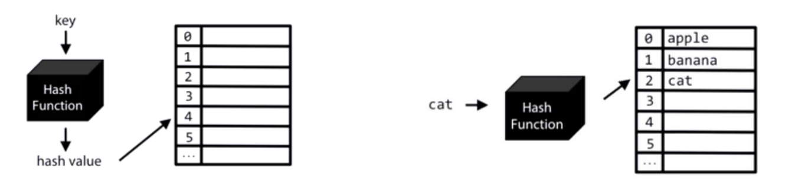

# <h1 align="center">Laporan Praktikum Modul 5 - Hash Table</h1>
<p align="center">Muhammad Deka Maulana - 2311102148</p>

## Dasar Teori

1. Pengenalan Hash Table
Hash Table adalah sebuah struktur data yang terdiri atas sebuah tabel dan fungsi yang bertujuan untuk memetakan nilai kunci yang unik untuk setiap record (baris) menjadi angka (hash) lokasi record tersebut dalam sebuah tabel.<br/>
Menyimpan data pada memori ke dalam baris-baris dan kolom-kolom sehingga membentuk table yang diakses dengan cepat


2. Tujuan Hash Table
- Mendapatkan posisi (lokasi, alamat) record secara langsung (immediate, direct) pada waktu dicari.
- Mempercepat pencarian kembali dari banyak data yang disimpan.
- Dapat memotong banyak biaya pencarian direktori. (memasukkan berkas,menghapus data juga lebih mudah dan cepat)
- Mempercepat table look-up, atau untuk membandingkan data (misalnya mencari data tertentu dalam sebuah basis data, mendeteksi data yang terduplikasi dalam sebuah file berukuran besar, dan sebagainya).
- Proses menyimpan dan mencari data lebih cepat

3. Kelebihan Hash Table
- Waktu aksesnya yang cukup cepat, jika record yang dicari langsung berada pada angka hash lokasi penyimpanannya.
- Hashing relatif lebih cepat
- Kecepatan dalam insertions, deletions, maupun searching relatif sama
- Cocok untuk merepresentasikan data dengan frekuensi insert, delete dan search yang tinggi

4. Kekurangan Hash Table
- Sering sekali ditemukan hash table yang recordrecordnya mempunyai angka hash yang sama (bertabrakan).
- Sulit (tidak efficient) untuk mencetak seluruh elemen pada hash table
- Tidak efficient untuk mencari elemen minimum or maximum

## Guided 

### 1. Latihan Hash Table Sederhana

```C++
// Guided 1

#include <iostream>
using namespace std;

const int MAX_SIZE = 10;

// Fungsi hash sederhana
int hash_func(int key) {
    return key % MAX_SIZE;
}

// Struktur data untuk setiap node
struct Node {
    int key;
    int value;
    Node* next;
    Node(int key, int value) : key(key), value(value), next(nullptr) {}
};

// Class hash table
class HashTable {
private:
    Node** table;

public:
    HashTable() {
        table = new Node*[MAX_SIZE]();
    }

    ~HashTable() {
        for (int i = 0; i < MAX_SIZE; i++) {
            Node* current = table[i];
            while (current != nullptr) {
                Node* temp = current;
                current = current->next;
                delete temp;
            }
        }
        delete[] table;
    }

    // Insertion
    void insert(int key, int value) {
        int index = hash_func(key);
        Node* current = table[index];
        while (current != nullptr) {
            if (current->key == key) {
                current->value = value;
                return;
            }
            current = current->next;
        }
        Node* node = new Node(key, value);
        node->next = table[index];
        table[index] = node;
    }

    // Searching
    int get(int key) {
        int index = hash_func(key);
        Node* current = table[index];
        while (current != nullptr) {
            if (current->key == key) {
                return current->value;
            }
            current = current->next;
        }
        return -1;
    }

    // Deletion
    void remove(int key) {
        int index = hash_func(key);
        Node* current = table[index];
        Node* prev = nullptr;
        while (current != nullptr) {
            if (current->key == key) {
                if (prev == nullptr) {
                    table[index] = current->next;
                } else {
                    prev->next = current->next;
                }
                delete current;
                return;
            }
            prev = current;
            current = current->next;
        }
    }

    // Traversal
    void traverse() {
        for (int i = 0; i < MAX_SIZE; i++) {
            Node* current = table[i];
            while (current != nullptr) {
                cout << current->key << ": " << current->value << endl;
                current = current->next;
            }
        }
    }
};

int main() {
    HashTable ht;

    // Insertion
    ht.insert(1, 10);
    ht.insert(2, 20);
    ht.insert(3, 30);

    // Searching
    cout << "Get key 1: " << ht.get(1) << endl;
    cout << "Get key 4: " << ht.get(4) << endl;

    // Deletion
    ht.remove(4);

    // Traversal
    ht.traverse();

    return 0;
}
```
Deskripsi Program Guided 1

### 2. Latihan Hash Table dengan Node

```C++
// Guided 2

#include <iostream>
#include <string>
#include <vector>

using namespace std;

const int TABLE_SIZE = 11;

string name;
string phone_number;
class HashNode{
    public:
    string name;
    string phone_number;

    HashNode(string name, string phone_number){
        this->name = name;
        this->phone_number = phone_number;
    }
};

class HashMap{
    private:
    vector<HashNode*> table[TABLE_SIZE];
    public:
    int hashFunc(string key){
        int hash_val = 0;
        for(char c : key){
            hash_val += c;
        }
    return hash_val % TABLE_SIZE;
    }

    void insert(string name, string phone_number){
        int hash_val = hashFunc(name);

        for(auto node : table[hash_val]){
            if(node->name == name){
                node->phone_number = phone_number;
                return;
            }
        }
        table[hash_val].push_back(new HashNode(name, phone_number));
    }

    void remove(string name){
        int hash_val = hashFunc(name);

        for(auto it = table[hash_val].begin(); it != table[hash_val].end(); it++){
            if((*it)->name == name){
                table[hash_val].erase(it);
                return;
            }
        }
    }

    string searchByName(string name){
        int hash_val = hashFunc(name);
        for(auto node : table[hash_val]){
            if(node->name == name){
                return node->phone_number;
            }
        }
        return "";
    }

    void print(){
        for(int i = 0; i < TABLE_SIZE; i++){
            cout << i << ": ";
            for(auto pair : table[i]){
                if(pair != nullptr){
                    cout << "[" << pair->name << ", " << pair->phone_number << "]";
                }
            }
            cout << endl;
        }
    }
};

int main(){
    HashMap employee_map;

    employee_map.insert("Mistah", "1234");
    employee_map.insert("Pastah", "5678");
    employee_map.insert("Ghana", "91011");

    cout << "Nomor HP Mistah : " << employee_map.searchByName("Mistah") << endl;
    cout << "Nomor HP Pastah : " << employee_map.searchByName("Pastah") << endl;

    employee_map.remove("Mistah");

    cout << "Nomor HP Mistah setelah dihapus : " << employee_map.searchByName("Mistah") << endl << endl;

    employee_map.print();

    return 0;
}
```

Deskripsi Program Guided 2

## Unguided

1. Implementasikan hash table untuk menyimpan data mahasiswa. Setiap mahasiswa
memiliki NIM dan nilai. Implementasikan fungsi untuk menambahkan data baru,
menghapus data, mencari data berdasarkan NIM, dan mencari data berdasarkan
nilai. Dengan ketentuan :<br/>
a. Setiap mahasiswa memiliki NIM dan nilai.<br/>
b. Program memiliki tampilan pilihan menu berisi poin C.<br/>
c. Implementasikan fungsi untuk menambahkan data baru, menghapus data, mencari data berdasarkan NIM, dan mencari data berdasarkan rentang nilai (80 – 90).


```C++

```
#### Output Unguided 1 :


## Kesimpulan


## Referensi
[1] Annisa Puspa Kirana, S.Kom, M.Kom, 2019, "TABEL HASH (HASH TABLE)". https://www.scribd.com/document/407460664/TABEL-HASH-HASH-TABLE-pdf<br/>
[2] 