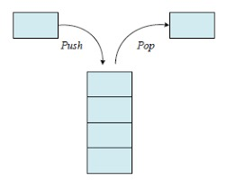
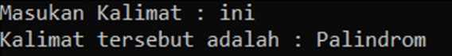
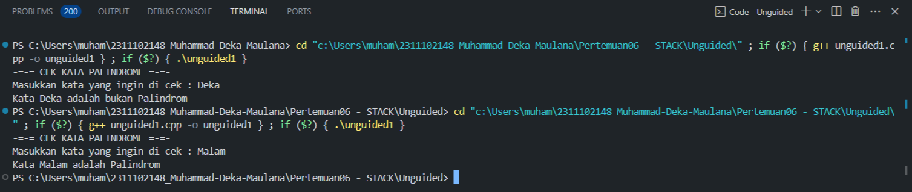
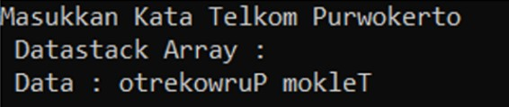
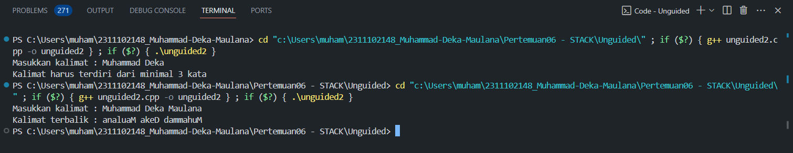

# <h1 align="center">Laporan Praktikum Modul 6 - Stack</h1>
<p align="center">Muhammad Deka Maulana - 2311102148</p>

## Dasar Teori
### 1. Pengertian Stack
Stack adalah suatu koleksi atau kumpulan item data yang terorganisasi dalam bentuk urutan linear, yang operasi pemasukan dan penghapusan datanya dilakukan pada salah satu sisinya. Sedangkan pengertian stack pada struktur data adalah sebagai tumpukan dari benda, sekumpulan data yang seolah-olah diletakkan di atas data yang lain, koleksi dari objek-objek homogen, atau Suatu urutan elemen yang elemennya dapat diambil dan ditambah hanya pada posisi akhir (top) saja. Stack merupakan bentuk khusus dari suatu struktur data, dimana node yang ditambahkan ke dalam list dan diambil dari list hanya pada kepalanya, atau dengan prinsip pengolahannya adalah last-in first-out (LIFO). Pada struktur ini hanya ada dua fungsi utama, yaitu push (memasukkan node ke dalam stack), dan pop (mengambil node dari stack). 

Stack adalah suatu tumpukan dari benda. Konsep utamanya adalah LIFO (Last In First Out), benda yang terakhir masuk dalam stack akan menjadi benda pertama yang dikeluarkan dari stack. Tumpukan disebut juga “Push Down Stack” yaitu penambahan elemen baru (PUSH) dan penghapusan elemen dari tumpukan (POP). Contoh pada PDA (Push Down Automaton). Sistem pada pengaksesan pada tumpukan menggunakn system LIFO (Last In First Out), artinya elemen yang terakhir masuk itu yang akan pertama dikeluarkan dari tumpukan (Stack). Ilustrasi tumpukan (Stack) dapat digambarkan seperti tumpukan CD atau tumpukan sate. Stack merupakan suatu susunan koleksi data dimana dapat ditambahkan dan dihapus selalu dilakukan pada bagian akhir data, yang disebut dengan Top Of Stack.

Penggunaan stack dalam pemrograman sangat luas, mulai dari menyelesaikan ekspresi matematika dalam notasi postfix hingga mengelola memori dalam sistem komputer. Dengan prinsip LIFO (Last In, First Out), stack membantu mempertahankan urutan operasi atau data yang penting dan memudahkan akses ke data terbaru yang dimasukkan. Dalam struktur data stack, ada dua situasi yang perlu dihindari, yaitu underflow dan overflow.
- Stack underflow terjadi saat mencoba mengakses atau menghapus elemen data dari stack yang kosong.
- Stack overflow terjadi saat ruang memori yang dialokasikan untuk stack sudah penuh tetapi masih ada upaya untuk menambahkan elemen baru.</br>


### 2. Operasi Dasar Pada Stack

a. Operasi Create 
Merupakan operator yang berfungsi untuk membuat sebuah stack kosong

b. Operasi IsEmpty
Merupakan operator yang berfungsi untuk menentukan apakah suatu stack merupakan stack kosong. Tanda bahwa sebuah stack kosong adalah Top bernilai kurang dari nol (-1) 

c. Operasi IsFull
Merupakan operator yang digunakan untuk memeriksa apakah stack yang ada sudah penuh. Stack akan penuh jika puncak stack terletak tepat dibawah jumlah maksimum yang dapat ditampung stack (Top = MAX_STACK-1).

d. Operasi Push
Merupakan operator yang berfungsi untuk menambahkan satu elemen ke dalam stack dan tidak dapat dilakukan jika stack dalam keadaan penuh. 

e. Operasi Pop
Merupakan operator yang berfungsi untuk mengeluarkan satu elemen teratas dari dalam stack dengan syarat stack tidak dalam kondisi kosong.

f. Operasi Clear
Merupakan fungsi yang digunakan untuk mengosongkan stack dengan cara mengeset Top dengan - 1. Jika Top bernilai kurang dari nol maka stack dianggap kosong.

g. Operasi Retrieve
Merupakan fungsi yang digunakan untuk melihat nilai yang berada pada posisi tumpukan teratas.

### 3. Kelebihan dan Kekurangan Stack

1. Kelebihan Stack 
- membantu mengelola data dengan metode LIFO 
- secara otomatis membersihkan objek 
- tidak mudah rusak 
- ukuran variabel tidak dapat diubah 
- mengontrol memori secara mandiri 

2. Kekurangan Stack 
- memori stack sangat terbatas 
- ada kemungkinan stack akan meluap atau overflow jika terlalu 
banyak objek
- tidak memungkinkan akses acak, karena harus mengeluarkan 
tumpukan paling atas terlebih dahulu untuk mengakses tumpukan 
paling bawah.

## Guided 

### 1. Guided

```C++
#include<iostream>

using namespace std;

//Deklarasi array bernama arrayBuku dengan ukuran 5
string arrayBuku[5];
int maksimal = 5, top = 0;

//Fungsi isFull untuk memeriksa apakah stack full atau tidak
bool isFull(){
    return (top == maksimal);
}

//Fungsi isEmpty untuk memeriksa apakah stack kosong atau tidak
bool isEmpty(){
    return (top == 0);
}

//Prosedur push untuk menambahkan elemen pada stack posisi paling atas
void pushArrayBuku(string data){
    if(isFull()){
        cout << "Data telah penuh" << endl;
    } else {
        arrayBuku[top] = data;
        top++;
    }
}

//Prosedur pop untuk menghapus elemen pada stack posisi paling atas
void popArrayBuku(){
    if(isEmpty()){
        cout << "tidak ada data yang dihapus" << endl;
    } else {
        arrayBuku[top - 1] = "";
        top--;
    }
}

//Prosedur peek untuk melihat elemen pada stack posisi tertentu 
void peekArrayBuku(int posisi){
    if(isEmpty()){
        cout << "tidak ada data yang bisa dilihat" << endl;
    } else {
        int index = top;
        for(int i = 1; i <= posisi; i++){
            index--;
        }
        cout << "Posisi ke-" << posisi << " adalah " << arrayBuku[index] << endl;
    }
}

//Fungsi Count untuk menghitung jumlah elemen pada stack
int countStack(){
    return top;
}

//Prosedur change untuk mengubah elemen posisi tertentu pada stack
void changeArrayBuku(int posisi, string data){
    if(posisi > top){
        cout << "Posisi melebihi data yang ada" << endl;
    } else {
        int index = top;
        for(int i = 1; i <= posisi; i++){
            index--;
        }
        arrayBuku[index] = data;
    }
}

//Prosedur destroy atau clear untuk menghapus semua elemen pada stack
void destroyArrayBuku(){
    for(int i = top; i >= 0; i--){
        arrayBuku[i] = "";
    }
    top = 0;
}

//Prosedur cetak untuk menampilkan semua elemen pada stack
void cetakArrayBuku(){
    if(isEmpty()){
        cout << "tidak ada data yang bisa dicetak" << endl;
    } else {
        for (int i = top - 1; i >= 0; i--){
            cout << arrayBuku[i] << endl;
        }
    }
}

int main(){
    //Menambahkan elemen pada stack menggunakan prosedur push
    pushArrayBuku("Kalkulus");
    pushArrayBuku("Struktur Data");
    pushArrayBuku("Matematika Diskrit");
    pushArrayBuku("Dasar Multimedia");
    pushArrayBuku("Inggris");

    //mencetak semua elemen pada stack menggunakan prosedur cetak
    cetakArrayBuku();
    cout << "\n";

    //Memeriksa apakah stack penuh atau tidak menggunakan fungsi isFull
    cout << "Apakah data stack penuh? " << isFull() << endl;

    //Memeriksa apakah stack kosong atau tidak menggunakan fungsi isEmpty
    cout << "Apakah data stack kosong? " << isEmpty() << endl;
    cout << "\n";

    //Melihat elemen pada stack posisi ke 2 menggunakan prosedur peek
    peekArrayBuku(2);

    //Menghapus elemen stack posisi paling atas menggunakan prosedur pop
    popArrayBuku();
    cout << "\n";

    //Menghitung jumlah elemen pada stack menggunakan fungsi count
    cout << "Banyaknya data = " << countStack() << endl;

    //Mengubah elemen stack posisi ke 2 menjadi "Bahasa Jerman" menggunakan prosedur change
    changeArrayBuku(2, "Bahasa Jerman");

    //mencetak semua elemen pada stack menggunakan prosedur cetak
    cetakArrayBuku();
    cout << "\n";

    //Menghapus semua elemen pada stack menggunakan prosedur destroy atau clear
    destroyArrayBuku();

    //Menghitung jumlah elemen pada stack menggunakan fungsi count
    cout << "Jumlah data setelah dihapus = " << countStack() << endl;

    //mencetak semua elemen pada stack menggunakan prosedur cetak
    cetakArrayBuku();

    return 0;
}
```
Program ini adalah contoh sederhana penggunaan stack dengan array dalam sebuah bahasa pemrograman. Pada awalnya, kita mendeklarasikan array `arrayBuku` dengan ukuran 5, serta variabel `maksimal` dan `top` untuk mengelola stack. Beberapa fungsi dan prosedur digunakan untuk berbagai manipulasi data dalam stack, seperti penambahan, penghapusan, dan pengubahan elemen.

Di dalam fungsi `main()`, dilakukan serangkaian operasi seperti menambahkan data ke stack, mencetak isi stack, memeriksa apakah stack sudah penuh atau masih kosong, melihat data pada posisi tertentu, menghapus data teratas, menghitung jumlah elemen dalam stack, mengubah data pada posisi tertentu, dan menghapus semua data dalam stack. Setelah setiap operasi, isi stack dicetak kembali untuk memeriksa perubahan yang terjadi.

## Unguided 

### 1. Buatlah program untuk menentukan apakah kalimat tersebut yang diinputkan dalam program stack adalah palindrom/tidak. Palindrom kalimat yang dibaca dari depan dan belakang sama. Jelaskan bagaimana cara kerja programnya.

contoh :

Kalimat : ini
<br>Kalimat tersebut adalah palindrom

Kalimat : telkom
<br>Kalimat tersebut adalah bukan palindrom


```C++
// Muhammad Deka Maulana
// 2311102148

#include<iostream>

using namespace std;

const int Max_148 = 100;
char Kata_148[Max_148]; // Deklarasi array bernama Kata_148 sebagai stack
int Top_148 = -1;

// Prosedur PushHuruf_148 untuk menambahkan huruf pada stack
void PushHuruf_148(char Huruf_148) {
    if (Top_148 < Max_148 - 1) {
        Kata_148[++Top_148] = Huruf_148;
    }
}

// Fungsi PeekHurufPertama_148 untuk melihat huruf atau elemen pertama yang disimpan pada stack
char PeekHurufPertama_148() {
    if (Top_148 >= 0) {
        return Kata_148[Top_148];
    }
    return '\0';
}

// Fungsi isEmpty_148 untuk memeriksa stack kosong atau tidak
bool isEmpty_148() {
    return (Top_148 == -1);
}

// Fungsi CekPalindrom_148 untuk memeriksa kata yang diinputkan user merupakan kata palindrom atau tidak
bool CekPalindrom_148(const char* InputKata_148, int Panjang_148) {
    // Memasukkan setengah huruf dari total huruf pada kata yang diinputkan user kedalam stack
    for (int i = 0; i < Panjang_148 / 2; i++) {
        PushHuruf_148(InputKata_148[i]);
    }

    // Menentukan jumlah dari setengah karakter kedua dari kata yang diinputkan user 
    int Kedua_148;
    if (Panjang_148 % 2 == 0) {
        Kedua_148 = Panjang_148 / 2;
    } else if (Panjang_148 % 2 == 1) {
        Kedua_148 = Panjang_148 / 2 + 1;
    }

    // Membandingkan setengah karakter kedua dengan setengah karakter pertama menggunakan fungsi PeekHurufPertama_148
    for (int i = Kedua_148; i < Panjang_148; i++) {
        if (PeekHurufPertama_148() != InputKata_148[Kedua_148]) {
            return false;
        }
    }
    return true;
}

int main() {
    char InputKata_148[Max_148];
    cout << "-=-= CEK KATA PALINDROME =-=-" << endl;
    cout << "Masukkan kata yang ingin di cek : ";
    cin.getline(InputKata_148, Max_148); // Memasukkan setiap karakter/huruf yang diinputkan user kedalam array InputKata_148

    // Menghitung panjang string input
    int PanjangKata_148 = 0;
    while (InputKata_148[PanjangKata_148] != '\0') {
        PanjangKata_148++;
    }

    // Mengecek kata yang diinputkan palindrom atau tidak menggunakan fungsi CekPalindrom_148
    if (CekPalindrom_148(InputKata_148, PanjangKata_148)) {
        cout << "Kata " << InputKata_148 << " adalah Palindrom" << endl;  
    } else {
        cout << "Kata " << InputKata_148 << " adalah bukan Palindrom" << endl;
    }
    
    return 0;
}
```

Kode di atas merupakan implementasi dalam bahasa C++ untuk memeriksa apakah sebuah kata yang dimasukkan oleh pengguna merupakan kata palindrom atau tidak. Program ini menggunakan konsep stack untuk membalikkan setengah dari total huruf dalam kata dan membandingkannya dengan setengah lainnya untuk menentukan apakah kata tersebut palindrom. Saat pertama kali dijalankan, program meminta pengguna untuk memasukkan sebuah kata. Setelah itu, program menghitung panjang kata tersebut dan memanggil fungsi `CekPalindrom_148` untuk melakukan pengecekan. Jika kata tersebut merupakan palindrom, program akan mencetak pesan bahwa kata tersebut merupakan kata palindrom; sebaliknya, jika bukan, program akan mencetak pesan bahwa kata tersebut bukan palindrom.

Dengan menggunakan fungsi-fungsi stack seperti `PushHuruf_148`, `PeekHurufPertama_148`, dan `isEmpty_148`, serta konsep pengecekan palindrom secara terbagi, program ini memungkinkan pengguna untuk dengan cepat dan mudah memeriksa apakah kata yang dimasukkan merupakan kata palindrom. Dengan demikian, program ini dapat digunakan sebagai alat bantu yang berguna untuk pengecekan sifat palindrom pada kata-kata yang diberikan pengguna.

#### Output:



### 2. Buatlah program untuk melakukan pembalikan terhadap kalimat menggunakan stack dengan minimal 3 kata.Jelaskan output program dan source codenya beserta operasi/fungsi yang dibuat?

contoh : 

Kalimat : Telkom Purwokerto
<br>Hasil : otrekowruP mokleT



```C++
// Muhammad Deka Maulana
// 2311102148

#include <iostream>
#include <string>
#include <stack>

using namespace std;

// Fungsi untuk membalikkan kalimat menggunakan stack
void balikKalimat_148(string kalimat_148) {
    stack<char> tumpukan_148;

    // Memasukkan setiap karakter dari kalimat ke dalam stack
    for (char c_148 : kalimat_148) {
        tumpukan_148.push(c_148);
    }

    string kalimatDibalik_148;
    // Mengambil karakter dari stack dan menyimpannya dalam kalimat yang dibalik
    while (!tumpukan_148.empty()) {
        kalimatDibalik_148 += tumpukan_148.top();
        tumpukan_148.pop();
    }

    // Menampilkan kalimat yang sudah dibalik
    cout << "Kalimat terbalik : " << kalimatDibalik_148 << endl;
}

int main() {
    string kalimat_148;

    // Meminta pengguna memasukkan sebuah kalimat
    cout << "Masukkan kalimat : ";
    getline(cin, kalimat_148);

    int jumlahKata_148 = 1;
    // Menghitung jumlah kata dalam kalimat
    for (char c_148 : kalimat_148) {
        if (c_148 == ' ') {
            jumlahKata_148++;
        }
    }

    // Memeriksa apakah jumlah kata kurang dari 3
    if (jumlahKata_148 < 3) {
        cout << "Kalimat harus terdiri dari minimal 3 kata" << endl;
    } else {
        // Memanggil fungsi untuk membalikkan kalimat dan menampilkan hasil kalimat yang sudah dibalik
        balikKalimat_148(kalimat_148);
    }

    return 0;
}
```

Program C++ di atas merupakan sebuah implementasi dari stack yang dapat membalikkan kalimat yang diinputkan oleh pengguna. Fungsi `balikKalimat_133` digunakan untuk melakukan proses pembalikan kalimat dengan menggunakan stack. Program pertama-tama membuat sebuah stack dengan tipe data char untuk menyimpan setiap karakter dalam kalimat. Setiap karakter dari kalimat kemudian dimasukkan ke dalam stack. Setelah itu, karakter-karakter tersebut diambil dari stack satu per satu dan disusun kembali menjadi kalimat yang sudah dibalik.

Fungsi `main` merupakan fungsi utama dari program. Program akan meminta pengguna untuk menginputkan sebuah kalimat menggunakan `cout`. Selanjutnya, program membaca inputan kalimat dari pengguna menggunakan `getline` dan menyimpannya dalam variabel `kalimat_133`. Kemudian, program menghitung jumlah kata dalam kalimat dengan menghitung jumlah spasi. Jika jumlah kata dalam kalimat kurang dari 3, maka program akan mencetak pesan kesalahan. Namun, jika jumlah kata mencukupi, program akan menggunakan fungsi `balikKalimat_133` untuk membalikkan kalimat dan menampilkan hasilnya.

#### Output:



## Kesimpulan

Dalam praktikum ini, para praktikan diminta untuk memahami konsep stack dalam bahasa pemrograman C++. Stack adalah struktur data yang mengikuti prinsip Last In First Out (LIFO), yang berarti elemen terakhir yang dimasukkan akan menjadi elemen pertama yang dihapus. Pada laporan ini, kita akan mempelajari operasi dasar stack seperti push, pop, clear, isEmpty, isFull, dan peek, serta berbagai penerapan stack dalam pemrograman, seperti pembalikan string, evaluasi ekspresi aritmetika, dan pemanggilan fungsi rekursif. Dari dua panduan yang diberikan, para praktikan akan melihat bagaimana stack digunakan untuk menangani tumpukan data secara efisien dan efektif, yang dapat membantu dalam pengembangan program yang memerlukan urutan operasi atau data yang penting.

## Referensi
[1] Ahmad Ghiyas Ahyar, et al., 2021, "JURNAL PEMBELAJARAN ARRAY, LINKED LIST, STACK, DAN QUEUE".
[2] Muh. Haidar, 2020, "MAKALAH STACK DAN QUEUE".