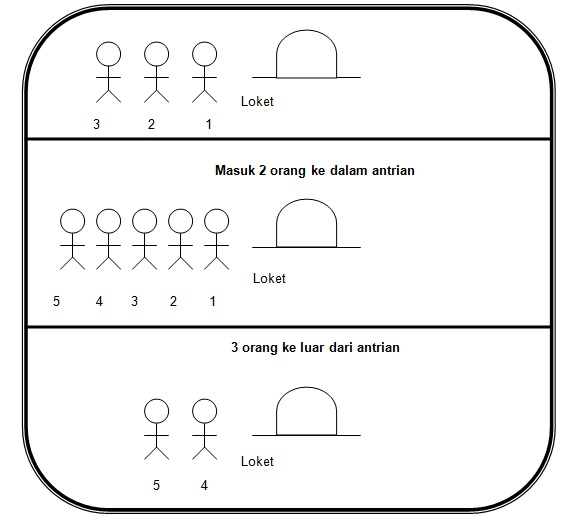

# <h1 align="center">Laporan Praktikum Modul 7 - Queue</h1>
<p align="center">Muhammad Deka Maulana - 2311102148</p>

## Dasar Teori

### Queue

### A. Pengertian Queue
Queue (antrian) adalah suatu jenis struktur data yang dapat diproses dengan sifat FIFO (First In First Out), dimana elemen yang pertama kali masuk ke antrian akan keluar pertama kalinya. Ada dua jenis operasi yang bias dilakukan di antrian : enqueue (memasukkan elemen baru ke dalam elemen) dan dequeue (adalah mengeluarkan satu elemen dari suatu antrian). Antrian dapat dibuat dengan menggunakan : Liniear Array dan Circular Array.



### B. Deklarasi Struktur Data Queue
Queue dapat dideklarasikan dengan bentuk berikut :

```C++
define maxsize 100
typdef struct {
    int jumlah; //jumlah data
    int depan; //ujung depan
    int belakang; //ujung belakang
char data [ maxsize ]; //array isi queue
} queue;
```

Sedangkan bentuk fungsi-fungsi queue dapat dilihat berikut ini :

1. Fungsi Initialize :
```C++
void initialize ( queue *q )
{
q -> jumlah = 0;
q -> depan = 0;
q -> belakang = 0;
}
```

2. Fungsi Is_Empty, yang antara lain digunakan untuk :
- Untuk memeriksa apakah Antrian sudah penuh atau belum
- Dengan cara memeriksa nilai Tail, jika Tail = -1 maka empty
- Tidak perlu memeriksa Head, karena Head adalah tanda untuk kepala antrian (elemen pertama dalam antrian) yan:g tidak akan berubah

Berikut adalah deklarasi fungsi.ls_Empty :
```C++
int Is_Empty (queue *q) {
if (q  jumlah == 0)
return (1);
else
return (0);
} 
```

3. Fungsi Is_Full, berfungsi untuk :
- Untuk mengecek apakah Antrian sudah penuh atau belum
- Dengan cara mengecek nilai Tail, jika Tail >= MAX-1 (karena MAX-1 adalah batas elemen array pada C) berarti sudah penuh

Deklarasi fungsi.Is_Empty :
```C++
int Is_Full (queue *q) {
if (q  jumlah == MAX)
return (1);
else
return (0);
}
```

4. Fungsi Enqueue , dengan tujuan :
- Untuk menambahkan elemen ke dalam Antrian, penambahan elemen selalu ditambahkan di elemen paling belakang.
- Penambahan elemen selalu menggerakan variabel Tail dengan cara increment counter Tail.

Deklarasi fungsi.Enqueue :
```C++
void enqueue(char X, Queue* q) {
    if (Is_Full(q)) {
        std::cerr << "\nERROR: queue sudah penuh\n";
    } else {
        q->data[q->belakang] = X;
        q->belakang = (q->belakang + 1) % maxsize;
        ++(q->count);
    }
}

```

### C. Perbedaan Implementasi Queue Linked List dengan Queue Array
.png)
.png)

## Guided 

### 1. Guided

```C++
#include<iostream>

using namespace std;

const int MaksimalAntrian = 5;
int front = 0;
int back = 0;
string QueueTeller[5];

// Mengecek apakah antrian sudah penuh atau belum
bool isFull(){
    if(back == MaksimalAntrian){
        return true;
    } else {
        return false;
    }
}

// Mengecek apakah antrian masih kosong atau tidak
bool isEmpty(){
    if(back == 0){
        return true;
    } else {
        return false;
    }
}

// Menambah antrian
void TambahData(string nama){
    if(isFull()){
        cout << "Antrian sudah penuh" << endl;
    } else if(!isFull()){
        if(isEmpty()){
            QueueTeller[0] = nama;
            front++;
            back++;
        } else if(!isEmpty()){
            QueueTeller[back] = nama;
            back++;
        }
    }
}

// Mengurangi antrian
void KurangAntrian(){
    if(isEmpty()){
        cout << "Antrian masih kosong" << endl;
    } else if(!isEmpty()){
        for(int i = 0; i < back; i++){
            QueueTeller[i] =  QueueTeller[i+1];
        }
        back--;
    }
}

// Menghitung banyak antrian
int Count(){
    return back;
}

// Menghapus seluruh antrian
void ClearQueue(){
    if(isEmpty()){
        cout << "Antrian masih kosong" << endl;
    } else if(!isEmpty()){
        for(int i = 0; i < back; i++){
            QueueTeller[i] = "";
        }
        back = 0;
        front = 0;
    }
}

// Melihat Antrian
void ViewQueue(){
    cout << "Data antrian = " << endl;
    for(int i = 0; i < MaksimalAntrian; i++){
        if(QueueTeller[i] != ""){
            cout << i+1 << ". " << QueueTeller[i] << endl;
        } else {
            cout << i+1 << ". " << "(kosong)" << endl;
        }
    }
}

// main fungsi
int main(){
    
    //Menambah 3 data nama kedalam antrian
    TambahData("Alya");
    TambahData("Kiki");
    TambahData("Artika");

    //menampilkan data yang sudah ditambahkan
    ViewQueue();

    //mengurangi data
    KurangAntrian();

    //menampilkan data setelah dikurangi
    ViewQueue();

    //menghapus seluruh antrian
    ClearQueue();

    //menampilkan data setelah dihapus
    ViewQueue();
}
```

Kode di atas adalah program latihan sederhana untuk antrian (queue). Implementasi antrian pada program ini menggunakan array bernama `QueueTeller`, sehingga memerlukan batas maksimal atau kapasitas array. Batas maksimal antrian pada program ini adalah 5. Pada awal program, dideklarasikan konstanta integer bernama `MaksimalAntrian` dengan nilai 5, serta variabel `front` dan `back` dengan nilai awal 0. Selain itu, dideklarasikan array `QueueTeller` dengan ukuran 5. Program ini memiliki beberapa fungsi dan prosedur untuk memanipulasi antrian, yaitu:
- `bool isFull()`: Mengecek apakah antrian penuh atau tidak.
- `bool isEmpty()`: Mengecek apakah antrian kosong atau tidak.
- `void TambahData(string nama)`: Menambahkan data nama ke dalam antrian.
- `void KurangAntrian()`: Mengurangi antrian (menghapus elemen pertama dan memajukan antrian).
- `int Count()`: Menghitung jumlah elemen dalam antrian.
- `void ClearQueue()`: Menghapus seluruh elemen dalam antrian.
- `void ViewQueue()`: Menampilkan seluruh elemen dalam antrian.

Pada `int main()`, dilakukan beberapa operasi terkait antrian: menambahkan 3 nama ke dalam antrian (`Alya`, `Kiki`, `Artika`) menggunakan prosedur `TambahData()`, menampilkan antrian setelah penambahan data menggunakan `ViewQueue()`, mengurangi antrian dengan `KurangAntrian()`, menampilkan antrian setelah pengurangan menggunakan `ViewQueue()`, menghapus seluruh antrian dengan `ClearQueue()`, dan menampilkan antrian setelah penghapusan menggunakan `ViewQueue()`.

## Unguided 

### 1. Ubahlah penerapan konsep queue pada bagian guided dari array menjadi linked list

```C++
#include<iostream>

using namespace std;

// Definisi struct node
struct node {
    string nama_148;
    node *next;
};

node *front; // node depan
node *back;  // node belakang

// Inisialisasi node depan dan belakang jadi NULL
void Inisialisasi_148() {
    front = NULL;
    back = NULL;
}

// Cek apakah queue kosong
bool isEmpty_148() {
    return front == NULL;
}

// Tambah data ke antrian
void TambahData_148(string name_148) {
    node *baru = new node;
    baru->nama_148 = name_148;
    baru->next = NULL;
    if (isEmpty_148()) {
        front = back = baru;
    } else {
        back->next = baru;
        back = baru;
    }
}

// Kurangi data dari antrian
void KurangiAntrian_148() {
    if (isEmpty_148()) {
        cout << "Antrian masih kosong!" << endl;
    } else {
        node *hapus = front;
        front = front->next;
        delete hapus;
        if (front == NULL) {
            back = NULL;
        }
    }
}

// Hitung jumlah antrian
int HitungAntrian_148() {
    int jumlah_148 = 0;
    node *hitung = front;
    while (hitung != NULL) {
        hitung = hitung->next;
        jumlah_148++;
    }
    return jumlah_148;
}

// Hapus semua antrian
void HapusAntrian_148() {
    node *hapus, *bantu = front;
    while (bantu != NULL) {
        hapus = bantu;
        bantu = bantu->next;
        delete hapus;
    }
    front = back = NULL;
}

// Tampilkan antrian
void LihatAntrian_148() {
    if (isEmpty_148()) {
        cout << "Antrian kosong!" << endl;
    } else {
        cout << "=-= Antrian saat ini =-=" << endl;
        node *bantu = front;
        int NomorAntrian_148 = 1;
        while (bantu != NULL) {
            cout << NomorAntrian_148 << ". " << bantu->nama_148 << endl;
            bantu = bantu->next;
            NomorAntrian_148++;
        }
    }
    cout << endl;
}

int main() {
    // Tambah 3 data nama ke antrian
    TambahData_148("Alya");
    TambahData_148("Kiki");
    TambahData_148("Artika");

    // Tampilkan data yang sudah ditambah
    LihatAntrian_148();

    // Kurangi data
    KurangiAntrian_148();

    // Tampilkan data setelah dikurangi
    LihatAntrian_148();

    // Hapus semua antrian
    HapusAntrian_148();

    // Tampilkan data setelah dihapus
    LihatAntrian_148();

    return 0;
}
```

Program di atas merupakan latihan sederhana untuk mengimplementasikan queue menggunakan linked list. Implementasi ini berbeda dengan panduan yang menggunakan array, karena linked list tidak memiliki batas maksimal pada jumlah elemen yang bisa ditambahkan, sehingga antrian bisa bertambah tanpa batas.
Di awal program, dideklarasikan sebuah struct node yang berisi variabel `nama_148` dan pointer `next`. Dua pointer, yaitu front dan back, juga dideklarasikan. Berikut adalah beberapa fungsi dan prosedur yang digunakan untuk memanipulasi queue dalam program ini:
- `void Inisialisasi_148();` untuk menginisialisasi front dan back sebagai NULL.
- `bool isEmpty_148();` untuk memeriksa apakah queue kosong.
- `void TambahData_148(string name_148);` untuk menambahkan data nama ke dalam antrian.
- `void KurangiAntrian_148();` untuk menghapus elemen pertama dari antrian.
- `int HitungAntrian_148();` untuk menghitung jumlah elemen dalam antrian.
- `void HapusAntrian_148();` untuk menghapus semua elemen dalam antrian.
- `void LihatAntrian_148();` untuk menampilkan semua elemen dalam antrian.

Dalam fungsi `int main()`, dilakukan beberapa operasi terkait queue, seperti menambahkan tiga nama (Alya, Kiki, Artika) ke dalam antrian menggunakan prosedur `TambahData_148()`, menampilkan antrian setelah penambahan menggunakan `LihatAntrian_148()`, menghapus elemen pertama dari antrian dengan `KurangiAntrian_148()`, menampilkan antrian setelah pengurangan dengan `LihatAntrian_148()`, menghapus seluruh antrian dengan `HapusAntrian_148()`, dan menampilkan antrian setelah penghapusan menggunakan `LihatAntrian_148()`.

#### Output:


### 2. Dari nomor 1 buatlah konsep antri dengan atribut Nama mahasiswa dan NIM Mahasiswa

```C++
#include <iostream>

using namespace std;

// Definisi struct node
struct node {
    string nama_148;
    string nim_148;
    node *next;
};

node *front; // node depan
node *back;  // node belakang

// Inisialisasi node depan dan belakang jadi NULL
void Inisialisasi_148() {
    front = NULL;
    back = NULL;
}

// Cek apakah queue kosong
bool isEmpty_148() {
    return front == NULL;
}

// Tambah data ke antrian
void TambahData_148(string name_148, string nim_148) {
    node *baru = new node;
    baru->nama_148 = name_148;
    baru->nim_148 = nim_148;
    baru->next = NULL;
    if (isEmpty_148()) {
        front = back = baru;
    } else {
        back->next = baru;
        back = baru;
    }
}

// Kurangi data dari antrian
void KurangiAntrian_148() {
    if (isEmpty_148()) {
        cout << "Antrian masih kosong!" << endl;
    } else {
        node *hapus = front;
        front = front->next;
        delete hapus;
        if (front == NULL) {
            back = NULL;
        }
    }
}

// Hitung jumlah antrian
int HitungAntrian_148() {
    int jumlah_148 = 0;
    node *hitung = front;
    while (hitung != NULL) {
        hitung = hitung->next;
        jumlah_148++;
    }
    return jumlah_148;
}

// Hapus semua antrian
void HapusAntrian_148() {
    node *hapus, *bantu = front;
    while (bantu != NULL) {
        hapus = bantu;
        bantu = bantu->next;
        delete hapus;
    }
    front = back = NULL;
}

// Tampilkan antrian
void LihatAntrian_148() {
    if (isEmpty_148()) {
        cout << "Antrian kosong!" << endl;
    } else {
        cout << "=-= Antrian saat ini =-=" << endl;
        node *bantu = front;
        int NomorAntrian_148 = 1;
        while (bantu != NULL) {
            cout << NomorAntrian_148 << ". Nama: " << bantu->nama_148 << ", NIM: " << bantu->nim_148 << endl;
            bantu = bantu->next;
            NomorAntrian_148++;
        }
    }
    cout << endl;
}

int main() {
    Inisialisasi_148();
    
    // Tambah 3 data mahasiswa ke antrian
    TambahData_148("Alya", "2311102001");
    TambahData_148("Kiki", "2311102002");
    TambahData_148("Artika", "2311102003");
    TambahData_148("Muhammad","2311102148");
    TambahData_148("Deka","2311102148");

    // Tampilkan data yang sudah ditambah
    LihatAntrian_148();

    // Kurangi data
    KurangiAntrian_148();

    // Tampilkan data setelah dikurangi
    LihatAntrian_148();

    // Hapus semua antrian
    HapusAntrian_148();

    // Tampilkan data setelah dihapus
    LihatAntrian_148();

    return 0;
}
```

Program di atas adalah implementasi sederhana dari struktur data antrian (queue) menggunakan bahasa pemrograman C++. Antrian adalah struktur data yang beroperasi berdasarkan prinsip "First In First Out" (FIFO), di mana elemen-elemen baru ditambahkan ke ujung belakang antrian dan dihapus dari ujung depan antrian.
- Struct Node : Program menggunakan struktur data `node` yang memiliki dua string untuk menyimpan nama dan NIM mahasiswa serta pointer `next` untuk menunjukkan ke node berikutnya dalam antrian.
- Variabel Global : Terdapat dua pointer global, `front` dan `back`, yang digunakan untuk menandai node pertama dan terakhir dalam antrian.
- Inisialisasi Queue : Fungsi `Inisialisasi_148()` digunakan untuk menginisialisasi `front` dan `back` menjadi NULL, menandakan bahwa antrian kosong.
- isEmpty_148() : Fungsi ini digunakan untuk memeriksa apakah antrian kosong dengan memeriksa apakah `front` bernilai NULL.
- TambahData_148() : Fungsi ini digunakan untuk menambahkan data mahasiswa baru ke dalam antrian. Data baru ini ditambahkan ke belakang antrian.
- KurangiAntrian_148() : Fungsi ini digunakan untuk menghapus data dari depan antrian, sesuai dengan prinsip FIFO.
- HitungAntrian_148() : Fungsi ini menghitung jumlah total data dalam antrian pada saat itu.
- HapusAntrian_148() : Fungsi ini digunakan untuk menghapus semua data dari antrian dengan melepaskan semua node dan mengembalikan `front` dan `back` ke NULL.
- LihatAntrian_148() : Fungsi ini digunakan untuk menampilkan semua data yang ada dalam antrian pada saat itu.

Program ini memberikan dasar implementasi antrian yang dapat digunakan sebagai landasan untuk pengembangan lebih lanjut dalam membangun aplikasi yang membutuhkan struktur data antrian.

#### Output:


## Kesimpulan

Antrian (queue) adalah struktur data yang mempertahankan urutan elemen-elemen di dalamnya, di mana elemen baru ditambahkan di bagian belakang (back) dan penghapusan elemen dilakukan di bagian depan (front), sesuai dengan prinsip "First In First Out" (FIFO). Istilah-istilah seperti front (bagian depan) dan back (bagian belakang), bersama dengan fungsi-fungsi seperti isEmpty, isFull, size, Enqueue, dan Dequeue, membentuk dasar operasional dari struktur data ini. Dengan Enqueue menambahkan elemen baru dan Dequeue menghapus elemen, queue menyediakan pendekatan yang efisien untuk mengatur urutan data dalam program atau aplikasi, terutama ketika prioritas urutan kedatangan data adalah hal yang penting.

## Referensi
[1] Johnson Sihombing, 2020, "PENERAPAN STACK DAN QUEUE PADA ARRAY DAN LINKED LIST DALAM JAVA".
<br>[2] Rizaldy Gunawan, 2023, "IMPLEMENTASI METODE QUEUE PADA SISTEM ANTRIAN ONLINE BERBASIS WEB STUDI KASUS UPTD PUSKESMAS SANANWETAN".
<br> [3] Joseph Teguh Santoso, 2021, "STRUKTUR DATA dan ALGORITMA (Bagian 1)"