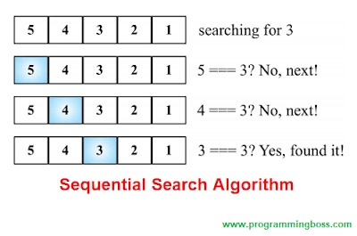
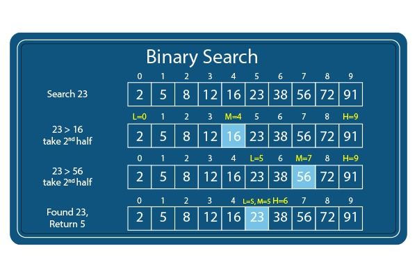
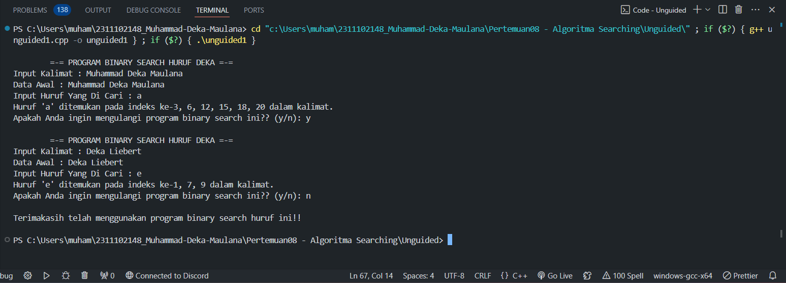
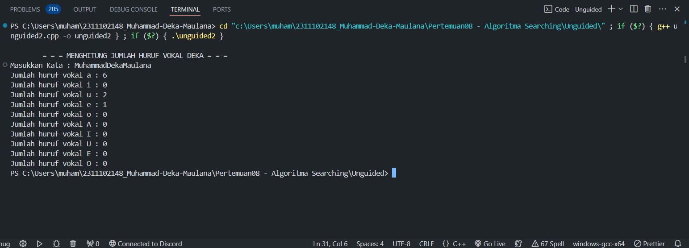

# <h1 align="center">Laporan Praktikum Modul 8 - Algoritma Searching</h1>
<p align="center">Muhammad Deka Maulana - 2311102148</p>

## Dasar Teori

### A. Pengertian Algoritma Searching

Algoritma searching adalah salah satu konsep dasar dalam ilmu komputer yang sangat penting. Dalam pemrograman, algoritma searching digunakan untuk mencari data yang terdapat dalam sebuah struktur data seperti array, list, atau tree.

Algoritma searching digunakan pada berbagai jenis aplikasi, mulai dari aplikasi sederhana hingga aplikasi kompleks seperti mesin searching. Dalam pembelajaran ilmu komputer, pemahaman tentang algoritma searching menjadi sangat penting karena dapat membantu dalam pemecahan masalah dan pengembangan aplikasi. Dalam artikel ini, kita akan membahas beberapa jenis algoritma searching yang umum digunakan.

Algoritma searching adalah serangkaian langkah atau instruksi yang digunakan untuk mencari suatu data atau informasi tertentu dalam struktur data seperti array, list, tree, atau database. Tujuan dari algoritma searching adalah untuk menemukan posisi atau keberadaan data yang dicari dalam struktur data dengan cara yang efisien dan efektif.

Algoritma searching digunakan pada berbagai jenis aplikasi, seperti mesin pencari, permainan, dan aplikasi bisnis. Pemahaman tentang algoritma searching sangat penting dalam ilmu komputer karena dapat membantu dalam pemecahan masalah dan pengembangan aplikasi.

### B. Jenis Algoritma Searching

### 1. Sequential Search

SequentialSearch adalah cara untuk  pencarian data dalam array 1 dimensi.  Data yang akan dicari nanti akan ditelusuri dalam semua elemen-elemen array  dari awal sampai akhir, dan data yang dicari tersebut tidak perlu diurutkan terlebih dahulu. Terdapat 2 kemungkinan yang akan terjadi dalam waktu pencarian data SequentialSearch, diantaranya yaitu :

a.	Best Case</br>
Best case / kemungkinan terbaik akan terjadi apabila data yang dicari terletak pada index array yang paling depan, sehingga waktu yang dibutuhkan untuk mencari data sedikit. 

b.	Worse Case</br>
Worse case / kemungkinan terburuk akan terjadi apabila data yang dicari terletak pada index array yang paling akhir, sehingga waktu yang dibutuhkan untuk mencari data akan sangat lama. Untuk meningkatkan efisiensi pencarian data pada SequentialSearch dapat dilakukan dengan cara menghentikan looping dengan menggunakan BREAK apabila data yang dicari sudah ketemu.



### 2. Binary Search

Binary Search adalah cara untuk pencarian data pada array yang sudah terurut. Salah satu syarat dalam Binary Search adalah data sudah dalam keadaan terurut. Dengan kata lain, apabila data belum dalam keadaan terurut, pencarian Binary tidak dapat dilakukan. Binary Search ini dilakukan untuk :

- Memperkecil jumlah operasi perbandingan yang harus dilakukan antara data yang dicari dengan data yang ada di dalam tabel, khususnya untuk jumlah data yang sangat besar ukurannya.
- Beban komputasi lebih kecil karena pencarian dilakukan dari depan, belakang, dan tengah.
- Prinsip dasarnya adalah melakukan proses pembagian ruang pencarian secara berulang-ulang sampai data ditemukan atau sampai pencarian tidak dapat dibagi lagi (berarti terdapat kemungkinan data tidak ditemukan).



## Guided

### 1. Buatlah sebuah project dengan menggunakan sequential search sederhana untuk melakukan pencarian data.

```C++
#include <iostream>

using namespace std;

int main() {
    int n = 10;
    int data[n] = {9,4,1,7,5,12,4,13,4,10};
    int cari = 10;
    bool ketemu = false;
    int i;

    for (i = 0; i < n; i++) {
        if (data[i] == cari) {
            ketemu = true;
            break;
        }
    }

    cout <<"Program Sequential Search" <<endl;
    cout <<"data : {9,4,1,7,5,12,4,13,4,10} " <<endl;

    if (ketemu) {
        cout <<"\nAngka " << cari <<" ditemukan pada indeks ke-" << i << endl;
    } else {
        cout << "data tidak ditemukan"<<br endl;
    }

    return 0;
}
```

Program di atas merupakan implementasi dari algoritma pencarian sekuensial (sequential search) untuk mencari suatu nilai dalam sebuah array. Algoritma ini bekerja dengan cara memeriksa setiap elemen dari array secara berurutan hingga nilai yang dicari ditemukan atau seluruh array telah diperiksa.</br>
Berikut adalah penjelasan langkah-langkahnya dalam program :

- n : Menampung jumlah elemen dalam array.
- data : Array integer berukuran n yang berisi data yang akan dicari.
- cari : Nilai integer yang ingin dicari dalam array.
- ketemu : Boolean untuk menandakan apakah nilai yang dicari telah ditemukan.
- i : Variabel iterator untuk loop.

Program ini menunjukkan implementasi sederhana dari algoritma Sequential Search untuk mencari nilai tertentu dalam array. Algoritma ini bekerja dengan cara membandingkan setiap elemen array dengan nilai yang dicari secara berurutan.

### 2. Buatlah sebuah project untuk melakukan pencarian data dengan menggunakan Binary Search.

```C++
#include<iostream>
#include<conio.h>
#include<iomanip>

using namespace std;

int dataArray[7] = {1, 8, 2, 5, 4, 9, 7};
int cari;

void Selection_Sort(){
    int temp, min, i, j;
    for(i = 0; i < 7; i++){
        min = i;
        for(j = i + 1; j < 7; j++){
            if(dataArray[j] < dataArray[min]){
                min = j;
            }
        }
        temp = dataArray[i];
        dataArray[i] = dataArray[min];
        dataArray[min] = temp;
    }
}

void BinarySearch(){
    int awal, akhir, tengah;
    bool b_flag = false;
    awal = 0;
    akhir = 6;
    while(!b_flag && awal <= akhir){
        tengah = (awal + akhir)/2;
        if(dataArray[tengah] == cari){
            b_flag = true;
        } else if(dataArray[tengah] < cari){
            awal = tengah + 1;
        } else {
            akhir = tengah - 1;
        }
    }
    if(b_flag){
        cout << "\nData ditemukan pada index ke-" << tengah << endl;
    } else {
        cout << "\nData tidak ditemukan" << endl;
    }
}

int main(){
    cout << "BINARY SEARCH" << endl;
    cout << "\nData : ";
    for(int x = 0; x < 7; x++){
        cout << setw(3) << dataArray[x];
    }
    cout << endl;

    cout << "Masukkan data yang ingin dicari : ";
    cin >> cari;
    
    cout << "\nData diurutkan : ";
    Selection_Sort();

    for(int x = 0; x < 7; x++){
        cout << setw(3) << dataArray[x];
    }
    cout <<br endl;
    BinarySearch();
    _getche();
    return 0;
}
```

Program di atas dibuat dengan menggunakan bahasa pemrograman C++ dan bertujuan untuk mencari data tertentu dalam sebuah array menggunakan metode Binary Search.

Program ini mengurutkan array `dataArray` menggunakan algoritma Selection Sort sebelum melakukan pencarian. Setelah pengurutan, nilai yang dicari akan dicari menggunakan algoritma Binary Search. Jika nilai tersebut ditemukan, program akan menampilkan indeks tempat nilai tersebut ditemukan; jika tidak, pesan bahwa nilai tidak ditemukan akan ditampilkan. Sebelumnya, program akan menampilkan data awal yang belum diurutkan dan meminta input dari pengguna untuk nilai yang dicari. Setelah itu, program akan menampilkan data yang telah diurutkan dan melakukan pencarian menggunakan Binary Search. Terakhir, program akan menahan tampilan layar sebelum selesai. Program ini merupakan contoh bagus tentang bagaimana algoritma yang berbeda dapat digunakan bersama untuk menyelesaikan masalah tertentu.

## Unguided 

### 1. Buatlah sebuah program untuk mencari sebuah huruf pada sebuah kalimat yang sudah di input dengan menggunakan Binary Search!

```C++
/*
Muhammad Deka Maulana - 2311102148
*/

#include <iostream>
#include <cstring>
#include <vector>
#include <algorithm>

using namespace std;

struct CharIndex_148 { // Struktur data untuk menyimpan pasangan karakter dan indeks dalam array 
    char character;
    int index;
};

vector<int> binary_search_all_2123(CharIndex_148 dataArray[], int size, char target) { // Fungsi untuk mencari semua indeks karakter target dalam array pasangan karakter dan indeks dengan algoritma pencarian biner sederhana.
    vector<int> result; // Array dinamis untuk menyimpan indeks hasil pencarian karakter target dalam array pasangan karakter dan indeks.
    for (int i = 0; i < size; i++) {
        if (dataArray[i].character == target) {
            result.push_back(dataArray[i].index); // Menambahkan indeks karakter target ke dalam array hasil pencarian.
        }
    }
    return result;
}

int main() {
    char kalimat_148[100]; // Array karakter untuk menyimpan kalimat yang diinputkan pengguna.
    char cari_148; 
    char ulangi_148;
    do {
        cout << "\n\t=-= PROGRAM BINARY SEARCH HURUF DEKA =-=" << endl;
        cout << "Input Kalimat : ";
        cin.getline(kalimat_148, 100); // Menggunakan getline() agar kalimat yang diinputkan dapat mengandung spasi.
        int size_148 = strlen(kalimat_148); // Menghitung panjang kalimat yang diinputkan.
        CharIndex_148 dataArray[100]; // Array statis untuk menyimpan pasangan karakter dan indeks
        // Membuat array pasangan karakter dan indeks aslinya
        for (int i = 0; i < size_148; i++) {
            dataArray[i] = {kalimat_148[i], i};
        }
        cout << "Data Awal : " << kalimat_148 << endl;
        cout << "Input Huruf Yang Di Cari : ";
        cin >> cari_148;
        // Pencarian biner sederhana
        vector<int> indeks = binary_search_all_2123(dataArray, size_148, cari_148); 
        if (!indeks.empty()) { // Jika indeks ditemukan dalam array pasangan karakter dan indeks.
            // Sort hasil jika lebih dari satu indeks ditemukan
            if (indeks.size() > 1) {
                sort(indeks.begin(), indeks.end());
            }
            cout << "Huruf '" << cari_148 << "' ditemukan pada indeks ke-";
            for (int i = 0; i < indeks.size(); i++) { // Menampilkan semua indeks karakter target dalam kalimat.
                if (i > 0) cout << ", ";
                cout << indeks[i];
            }
            cout << " dalam kalimat.\n";
        } else {
            cout << "Huruf '" << cari_148 << "' tidak ditemukan dalam kalimat.\n";
        }
        cout << "Apakah Anda ingin mengulangi program binary search ini?? (y/n): ";
        cin >> ulangi_148;
        cin.ignore(); // Membersihkan buffer agar getline() tidak terganggu
    } while (ulangi_148 == 'y' || ulangi_148 == 'Y'); // Ulangi program jika pengguna mengetikkan 'y' atau 'Y'

    cout << "\nTerimakasih telah menggunakan program binary search huruf ini!!\n\n";

    return 0;
}
```

Program di atas adalah aplikasi pencarian huruf menggunakan metode pencarian linier sederhana dalam bahasa C++. Program dimulai dengan mendefinisikan sebuah struktur data `CharIndex_148` untuk menyimpan pasangan karakter dan indeks dari sebuah kalimat yang dimasukkan oleh pengguna. Kemudian, fungsi `binary_search_all_2123()` digunakan untuk mencari semua kemunculan karakter target dalam array pasangan karakter dan indeks tersebut. Pengguna diminta memasukkan sebuah kalimat dan karakter yang ingin dicari. Setelah itu, program mencari semua indeks di mana karakter tersebut muncul dan menampilkan hasilnya.

Proses utama dilakukan dalam fungsi `main`, di mana program mengulang proses pencarian jika pengguna ingin mencari karakter lain. Setelah setiap pencarian, program menampilkan hasilnya dan menanyakan apakah pengguna ingin mengulangi pencarian. Program terus berulang sampai pengguna memutuskan untuk berhenti. Pada akhir program, ditampilkan pesan terima kasih. Program ini memberikan cara yang sederhana dan interaktif untuk mencari dan menemukan semua kemunculan sebuah karakter dalam sebuah kalimat.

#### Output:



### 2. Buatlah sebuah program yang dapat menghitung banyaknya huruf vocal dalam sebuah kalimat!

```C++
/*
Muhammad Deka Maulana - 2311102148
*/

#include <iostream>
#include <string>

using namespace std;

int cari_148(string kata, char huruf) // Fungsi untuk mencari jumlah huruf vokal (sequential search)
{
    int jumlah = 0;
    for (int i = 0; i < kata.length(); i++) // Sequential search dilakukan dengan memeriksa setiap karakter dalam string satu per satu
    {
        if (kata[i] == huruf) // Mengevaluasi apakah karakter pada posisi indeks saat ini sesuai dengan huruf yang ingin ditemukan
        {
            jumlah++; // Jika ditemukan huruf yang sesuai, jumlahnya ditambah
        }
    }
    return jumlah; // Mengembalikan jumlah huruf yang ditemukan
}

void hitung_148(string kata) // Fungsi untuk menampilkan jumlah huruf vokal
{
    int jumlah;
    char vokal[10] = {'a', 'i', 'u', 'e', 'o', 'A', 'I', 'U', 'E', 'O'};
    for (int i = 0; i < 10; i++)
    {
        jumlah = cari_148(kata, vokal[i]);
        cout << "Jumlah huruf vokal " << vokal[i] << " : " << jumlah << endl;
    }
}

int main() // Fungsi utama
{
    cout << "\n\t=-=-= MENGHITUNG JUMLAH HURUF VOKAL DEKA =-=-=" << endl;
    string kata;
    cout << "Masukkan Kata : ";
    cin >> kata;
    hitung_148(kata);
    return 0;
}
```

Program di atas ditulis dalam bahasa C++ dan bertujuan untuk menghitung jumlah huruf vokal dalam sebuah kata yang dimasukkan oleh pengguna. Program ini terdiri dari dua fungsi utama, yaitu `cari_148` dan `hitung_148`. Fungsi `cari_148` menggunakan pencarian berurutan (sequential search) untuk menghitung jumlah kemunculan karakter vokal tertentu dalam string yang diberikan. Fungsi ini menerima dua parameter: sebuah string (`kata`) dan karakter vokal yang ingin dicari (`huruf`). Setiap kali karakter dalam string cocok dengan huruf vokal yang dicari, penghitung (`jumlah`) akan ditingkatkan, dan hasil akhirnya akan dikembalikan sebagai jumlah total karakter vokal tersebut dalam string.

Fungsi `hitung_148` bertanggung jawab untuk memanggil fungsi `cari_148` untuk setiap huruf vokal yang ada (baik huruf vokal kecil maupun besar) dan menampilkan hasilnya ke layar. Daftar huruf vokal yang diperiksa disimpan dalam array `vokal`, yang berisi huruf-huruf 'a', 'i', 'u', 'e', 'o' dalam bentuk kecil dan besar. Pada fungsi `main`, pengguna diminta untuk memasukkan sebuah kata, yang kemudian diproses oleh fungsi `hitung_148` untuk menghitung dan menampilkan jumlah setiap huruf vokal dalam kata tersebut. Program ini membantu pengguna memahami jumlah kemunculan masing-masing huruf vokal dalam sebuah kata dengan cara yang sederhana dan terstruktur.

#### Output:



### 3. Diketahui data = 9, 4, 1, 4, 7, 10, 5, 4, 12, 4. Hitunglah berapa banyak angka 4 dengan menggunakan algoritma Sequential Search!

```C++
/*
Muhammad Deka Maulana - 2311102148
*/

#include <iostream>

using namespace std;

int main() {
    cout << "\n\t=-=-= Searching Data Angka 4 Deka =-=-=" << endl;
    int data_148[] = {9, 4, 1, 4, 7, 10, 5, 4, 12, 4}; // Array data
    int cari_148 = 4; // Angka yang dicari
    int jumlahAngka_148 = 0; // Jumlah angka 4 dalam data
    const int size_148 = sizeof(data_148) / sizeof(data_148[0]); // Ukuran array

    // Menampilkan data array
    cout << "\nData array : ";
    for (int i = 0; i < size_148; i++) {
        cout << data_148[i] << " "; // Menampilkan nilai setiap elemen array
    }
    cout << endl;

    // Algoritma Sequential Search
    for (int i = 0; i < size_148; i++) { // Looping untuk setiap elemen dalam array data (10 elemen)
        if (data_148[i] == cari_148) { // Jika elemen saat ini sama dengan angka yang dicari (4)
            jumlahAngka_148++; // Tambahkan jumlah angka 4
        }
    }

    cout << "\nBanyaknya angka 4 dalam data diatas adalah : " << jumlahAngka_148 << endl; // Tampilkan jumlah angka 4 dalam data
    cout << endl;

    return 0;
}
```

Program di atas merupakan implementasi dari algoritma Sequential Search untuk mencari jumlah kemunculan suatu angka dalam sebuah array. Program ini dimulai dengan mendefinisikan array `data_148` yang berisi sejumlah bilangan bulat. Selanjutnya, program akan mencari kemunculan angka 4 dalam array tersebut. Proses pencarian dilakukan dengan iterasi melalui setiap elemen array menggunakan perulangan `for`. Setiap kali angka 4 ditemukan, jumlahAngka_148 akan bertambah. Setelah proses pencarian selesai, program akan menampilkan jumlah kemunculan angka 4 dalam array. Deskripsi ini mencakup langkah-langkah utama program serta tujuan dari implementasi kode tersebut.

Program tersebut menggunakan pendekatan sequential search untuk mencari angka 4 dalam array data_148. Pendekatan ini dilakukan dengan cara mengiterasi setiap elemen dalam array dan memeriksa apakah nilai elemen tersebut sama dengan angka yang dicari. Jika ditemukan, jumlahAngka_148 akan bertambah. Langkah ini diulangi hingga semua elemen dalam array telah diperiksa. Hasil akhir dari program adalah menampilkan jumlah kemunculan angka 4 dalam array data_148. Dengan demikian, program memberikan solusi untuk mencari jumlah kemunculan suatu angka dalam sebuah array menggunakan pendekatan sequential search.

#### Output:


## Kesimpulan

Algoritma searching merupakan konsep dasar dalam ilmu komputer yang bertujuan untuk menemukan suatu nilai tertentu dalam kumpulan data. Dua jenis utama algoritma searching yang umum digunakan adalah Sequential Search dan Binary Search. Sequential Search sederhana dalam konsepnya dan cocok untuk data kecil atau tidak terurut, namun kurang efisien untuk data besar. Di sisi lain, Binary Search sangat efisien untuk data besar karena membagi rentang pencarian secara eksponensial, meskipun memerlukan data yang sudah diurutkan. Meskipun Binary Search lebih optimal secara teoritis, namun Sequential Search tetap berguna untuk data kecil atau tidak terurut. Pemilihan antara keduanya tergantung pada kebutuhan spesifik dan pemahaman yang baik akan keduanya memungkinkan pengembang untuk memilih algoritma yang paling sesuai untuk tugas pemrograman mereka.

## Referensi
[1] Naufal Fadhiil Nasrullah, 2023, "ALGORITMA PENCARIAN", https://www.researchgate.net/publication/377157930_ALGORITMA_PENCARIAN_IF4005_KELAS_IF_-IIIC_Disusun_Oleh_Naufal_Fadhiil_Nasrullah_220660121174_PROGRAM_STUDI_TEKNIK_INFORMATIKA_FAKULTAS_TEKNOLOGI_INFORMASI_UNIVERSITAS_SEBELAS_APRIL_UNSAP_SUMEDANG_2023.</br>
[2] Yoga Religia, 2019, "Pelita Teknologi: Jurnal Ilmiah Informatika, Arsitektur dan Lingkungan", http://jurnal.pelitabangsa.ac.id/index.php/pelitatekno/article/view/232/184.<br/>
[3] Malik, D.S., 2023, "C++ Programming. Boston: Course Technology",  https://www.amazon.com/Programming-Problem-Analysis-Program-Design/dp/1337102083.