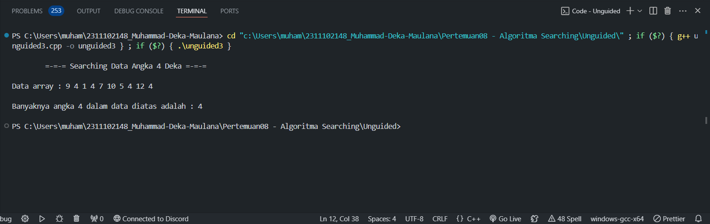

# <h1 align="center">Laporan Praktikum Modul 8 - Algoritma Searching</h1>
<p align="center">Muhammad Deka Maulana - 2311102148</p>

## Dasar Teori

### A. Pengertian Algoritma Searching

Algoritma searching adalah salah satu konsep dasar dalam ilmu komputer yang sangat penting. Dalam pemrograman, algoritma searching digunakan untuk mencari data yang terdapat dalam sebuah struktur data seperti array, list, atau tree.

Algoritma searching digunakan pada berbagai jenis aplikasi, mulai dari aplikasi sederhana hingga aplikasi kompleks seperti mesin searching. Dalam pembelajaran ilmu komputer, pemahaman tentang algoritma searching menjadi sangat penting karena dapat membantu dalam pemecahan masalah dan pengembangan aplikasi. Dalam artikel ini, kita akan membahas beberapa jenis algoritma searching yang umum digunakan.

Algoritma searching adalah serangkaian langkah atau instruksi yang digunakan untuk mencari suatu data atau informasi tertentu dalam struktur data seperti array, list, tree, atau database. Tujuan dari algoritma searching adalah untuk menemukan posisi atau keberadaan data yang dicari dalam struktur data dengan cara yang efisien dan efektif.

Algoritma searching digunakan pada berbagai jenis aplikasi, seperti mesin pencari, permainan, dan aplikasi bisnis. Pemahaman tentang algoritma searching sangat penting dalam ilmu komputer karena dapat membantu dalam pemecahan masalah dan pengembangan aplikasi.

### B. Jenis Algoritma Searching

### 1. Sequential Search

SequentialSearch adalah cara untuk  pencarian data dalam array 1 dimensi.  Data yang akan dicari nanti akan ditelusuri dalam semua elemen-elemen array  dari awal sampai akhir, dan data yang dicari tersebut tidak perlu diurutkan terlebih dahulu. Terdapat 2 kemungkinan yang akan terjadi dalam waktu pencarian data SequentialSearch, diantaranya yaitu :

a.	Best Case
Best case / kemungkinan terbaik akan terjadi apabila data yang dicari terletak pada index array yang paling depan, sehingga waktu yang dibutuhkan untuk mencari data sedikit. 

b.	Worse Case
Worse case / kemungkinan terburuk akan terjadi apabila data yang dicari terletak pada index array yang paling akhir, sehingga waktu yang dibutuhkan untuk mencari data akan sangat lama. Untuk meningkatkan efisiensi pencarian data pada SequentialSearch dapat dilakukan dengan cara menghentikan looping dengan menggunakan BREAK apabila data yang dicari sudah ketemu.


### 2. Binary Search

Binary Search adalah cara untuk pencarian data pada array yang sudah terurut. Salah satu syarat dalam Binary Search adalah data sudah dalam keadaan terurut. Dengan kata lain, apabila data belum dalam keadaan terurut, pencarian Binary tidak dapat dilakukan. Binary Search ini dilakukan untuk :

- Memperkecil jumlah operasi perbandingan yang harus dilakukan antara data yang dicari dengan data yang ada di dalam tabel, khususnya untuk jumlah data yang sangat besar ukurannya.
- Beban komputasi lebih kecil karena pencarian dilakukan dari depan, belakang, dan tengah.
- Prinsip dasarnya adalah melakukan proses pembagian ruang pencarian secara berulang-ulang sampai data ditemukan atau sampai pencarian tidak dapat dibagi lagi (berarti terdapat kemungkinan data tidak ditemukan).


## Guided

### 1. Buatlah sebuah project dengan menggunakan sequential search sederhana untuk melakukan pencarian data.

```C++
#include <iostream>

using namespace std;

int main() {
    int n = 10;
    int data[n] = {9,4,1,7,5,12,4,13,4,10};
    int cari = 10;
    bool ketemu = false;
    int i;

    for (i = 0; i < n; i++) {
        if (data[i] == cari) {
            ketemu = true;
            break;
        }
    }

    cout <<"Program Sequential Search" <<endl;
    cout <<"data : {9,4,1,7,5,12,4,13,4,10} " <<endl;

    if (ketemu) {
        cout <<"\nAngka " << cari <<" ditemukan pada indeks ke-" << i << endl;
    } else {
        cout << "data tidak ditemukan"<<br endl;
    }

    return 0;
}
```

Program di atas merupakan implementasi dari algoritma pencarian sekuensial (sequential search) untuk mencari suatu nilai dalam sebuah array. Algoritma ini bekerja dengan cara memeriksa setiap elemen dari array secara berurutan hingga nilai yang dicari ditemukan atau seluruh array telah diperiksa.</br>
Berikut adalah penjelasan langkah-langkahnya dalam program :

- n : Menampung jumlah elemen dalam array.
- data : Array integer berukuran n yang berisi data yang akan dicari.
- cari : Nilai integer yang ingin dicari dalam array.
- ketemu : Boolean untuk menandakan apakah nilai yang dicari telah ditemukan.
- i : Variabel iterator untuk loop.

Program ini menunjukkan implementasi sederhana dari algoritma Sequential Search untuk mencari nilai tertentu dalam array. Algoritma ini bekerja dengan cara membandingkan setiap elemen array dengan nilai yang dicari secara berurutan.

### 2. Buatlah sebuah project untuk melakukan pencarian data dengan menggunakan Binary Search.

```C++
#include<iostream>
#include<conio.h>
#include<iomanip>

using namespace std;

int dataArray[7] = {1, 8, 2, 5, 4, 9, 7};
int cari;

void Selection_Sort(){
    int temp, min, i, j;
    for(i = 0; i < 7; i++){
        min = i;
        for(j = i + 1; j < 7; j++){
            if(dataArray[j] < dataArray[min]){
                min = j;
            }
        }
        temp = dataArray[i];
        dataArray[i] = dataArray[min];
        dataArray[min] = temp;
    }
}

void BinarySearch(){
    int awal, akhir, tengah;
    bool b_flag = false;
    awal = 0;
    akhir = 6;
    while(!b_flag && awal <= akhir){
        tengah = (awal + akhir)/2;
        if(dataArray[tengah] == cari){
            b_flag = true;
        } else if(dataArray[tengah] < cari){
            awal = tengah + 1;
        } else {
            akhir = tengah - 1;
        }
    }
    if(b_flag){
        cout << "\nData ditemukan pada index ke-" << tengah << endl;
    } else {
        cout << "\nData tidak ditemukan" << endl;
    }
}

int main(){
    cout << "BINARY SEARCH" << endl;
    cout << "\nData : ";
    for(int x = 0; x < 7; x++){
        cout << setw(3) << dataArray[x];
    }
    cout << endl;

    cout << "Masukkan data yang ingin dicari : ";
    cin >> cari;
    
    cout << "\nData diurutkan : ";
    Selection_Sort();

    for(int x = 0; x < 7; x++){
        cout << setw(3) << dataArray[x];
    }
    cout <<br endl;
    BinarySearch();
    _getche();
    return 0;
}
```

Program di atas dibuat dengan menggunakan bahasa pemrograman C++ dan bertujuan untuk mencari data tertentu dalam sebuah array menggunakan metode Binary Search. Berikut adalah deskripsi detail dari program tersebut :

Program ini mengurutkan array `dataArray` menggunakan algoritma Selection Sort sebelum melakukan pencarian. Setelah pengurutan, nilai yang dicari akan dicari menggunakan algoritma Binary Search. Jika nilai tersebut ditemukan, program akan menampilkan indeks tempat nilai tersebut ditemukan; jika tidak, pesan bahwa nilai tidak ditemukan akan ditampilkan. Sebelumnya, program akan menampilkan data awal yang belum diurutkan dan meminta input dari pengguna untuk nilai yang dicari. Setelah itu, program akan menampilkan data yang telah diurutkan dan melakukan pencarian menggunakan Binary Search. Terakhir, program akan menahan tampilan layar sebelum selesai. Program ini merupakan contoh bagus tentang bagaimana algoritma yang berbeda dapat digunakan bersama untuk menyelesaikan masalah tertentu.

## Unguided 

### 1. Buatlah sebuah program untuk mencari sebuah huruf pada sebuah kalimat yang sudah di input dengan menggunakan Binary Search!

```C++

```

DESKERIPSI PROGRAM

#### Output:


### 2. Buatlah sebuah program yang dapat menghitung banyaknya huruf vocal dalam sebuah kalimat!

```C++

```

DESKRIPSI PROGRAM

#### Output:


### 3. Diketahui data = 9, 4, 1, 4, 7, 10, 5, 4, 12, 4. Hitunglah berapa banyak angka 4 dengan menggunakan algoritma Sequential Search!

```C++

```

DESKRIPSI PROGRAM

#### Output:



## Kesimpulan

## Referensi
[1] Naufal Fadhiil Nasrullah, 2023, "ALGORITMA PENCARIAN", https://www.researchgate.net/publication/377157930_ALGORITMA_PENCARIAN_IF4005_KELAS_IF_-IIIC_Disusun_Oleh_Naufal_Fadhiil_Nasrullah_220660121174_PROGRAM_STUDI_TEKNIK_INFORMATIKA_FAKULTAS_TEKNOLOGI_INFORMASI_UNIVERSITAS_SEBELAS_APRIL_UNSAP_SUMEDANG_2023.</br>
[2] Yoga Religia, 2019, "Pelita Teknologi: Jurnal Ilmiah Informatika, Arsitektur dan Lingkungan", http://jurnal.pelitabangsa.ac.id/index.php/pelitatekno/article/view/232/184.<br/>
[3] 