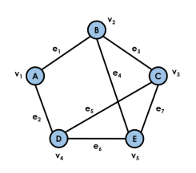
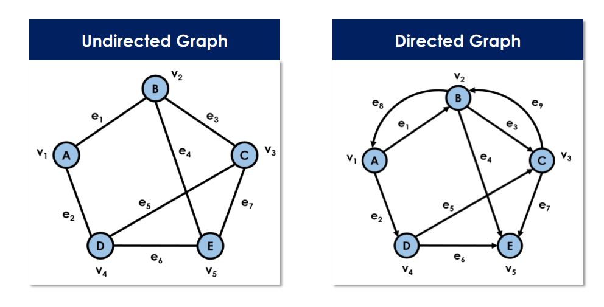
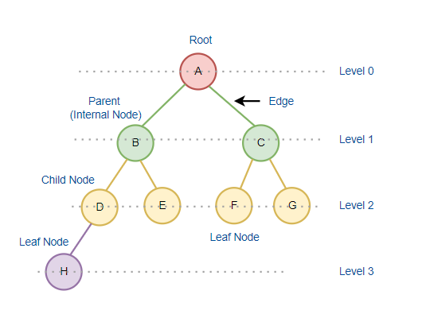
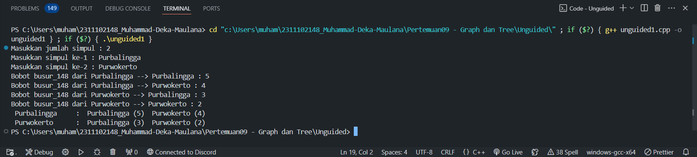
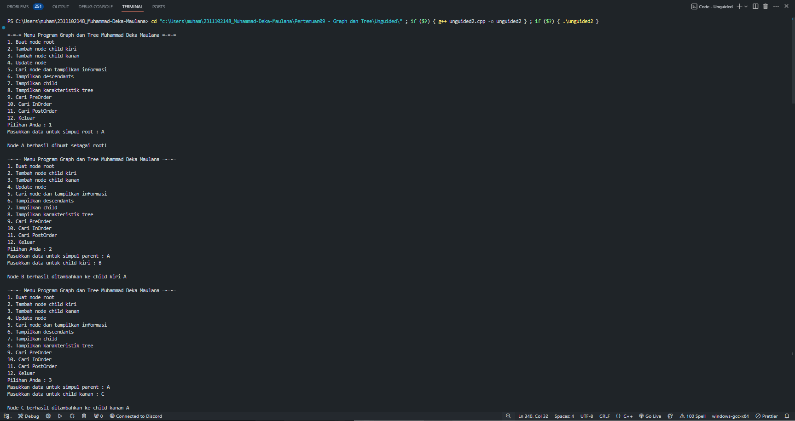
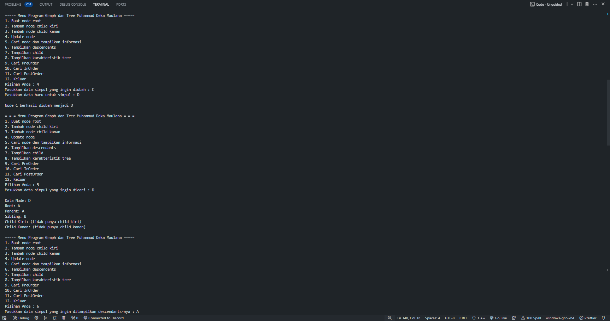
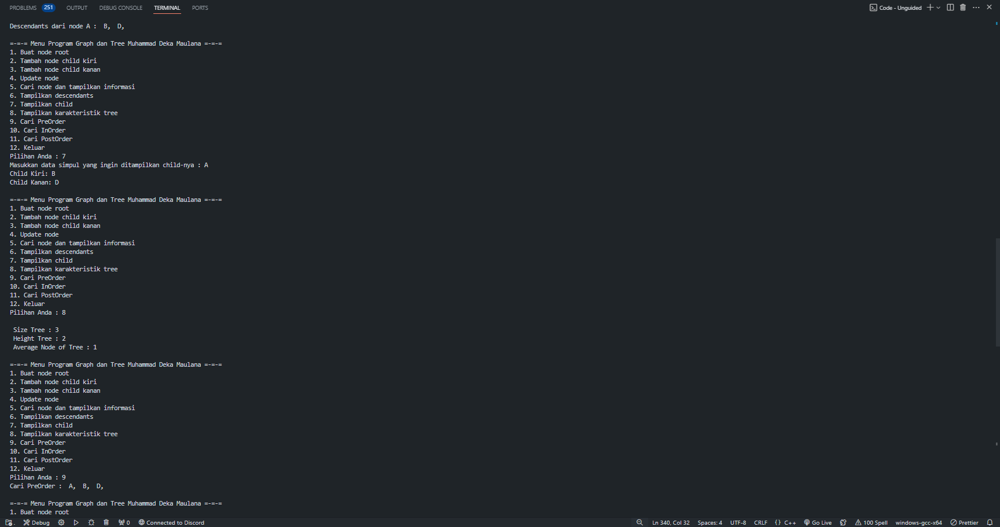
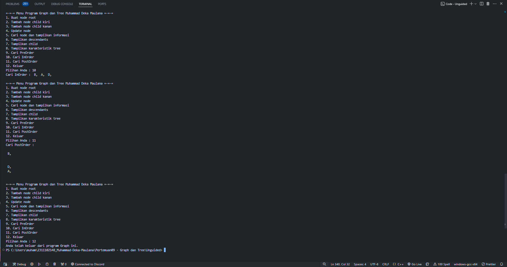

# <h1 align="center">Laporan Praktikum Modul 9 - Graph dan Tree</h1>
<p align="center">Muhammad Deka Maulana - 2311102148</p>

## Dasar Teori

### Pengertian Graph dan Tree

### Graph
Graph adalah cara mewakili hubungan yang ada di antara pasangan objek. Graph adalah seperangkat objek, yang disebut simpul (vertex), bersama dengan kumpulan koneksi berpasangan di antara mereka, yang disebut edge. Graph memiliki aplikasi dalam pemodelan banyak domain, termasuk pemetaan, transportasi, jaringan komputer, dan teknik listrik.
Graph G adalah kumpulan V dari simpul dan kumpulan E dari pasangan simpul dari V, yang disebut edge. Dengan demikian, graph adalah cara untuk mewakili koneksi atau hubungan antara pasangan objek dari beberapa set V. Secara kebetulan, beberapa buku menggunakan terminologi berbeda untuk graph dan merujuk pada apa yang kita sebut vertex sebagai node dan yang kita sebut edge sebagai arc.



### Jenis-Jenis Graph
1. Undirected Graph (Graph Tidak Berarah)
Graph Tak Berarah (undirected graph atau non-direct graph), adalah graph yang simpulnya hanya menghubungkan 2 vertex tanpa menunjukkan arah.
2. Directed Graph (Graph Berarah)
Graph Berarah (directed graph/digraph), adalah graph yang simpulnya tidak hanya menghubungkan 2 vertex tetapi juga menunjukkan arah.


Berikut adalah berbagai terminologi dalam graf :
- Dua buah simpul dari sautu graf dikatakan bertetangga (Adjacency) jika keduanya terhubung secara langsung.
- Sebuah sisi dapat dikatakan bersisian (Incidency) dengan salah satu dari dua simpul yang dihubungkan olehnya. 
- Jika sebuah simpul tidak mempunyai sisi yang bersisian dengannya, maka simpul tersebut disebut dengan simpul terpencil
- Graf kosong adalah graf yang sisinya merupakan himpunan kosong.
- Derajat (Degree) adalah jumlah sisi yang bersisian dengan simpul tersebut.
- Lintasan (Path) adalah jumlah sisi yang harus dilalui dari simpul asal ke simpul tujuan.
- Siklus (Cycle) adalah lintasan yang berawal dan berakhir di simpul yang sama.
- Keterhubungan (Connected) suatu simpul dikatakan ada jika terdapat lintasan dari simpul awal ke simpul tujuan.

### Tree
Pohon (tree) merupakan salah satu bentuk khusus dari struktur suatu graf. Misalkan A merupakan sebuah himpunan berhingga simpul (vertex) pada suatu graf G yang terhubung. Untuk setiap pasangan simpul di A dapat ditentukan suatu lintasan yang menghubungkan pasangan simpul tersebut. Suatu graf terhubung yang setiap pasangan simpulnya hanya dapat dihubungkan oleh suatu lintasan tertentu, maka graf tersebut dinamakan pohon (tree). Dengan kata lain, pohon (tree) merupakan graf tak-berarah yang terhubung dan tidak memiliki sirkuit.


### Jenis-Jenis Tree
Struktur data tree dapat diklasifikasikan ke dalam 4 jenis, yaitu:

1. General tree <br/>
Struktur data tree yang tidak memiliki batasan jumlah node pada hierarki tree disebut General tree. Setiap simpul atau node bebas memiliki berapapun child node. Tree jenis adalah superset dari semua jenis tree.

2. Binary tree  <br/>
Binary tree adalah jenis tree yang simpulnya hanya dapat memiliki paling banyak 2 simpul anak (child node). Kedua simpul tersebut biasa disebut simpul kiri (left node) dan simpul kanan (right node). Tree tipe ini lebih populer daripada jenis lainnya.

3. Balanced tree <br/>
Apabila tinggi dari subtree sebelah kiri dan subtree sebelah kanan sama atau kalaupun berbeda hanya berbeda 1, maka disebut sebagai balanced tree. 

4. Binary search tree <br/>
Sesuai dengan namanya, Binary search tree digunakan untuk berbagai algoritma pencarian dan pengurutan. Contohnya seperti AVL tree dan Red-black tree. Struktur data tree jenis ini memiliki nilai pada simpul sebelah kiri lebih kecil daripada induknya. Sedangkan nilai simpul sebelah kanan lebih besar dari induknya.


## Guided

### 1. Program Graph

```C++
#include <iostream> // Library standar yang digunakan untuk input dan output
#include <iomanip>  // Library standar yang digunakan untuk manipulasi input dan output

using namespace std; // Untuk mempersingkat penulisan kode program

string simpul[7] =
    {
        "Ciamis", "Bandung", "Bekasi", "Tasikmalaya", "Cianjur", "Purwokerto", "Yogyakarta"}; // Array yang berisi nama-nama simpul

int busur[7][7] =
    {
        {0, 7, 8, 0, 0, 0, 0},
        {0, 0, 5, 0, 0, 15, 0},
        {0, 6, 0, 0, 5, 0, 0},
        {0, 5, 0, 0, 2, 4, 0},
        {23, 0, 0, 10, 0, 0, 8},
        {0, 0, 0, 0, 7, 0, 3},
        {0, 0, 0, 0, 9, 4, 0}}; // Array yang berisi bobot dari busur

void tampilGraph() // Fungsi untuk menampilkan graph
{
    for (int baris = 0; baris < 7; baris++)
    {
        cout << " " << setiosflags(ios::left) << setw(15) << simpul[baris] << " : ";
        for (int kolom = 0; kolom < 7; kolom++)
        {
            if (busur[baris][kolom] != 0)
            {
                cout << " " << simpul[kolom] << "(" << busur[baris][kolom] << ") ";
            }
        }
        cout << endl;
    }
}

int main() // Fungsi utama program
{
    tampilGraph();
    return 0;
}
```

Program ini adalah sebuah program yang menampilkan graf berarah yang terdiri dari 7 simpul dan 12 busur. Untuk merepresentasikan graf tersebut, program menggunakan array 2 dimensi. Graf ini ditampilkan melalui fungsi bernama tampilGraph(). Simpul graf disimpan dalam sebuah array yang berisi nama-nama simpul, sementara busur disimpan dalam array yang memuat bobot antar simpul. Dalam fungsi tampilGraph(), graf ditampilkan menggunakan perulangan for. Pada bagian main() dari program, fungsi tampilGraph() dipanggil untuk menampilkan graf tersebut.

### 2. Program Tree

```C++
#include <iostream>
#include <iomanip>
using namespace std;
struct Pohon
{
    char data;
    Pohon *left, *right, *parent;
};
Pohon *root, *baru;
void init()
{
    root = NULL;
}
bool isEmpty()
{
    return root == NULL;
}
void buatNode(char data)
{
    if (isEmpty())
    {
        root = new Pohon();
        root->data = data;
        root->left = NULL;
        root->right = NULL;
        root->parent = NULL;
        cout << "\n Node " << data << " berhasil dibuat sebagai root."
            << endl;
    }
    else
    {
        cout << "\n Tree sudah ada!" << endl;
    }
}
Pohon *insertLeft(char data, Pohon *node)
{
    if (isEmpty())
    {
        cout << "\n Buat tree terlebih dahulu!" << endl;
        return NULL;
    }
    else
    {
        if (node->left != NULL)
        {
            cout << "\n Node " << node->data << " sudah ada child kiri !" << endl;
            return NULL;
        }
        else
        {
            Pohon *baru = new Pohon();
            baru->data = data;
            baru->left = NULL;
            baru->right = NULL;
            baru->parent = node;
            node->left = baru;
            cout << "\n Node " << data << " berhasil ditambahkan kechild kiri " << baru->parent->data << endl;
            return baru;
        }
    }
}
Pohon *insertRight(char data, Pohon *node)
{
    if (isEmpty())
    {
        cout << "\n Buat tree terlebih dahulu!" << endl;
        return NULL;
    }
    else
    {
        if (node->right != NULL)
        {
            cout << "\n Node " << node->data << " sudah ada child kanan !" << endl;
            return NULL;
        }
        else
        {
            Pohon *baru = new Pohon();
            baru->data = data;
            baru->left = NULL;
            baru->right = NULL;
            baru->parent = node;
            node->right = baru;
            cout << "\n Node " << data << " berhasil ditambahkan ke child kanan " << baru->parent->data << endl;
            return baru;
        }
    }
}
void update(char data, Pohon *node)
{
    if (isEmpty())
    {
        cout << "\n Buat tree terlebih dahulu!" << endl;
    }
    else
    {
        if (!node)
        {
            cout << "\n Node yang ingin diganti tidak ada!!" << endl;
        }
        else
        {
            char temp = node->data;
            node->data = data;
            cout << "\n Node " << temp << " berhasil diubah menjadi "
                << data << endl;
        }
    }
}
void retrieve(Pohon *node)
{
    if (isEmpty())
    {
        cout << "\n Buat tree terlebih dahulu!" << endl;
    }
    else
    {
        if (!node)
        {
            cout << "\n Node yang ditunjuk tidak ada!" << endl;
        }
        else
        {
            cout << "\n Data node : " << node->data << endl;
        }
    }
}
void find(Pohon *node)
{
    if (isEmpty())
    {
        cout << "\n Buat tree terlebih dahulu!" << endl;
    }
    else
    {
        if (!node)
        {
            cout << "\n Node yang ditunjuk tidak ada!" << endl;
        }
        else
        {
            cout << "\n Data Node : " << node->data << endl;
            cout << " Root : " << root->data << endl;
            if (!node->parent)
                cout << " Parent : (tidak punya parent)" << endl;
            else
                cout << " Parent : " << node->parent->data << endl;
            if (node->parent != NULL && node->parent->left != node &&
                node->parent->right == node)
                cout << " Sibling : " << node->parent->left->data << endl;
            else if (node->parent != NULL && node->parent->right != node && node->parent->left == node)
                cout << " Sibling : " << node->parent->right->data << endl;
            else
                cout << " Sibling : (tidak punya sibling)" << endl;
            if (!node->left)
                cout << " Child Kiri : (tidak punya Child kiri)" << endl;
            else
                cout << " Child Kiri : " << node->left->data << endl;
            if (!node->right)
                cout << " Child Kanan : (tidak punya Child kanan)" << endl;
            else
                cout << " Child Kanan : " << node->right->data << endl;
        }
    }
}
// Penelusuran (Traversal)
// preOrder
void preOrder(Pohon *node = root)
{
    if (isEmpty())
    {
        cout << "\n Buat tree terlebih dahulu!" << endl;
    }
    else
    {
        if (node != NULL)
        {
            cout << " " << node->data << ", ";
            preOrder(node->left);
            preOrder(node->right);
        }
    }
}
// inOrder
void inOrder(Pohon *node = root)
{
    if (isEmpty())
    {
        cout << "\n Buat tree terlebih dahulu!" << endl;
    }
    else
    {
        if (node != NULL)
        {
            inOrder(node->left);
            cout << " " << node->data << ", ";
            inOrder(node->right);
        }
    }
}
// postOrder
void postOrder(Pohon *node = root)
{
    if (isEmpty())
    {
        cout << "\n Buat tree terlebih dahulu!" << endl;
    }
    else
    {
        if (node != NULL)
        {
            postOrder(node->left);
            postOrder(node->right);
            cout << " " << node->data << ", ";
        }
    }
}
// Hapus Node Tree
void deleteTree(Pohon *node)
{
    if (isEmpty())
    {
        cout << "\n Buat tree terlebih dahulu!" << endl;
    }
    else
    {
        if (node != NULL)
        {
            if (node != root)
            {
                node->parent->left = NULL;
                node->parent->right = NULL;
            }
            deleteTree(node->left);
            deleteTree(node->right);
            if (node == root)
            {
                delete root;
                root = NULL;
            }
            else
            {
                delete node;
            }
        }
    }
}
// Hapus SubTree
void deleteSub(Pohon *node)
{
    if (isEmpty())
    {
        cout << "\n Buat tree terlebih dahulu!" << endl;
    }
    else
    {
        deleteTree(node->left);
        deleteTree(node->right);
        cout << "\n Node subtree " << node->data << " berhasil dihapus." << endl;
    }
}
void clear()
{
    if (isEmpty())
    {
        cout << "\n Buat tree terlebih dahulu!!" << endl;
    }
    else
    {
        deleteTree(root);
        cout << "\n Pohon berhasil dihapus." << endl;
    }
}

// Cek Size Tree
int size(Pohon *node = root)
{
    if (isEmpty())
    {
        cout << "\n Buat tree terlebih dahulu!!" << endl;
        return 0;
    }
    else
    {
        if (!node)
        {
            return 0;
        }
        else
        {
            return 1 + size(node->left) + size(node->right);
        }
    }
}
// Cek Height Level Tree
int height(Pohon *node = root)
{
    if (isEmpty())
    {
        cout << "\n Buat tree terlebih dahulu!" << endl;
        return 0;
    }
    else
    {
        if (!node)
        {
            return 0;
        }
        else
        {
            int heightKiri = height(node->left);
            int heightKanan = height(node->right);
            if (heightKiri >= heightKanan)
            {
                return heightKiri + 1;
            }
            else
            {
                return heightKanan + 1;
            }
        }
    }
}
// Karakteristik Tree
void characteristic()
{
    cout << "\n Size Tree : " << size() << endl;
    cout << " Height Tree : " << height() << endl;
    cout << " Average Node of Tree : " << size() / height() << endl;
}

int main()
{
    buatNode('A');
    Pohon *nodeB, *nodeC, *nodeD, *nodeE, *nodeF,
        *nodeG, *nodeH,
        *nodeI, *nodeJ;
    nodeB = insertLeft('B', root);
    nodeC = insertRight('C', root);
    nodeD = insertLeft('D', nodeB);
    nodeE = insertRight('E', nodeB);
    nodeF = insertLeft('F', nodeC);
    nodeG = insertLeft('G', nodeE);
    nodeH = insertRight('H', nodeE);
    nodeI = insertLeft('I', nodeG);
    nodeJ = insertRight('J', nodeG);
    update('Z', nodeC);
    update('C', nodeC);
    retrieve(nodeC);
    find(nodeC);
    cout << "\n PreOrder :" << endl;
    preOrder(root);
    cout << "\n"
        << endl;
    cout << " InOrder :" << endl;
    inOrder(root);
    cout << "\n"
        << endl;
    cout << " PostOrder :" << endl;
    postOrder(root);
    cout << "\n"
        << endl;
    characteristic();
    deleteSub(nodeE);
    cout << "\n PreOrder :" << endl;
    preOrder();
    cout << "\n"
        << endl;
    characteristic();
}
```

Program di atas merupakan implementasi struktur data pohon menggunakan bahasa pemrograman C++. Berbagai fungsi digunakan dalam program ini, seperti pembuatan node baru dengan fungsi buatNode, penambahan node baru ke anak kiri dan kanan dengan fungsi insertLeft dan insertRight, serta pengubahan data node dengan fungsi update, pengambilan data node dengan fungsi retrieve, dan pencarian data node dengan fungsi find. Selain itu, terdapat pula fungsi untuk penelusuran pohon menggunakan fungsi preOrder, inOrder, dan postOrder. Di samping itu, terdapat fungsi untuk menghapus pohon dan subpohon dengan fungsi deleteTree dan deleteSub, serta membersihkan pohon dengan fungsi clear. Fungsi size digunakan untuk mengetahui ukuran pohon, sedangkan fungsi height digunakan untuk mengetahui tinggi pohon. Terakhir, terdapat fungsi characteristic yang digunakan untuk mengecek karakteristik pohon.

Pada fungsi main, berbagai fungsi tersebut dipanggil sesuai dengan kebutuhan program. Dengan demikian, program dapat melakukan berbagai operasi yang berkaitan dengan struktur data pohon, seperti penambahan, penghapusan, penelusuran, dan pengecekan karakteristik pohon. Ini memungkinkan penggunaan struktur data pohon dalam berbagai aplikasi yang memerlukan organisasi data yang hierarkis dan berhirarkis.

## Unguided 

### 1. Buatlah program graph dengan menggunakan inputan user untuk menghitung jarak dari sebuah kota ke kota lainnya.

```C++
/*
Muhammad Deka Maulana - 2311102148
*/

#include <iostream>
#include <iomanip>

using namespace std;

string simpulKota_148[100];
int busur_148[100][100];
int jumlahSimpul_148 = 0; 
void hitungJarak_148(){
    for (int baris = 0; baris < jumlahSimpul_148; baris++){
        cout << " " << setiosflags(ios::left) << setw(15) << simpulKota_148[baris] << " : ";
        for (int kolom = 0; kolom < jumlahSimpul_148; kolom++){
            if (busur_148[baris][kolom] != 0){
                cout << " " << simpulKota_148[kolom] << " (" << busur_148[baris][kolom] << ") ";
            }
        }
        cout << endl;
    }
}

int main(){
    cout << "Masukkan jumlah simpul : ";
    cin >> jumlahSimpul_148;
    for (int i = 0; i < jumlahSimpul_148; i++){
        cout << "Masukkan simpul ke-" << i+1 << " : ";
        cin >> simpulKota_148[i];
    }
    for (int i = 0; i < jumlahSimpul_148; i++){
        for (int j = 0; j < jumlahSimpul_148; j++){
            cout << "Bobot busur_148 dari " << simpulKota_148[i] << " --> " << simpulKota_148[j] << " : ";
            cin >> busur_148[i][j];
        } 
    }
    hitungJarak_148();
    return 0;
}

```

Program di atas adalah sebuah program sederhana dalam bahasa C++ yang digunakan untuk merepresentasikan graf berbentuk matriks ketetanggaan yang menggambarkan jarak antar simpul kota. Pengguna diminta untuk memasukkan jumlah simpul (kota) yang diinginkan, kemudian nama-nama kota tersebut. Selanjutnya, pengguna diminta untuk memasukkan bobot busur (jarak) antara setiap pasangan kota. Setelah semua data dimasukkan, program akan menampilkan matriks ketetanggaan yang merepresentasikan jarak antar kota berdasarkan input pengguna. Fungsi `hitungJarak_148()` bertugas untuk mencetak matriks ketetanggaan, sedangkan `main()` berfungsi sebagai fungsi utama yang mengatur alur program, menerima input pengguna, dan memanggil fungsi-fungsi yang diperlukan.

#### Output:



### 2. Modifikasi guided tree diatas dengan program menu menggunakan input data tree dari user dan berikan fungsi tambahan untuk menampilkan node child dan descendant dari node yang diinput kan!

```C++
/*
Muhammad Deka Maulana - 2311102148
*/

#include <iostream>
#include <iomanip>

using namespace std;

struct Pohon
{
    char data;
    Pohon *left, *right, *parent;
};

Pohon *root, *baru;

void init() // inisialisasi
{
    root = NULL;
}

bool isEmpty() // cek apakah tree kosong
{
    return root == NULL;
}

void buatNode(char data) // membuat node root
{
    if (isEmpty())
    {
        root = new Pohon();
        root->data = data;
        root->left = NULL;
        root->right = NULL;
        root->parent = NULL;
        cout << "\nNode " << data << " berhasil dibuat sebagai root!" << endl;
    }
    else
    {
        cout << "\nTree sudah ada!" << endl;
    }
}

Pohon *findNode(Pohon *node, char data) // mencari node
{
    if (node == NULL) return NULL;
    if (node->data == data) return node;

    Pohon *foundNode = findNode(node->left, data);
    if (foundNode == NULL)
        foundNode = findNode(node->right, data);

    return foundNode;
}

Pohon *insertLeft(char data, Pohon *node) // menambah child kiri
{
    if (isEmpty())
    {
        cout << "\nBuat tree terlebih dahulu!" << endl;
        return NULL;
    }
    else
    {
        if (node->left != NULL)
        {
            cout << "\nNode " << node->data << " sudah ada child kiri!" << endl;
            return NULL;
        }
        else
        {
            Pohon *baru = new Pohon();
            baru->data = data;
            baru->left = NULL;
            baru->right = NULL;
            baru->parent = node;
            node->left = baru;
            cout << "\nNode " << data << " berhasil ditambahkan ke child kiri " << baru->parent->data << endl;
            return baru;
        }
    }
}

Pohon *insertRight(char data, Pohon *node) // menambah child kanan
{
    if (isEmpty())
    {
        cout << "\nBuat tree terlebih dahulu!" << endl;
        return NULL;
    }
    else
    {
        if (node->right != NULL)
        {
            cout << "\nNode " << node->data << " sudah ada child kanan!" << endl;
            return NULL;
        }
        else
        {
            Pohon *baru = new Pohon();
            baru->data = data;
            baru->left = NULL;
            baru->right = NULL;
            baru->parent = node;
            node->right = baru;
            cout << "\nNode " << data << " berhasil ditambahkan ke child kanan " << baru->parent->data << endl;
            return baru;
        }
    }
}

void update(char data, Pohon *node) // mengupdate node
{
    if (isEmpty())
    {
        cout << "\nBuat tree terlebih dahulu!" << endl;
    }
    else
    {
        if (!node)
        {
            cout << "\nNode yang ingin diganti tidak ada!!" << endl;
        }
        else
        {
            char temp = node->data;
            node->data = data;
            cout << "\nNode " << temp << " berhasil diubah menjadi " << data << endl;
        }
    }
}

void find(Pohon *node) // mencari node dan menampilkan informasi node
{
    if (isEmpty())
    {
        cout << "\nBuat tree terlebih dahulu!" << endl;
    }
    else
    {
        if (!node)
        {
            cout << "\nNode yang ditunjuk tidak ada!" << endl;
        }
        else
        {
            cout << "\nData Node: " << node->data << endl;
            cout << "Root: " << root->data << endl;
            if (!node->parent)
                cout << "Parent: (tidak punya parent)" << endl;
            else
                cout << "Parent: " << node->parent->data << endl;
            if (node->parent != NULL && node->parent->left != node && node->parent->right == node)
                cout << "Sibling: " << node->parent->left->data << endl;
            else if (node->parent != NULL && node->parent->right != node && node->parent->left == node)
                cout << "Sibling: " << node->parent->right->data << endl;
            else
                cout << "Sibling: (tidak punya sibling)" << endl;
            if (!node->left)
                cout << "Child Kiri: (tidak punya child kiri)" << endl;
            else
                cout << "Child Kiri: " << node->left->data << endl;
            if (!node->right)
                cout << "Child Kanan: (tidak punya child kanan)" << endl;
            else
                cout << "Child Kanan: " << node->right->data << endl;
        }
    }
}

void printDescendants(Pohon *node) // menampilkan descendants
{
    void preOrder(Pohon * node);

    if (isEmpty())
    {
        cout << "\nBuat tree terlebih dahulu!" << endl;
    }
    else if (!node)
    {
        cout << "\nNode yang ditunjuk tidak ada!" << endl;
    }
    else
    {
        cout << "Descendants dari node " << node->data << " : ";
        if (node->left) preOrder(node->left);
        if (node->right) preOrder(node->right);
        cout << endl;
    }
}

void printChild(Pohon *node) // menampilkan child
{
    if (isEmpty())
    {
        cout << "\nBuat tree terlebih dahulu!" << endl;
    }
    else if (!node)
    {
        cout << "\nNode yang ditunjuk tidak ada!" << endl;
    }
    else
    {
        if (node->left)
        {
            cout << "Child Kiri: " << node->left->data << endl;
        }
        else
        {
            cout << "Child Kiri: (tidak ada)" << endl;
        }

        if (node->right)
        {
            cout << "Child Kanan: " << node->right->data << endl;
        }
        else
        {
            cout << "Child Kanan: (tidak ada)" << endl;
        }
    }
}

// Cek Size Tree
int size(Pohon *node = root)
{
    if (isEmpty())
    {
        cout << "\n Buat tree terlebih dahulu!!" << endl;
        return 0;
    }
    else
    {
        if (!node)
        {
            return 0;
        }
        else
        {
            return 1 + size(node->left) + size(node->right);
        }
    }
}

// Cek Height Level Tree
int height(Pohon *node = root)
{
    if (isEmpty())
    {
        cout << "\n Buat tree terlebih dahulu!" << endl;
        return 0;
    }
    else
    {
        if (!node)
        {
            return 0;
        }
        else
        {
            int heightKiri = height(node->left);
            int heightKanan = height(node->right);
            if (heightKiri >= heightKanan)
            {
                return heightKiri + 1;
            }
            else
            {
                return heightKanan + 1;
            }
        }
    }
}

// Penelusuran (Traversal)
// preOrder
void preOrder(Pohon *node)
{
    if (node != NULL)
    {
        cout << " " << node->data << ", ";
        preOrder(node->left);
        preOrder(node->right);
    }
}


// inOrder
void inOrder(Pohon *node = root)
{
    if (node != NULL)
    {
        inOrder(node->left);
        cout << " " << node->data << ", ";
        inOrder(node->right);
    }
}

// postOrder
void postOrder(Pohon *node = root)
{
    if (node != NULL)
    {
        postOrder(node->left);
        postOrder(node->right);
        cout << " " << node->data << ", ";
    }
    cout << endl;
}

// Karakteristik Tree
void characteristic()
{
    cout << "\n Size Tree : " << size() << endl;
    cout << " Height Tree : " << height() << endl;
    cout << " Average Node of Tree : " << size() / height() << endl;
}

int main() {
    int choise_148;
    char data_148, parentdata_148;
    Pohon *parentNode_148;

    init();

    do {
        cout << "\n=-=-= Menu Program Graph dan Tree Muhammad Deka Maulana =-=-=\n";
        cout << "1. Buat node root\n";
        cout << "2. Tambah node child kiri\n";
        cout << "3. Tambah node child kanan\n";
        cout << "4. Update node\n";
        cout << "5. Cari node dan tampilkan informasi\n";
        cout << "6. Tampilkan descendants\n";
        cout << "7. Tampilkan child\n";
        cout << "8. Tampilkan karakteristik tree\n";
        cout << "9. Cari PreOrder\n";
        cout << "10. Cari InOrder\n";
        cout << "11. Cari PostOrder\n";
        cout << "12. Keluar\n";
        cout << "Pilihan Anda : ";
        cin >> choise_148;

        switch (choise_148) {

            case 1:
                if (isEmpty()) {
                    cout << "Masukkan data untuk simpul root : ";
                    cin >> data_148;
                    buatNode(data_148);
                } else {
                    cout << "Tree ternyata sudah ada\n";
                }
                break;

            case 2:
                cout << "Masukkan data untuk simpul parent : ";
                cin >> parentdata_148;
                parentNode_148 = findNode(root, parentdata_148);
                if (parentNode_148)
                {
                    cout << "Masukkan data untuk child kiri : ";
                    cin >> data_148;
                    insertLeft(data_148, parentNode_148);
                }
                else
                {
                    cout << "Simpul parent tidak ada.\n";
                }
                break;

            case 3:
                cout << "Masukkan data untuk simpul parent : ";
                cin >> parentdata_148;
                parentNode_148 = findNode(root, parentdata_148);
                if (parentNode_148)
                {
                    cout << "Masukkan data untuk child kanan : ";
                    cin >> data_148;
                    insertRight(data_148, parentNode_148);
                }
                else
                {
                    cout << "Simpul parent tidak ada.\n";
                }
                break;

            case 4:
                cout << "Masukkan data simpul yang ingin diubah : ";
                cin >> data_148;
                parentNode_148 = findNode(root, data_148);
                if (parentNode_148)
                {
                    cout << "Masukkan data baru untuk simpul : ";
                    cin >> data_148;
                    update(data_148, parentNode_148);
                }
                else
                {
                    cout << "Simpul tidak ada.\n";
                }
                break;

            case 5:
                cout << "Masukkan data simpul yang ingin dicari : ";
                cin >> data_148;
                parentNode_148 = findNode(root, data_148);
                find(parentNode_148);
                break;

            case 6:
                cout << "Masukkan data simpul yang ingin ditampilkan descendants-nya : ";
                cin >> data_148;
                parentNode_148 = findNode(root, data_148);
                printDescendants(parentNode_148);
                break;

            case 7:
                cout << "Masukkan data simpul yang ingin ditampilkan child-nya : ";
                cin >> data_148;
                parentNode_148 = findNode(root, data_148);
                printChild(parentNode_148);
                break;
                
            case 8:
                characteristic();
                break;

            case 9:
                cout << "Cari PreOrder : ";
                preOrder(root);
                cout << endl;
                break;

            case 10:
                cout << "Cari InOrder : ";
                inOrder(root);
                cout << endl;
                break;

            case 11:
                cout << "Cari PostOrder : ";
                postOrder(root);
                cout << endl;
                break;

            case 12:
                cout << "Anda telah keluar dari program Graph ini.\n";
                break;
            default:
                cout << "Pilihan anda tidak sesuai.\n";
                break;
        }
    } while (choise_148 != 12);

    return 0;
}
```

Program ini mirip dengan yang telah diarahkan sebelumnya, tetapi sekarang telah diperbarui dengan tambahan beberapa fungsi baru seperti printdescendants dan printchild. Ini membuatnya memiliki total 12 fungsi untuk mengelola pohon melalui menu yang tersedia. Fungsi-fungsi ini mencakup pembuatan node baru dengan buatNode, penambahan child kiri dan kanan dengan insertLeft dan insertRight, pengubahan node dengan update, pencarian node dan tampilan informasi dengan find, tampilan turunan dari node dengan printDescendants, tampilan child dari node dengan printChild, pengecekan ukuran tree dengan size, pengecekan tinggi level tree dengan height, penelusuran pohon dengan preOrder, inOrder, dan postOrder, serta tampilan karakteristik tree dengan characteristic.

Dalam fungsi utama main, dibuat sebuah menu dengan 12 pilihan untuk mengelola pohon. Kemudian, fungsi-fungsi ini dipanggil sesuai kebutuhan program. Dengan menu ini, pengguna dapat dengan mudah mengelola dan memanipulasi struktur pohon sesuai dengan kebutuhan mereka.

#### Output:






## Kesimpulan

Pemahaman tentang struktur data tree dan graph sangat penting dalam pengembangan perangkat lunak dan pemrosesan informasi. Tree memberikan kerangka kerja hierarkis untuk menyusun data dengan baik, sementara graph memberikan representasi lebih luas tentang hubungan antara objek. Dengan pengetahuan tentang operasi dasar seperti penyisipan, penghapusan, dan penelusuran, serta jenis-jenis penelusuran seperti inorder, postorder, dan preorder, pengembang dapat mengimplementasikan dan memanipulasi struktur data tree dan graph secara efektif dalam pemrograman.

Dalam pengembangan perangkat lunak, pemahaman tentang tree dan graph sangat diperlukan untuk merancang algoritma yang efisien dan mengatasi berbagai tantangan dalam pemrosesan data. Kemampuan untuk menerapkan konsep-konsep seperti representasi graf dengan matriks dan linked list, serta operasi dasar pada tree, memungkinkan pengembang untuk menghadapi masalah kompleks dan membangun solusi yang efisien. Pemahaman yang baik tentang materi ini memberikan dasar yang kokoh bagi pengembang untuk menjelajahi berbagai aplikasi, mulai dari analisis jaringan hingga pengembangan algoritma pencarian dan pengurutan data. Dengan memanfaatkan konsep-konsep ini secara efektif, pengembang dapat menciptakan solusi yang inovatif dan terukur dalam pemrosesan informasi modern.

## Referensi
[1] Muhammad Althariq Fairuz, 2023-2024, "Aplikasi Undirected Graph untuk Hubungan
Pertemanan pada Facebook"</br>
[2] Prio Handoko, S.Kom., M.T.I., 2020, "STRUKTUR DATA & ALGORITMA-GRAPH"<br/>
[3] Muhammad Nugraha, 2021. "Dasar Pemrograman Dengan C++, Materi Paling Dasar untuk Menjadi Programmer Berbagai Platform".