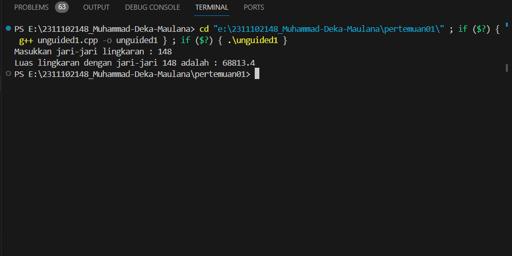
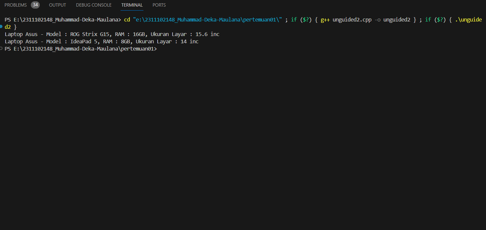
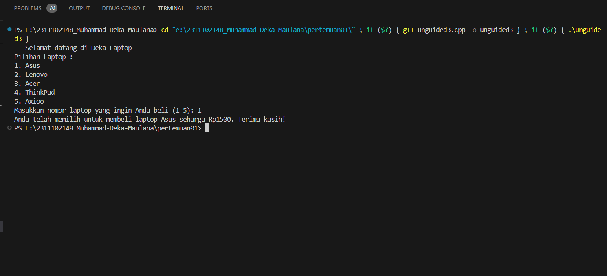

# <h1 align="center">Laporan Praktikum Modul 1 - Tipe Data</h1>
<p align="center">Muhammad Deka Maulana - 2311102148</p>

## Dasar Teori

Tipe data adalah suatu memori atau media pada komputer yang digunakan untuk menampung informasi atau data sementara. Tipe data berfungsi untuk mempermudah dalam mengelola dan mengolah data yang akan digunakan dalam program. Setiap tipe data memiliki karakteristik dan fungsi yang berbeda, yang mempermudah dalam mengelola data yang sesuai dengan kebutuhan program.
Berikut ini adalah macam-macam tipe data beserta penjelasannya yang terdapat pada C++ :

1. Tipe data primitif<br/>
Tipe data primitif adalah tipe data bawaan bahasa pemrograman dan bisa langsung digunakan programmer untuk mendeklarasikan variabel. 
Dalam C++, terdapat beberapa tipe data yang termasuk tipe data primitif, yaitu:
    - Int
    - Float
    - Double
    - Boolean
    - Char
    - Void

2. Tipe Data Abstrak<br/>
Tipe data abstrak adalah tipe data yang berisi nilai yang tidak dapat langsung ditentukan. Ini termasuk jenis data seperti array, object, dan class. Tipe data abstrak hanya menyediakan informasi mengenai jenis data, namun tidak menyediakan informasi mengenai nilai data.
Berikut adalah contoh tipe data abstrak :
    - Array
    - Object
    - Class

3. Tipe Data Koleksi<br/>
Tipe data koleksi adalah tipe data yang berisi kumpulan data yang dapat diakses secara berurutan. Ini termasuk jenis data seperti array, linked list, stack, queue, dan hash table. Tipe data koleksi memiliki sifat mutable, yang berarti nilainya dapat diubah setelah ditetapkan. 
Berikut contoh tipe data koleksi adalah :
    - Array
    - Linked list
    - Stack
    - Queue
    - Hash table.

## Guided 

### 1. Tipe Data Primitif

```C++
#include <iostream>
#include <iomanip>

using namespace std;

int main(){
    char op;
    float num1, num2;

    cout << "enter operator (+, -, *, /) : ";
    cin >> op;

    cout << "Enter two operands : ";
    cin >> num1 >> num2;

    switch (op) {
        case '+':
            cout << "Result: " << num1 + num2;
            break;
        case '-':
            cout << "Result: " << num1 - num2;
            break;
        case '*':
            cout << "Result: " << num1 * num2;
            break;
        case '/':
            if (num2 != 0) {
                cout << "Result: " << fixed << setprecision(2) <<
num1 / num2;
            } else {
                cout << "Error! Division by zero is not allowed.";
            }
            break;
        default:
            cout << "Error! Operator is not correct";
    } 
return 0;
}
```
Kode di atas di gunakan untuk memilih operasi penambahan (+), pengurangan (-), perkalian (*), dan pembagian (/) dapat dipilih dengan menggunakan kode di atas. Jika pengguna sudah menginput dua angka saat penginputan cin, keempat operasi ini akan berjalan. Program ini juga memiliki dua tipe data dasar: char dan float. Char digunakan saat memilih switch case, dan float digunakan sebagai tipe data untuk dua angka yang diinput pengguna.

### 2. Tipe Data Abstrak

```C++
#include <stdio.h>
#include <string.h>
//Struct
struct Mahasiswa
{
    char name[50];
    char address[100];
    int age;
};
int main()
{

    struct Mahasiswa mhs1, mhs2;

    strcpy(mhs1.name, "Dian");
    strcpy(mhs1.address, "Mataram");
    mhs1.age = 22;
    strcpy(mhs2.name, "Bambang");
    strcpy(mhs2.address, "Surabaya");
    mhs2.age = 23;

    printf("## Mahasiswa 1 ##\n");
    printf("Nama: %s\n", mhs1.name);
    printf("Alamat: %s\n", mhs1.address);
    printf("Umur: %d\n", mhs1.age);
    printf ("\n");
    printf("## Mahasiswa 2 ##\n");
    printf("Nama: %s\n", mhs2.name);
    printf("Alamat: %s\n", mhs2.address);
    printf("Umur: %d\n", mhs2.age);
return 0;
}
```
Kode yang disebutkan di atas digunakan untuk mencetak isi struct. Salah satu contoh tipe data abstrak adalah struktur. Struktur mahasiswa ada dalam kode di atas. Struktur siswa ini memiliki tiga nilai: char nama berukuran 50, char address berukuran 50, dan int usia. Kemudian, nilai diisi pada int main, dan struktur siswa dideklarasikan dengan dua objek: mhs1 bernama Dian dan mhs2 bernama Bambang.

### 3. Tipe Data Koleksi

```C++
#include <iostream>
#include <array>
using namespace std;

int main() {
    int nilai[5];
    nilai[0] = 23;
    nilai[1] = 50;
    nilai[2] = 34;
    nilai[3] = 78;
    nilai[4] = 90;

    cout << "Isi array pertama : " << nilai[0] << endl;
    cout << "Isi array kedua : " << nilai[1] << endl;
    cout << "Isi array ketiga : " << nilai[2] << endl;
    cout << "Isi array keempat : " << nilai[3] << endl;
    cout << "Isi array kelima : " << nilai[4] << endl;
    
return 0;
}
```
Kode di atas mencetak isi dari sebuah array, yang merupakan salah satu contoh tipe data koleksi. Kode ini juga menggunakan library array untuk membantu proses pemrogramannya. Nilai 23, 50, 34, 78, dan 90 termasuk dalam array nilai. lalu di deklarasikan dibawahnya.

## Unguided 

### 1. Buatlah program menggunakan tipe data primitif minimal dua fungsi dan bebas. Menampilkan program, jelaskan program tersebut dan ambil kesimpulan dari materi tipe data primitif!

```C++
/*
oleh Muhammad Deka Maulana - 2311102148
*/

#include <iostream>

// library untuk fungsi matematika
#include <cmath>

using namespace std;

// fungsi untuk menghitung luas lingkaran
double hitungLuasLingkaran_148(double jariJari_148) {
    const double PI = 3.14159;
    return PI * pow(jariJari_148, 2);
}

// fungsi untuk menampilkan hasil perhitungan
void tampilkanHasil_148(double jariJari_148, double luas_148) {
    cout << "Luas lingkaran dengan jari-jari " << jariJari_148 << " adalah : " << luas_148 << endl;
}

int main() {
    // input
    double jariJari_148;
    cout << "Masukkan jari-jari lingkaran : ";
    cin >> jariJari_148;

    // memanggil fungsi untuk menghitung luas lingkaran
    double luas_148 = hitungLuasLingkaran_148(jariJari_148);

    // memanggil fungsi untuk menampilkan hasil
    tampilkanHasil_148(jariJari_148, luas_148);

    return 0;
} 
```
#### Output:


Kode di atas meminta pengguna untuk memasukkan nilai jari-jari lingkaran. Setelah pengguna memberikan input, program menghitung luas lingkaran menggunakan rumus \( \pi r^2 \) dengan nilai pi sebesar 3.14159, dan kemudian menampilkan hasilnya. Hasil output program adalah kalimat yang memberitahu pengguna luas lingkaran dengan jari-jari yang telah dimasukkan. Sebagai contoh, jika pengguna memasukkan jari-jari 148, program akan menampilkan pesan: "Luas lingkaran dengan jari-jari 148 adalah: 68813.4." Pesan ini memberikan informasi yang jelas kepada pengguna tentang hasil perhitungan luas lingkaran berdasarkan input yang diberikan.

## Kesimpulan Tipe Data Primitif<br/>
Tipe data primitif adalah tipe data yang sudah ditentukan oleh sistem. Ini tersedia dalam banyak bahasa pemrograman dan merupakan komponen dasar untuk menyimpan nilai sederhana.

### 2. Jelaskan fungsi dari class dan struct secara detail dan berikan contoh programnya!

```C++
/*
oleh Muhammad Deka Maulana - 2311102148
*/

// contoh program class dan struct
#include <iostream>
#include <string>
using namespace std;

// class untuk laptop asus
class LaptopAsus_148 {
public:
    // data laptop
    string model;
    int ram;
    double ukuranLayar;

    // metode laptop
    void display() {
        cout << "Laptop Asus - Model : " << model << ", RAM : " << ram << "GB, Ukuran Layar : " << ukuranLayar << " inc" << endl;
    }
};

// struct untuk laptop lenovo
struct LaptopLenovo_148 {
    // data laptop
    string model;
    int ram;
    double ukuranLayar;

    // metode laptop
    void display() {
        cout << "Laptop Asus - Model : " << model << ", RAM : " << ram << "GB, Ukuran Layar : " << ukuranLayar << " inc" << endl;
    }
};

int main() {
    // membuat objek dari class LaptopAsus_148
    LaptopAsus_148 asus;
    asus.model = "ROG Strix G15";
    asus.ram = 16;
    asus.ukuranLayar = 15.6;
    asus.display();

    // Membuat objek dari struct LaptopLenovo_148
    LaptopLenovo_148 lenovo;
    lenovo.model = "IdeaPad 5";
    lenovo.ram = 8;
    lenovo.ukuranLayar = 14.0;
    lenovo.display();

    return 0;
}
```
#### Output:


Program ini merupakan contoh implementasi bahasa pemrograman C++, di mana dua struktur data, yaitu `class` dan `struct`, digunakan untuk merepresentasikan informasi tentang laptop dari merek Asus dan Lenovo. Melalui pembuatan objek dari keduanya, program mengilustrasikan cara mengorganisir data seperti model, ukuran RAM, dan ukuran layar dalam suatu entitas yang dapat memiliki metode anggota untuk menampilkan informasi terkait. Dengan demikian, program ini membantu dalam memahami konsep dasar penggunaan `class` dan `struct` untuk menyusun dan mengelola data terstruktur, sesuai dengan prinsip-prinsip dasar pemrograman berorientasi objek.
A. Fungsi dari Class<br/>
class adalah tipe data yang dapat menggabungkan data (variabel) dan fungsi (metode) dalam satu entitas. Secara default, anggota class bersifat private, artinya hanya dapat diakses dari dalam class tersebut. Namun, dapat diubah menjadi public atau protected.
B. Fungsi dari Struct<br/>
juga digunakan untuk menggabungkan data dan fungsi, tetapi secara default semua anggota bersifat public. Oleh karena itu, semua anggota dapat diakses dari luar struct tanpa perlu hak akses tambahan.

### 3. Buat dan jelaskan program menggunakan fungsi map dan jelaskan perbedaan dari array dengan map!

```C++
/*
oleh Muhammad Deka Maulana - 2311102148
*/

// contoh program fungsi map
#include <iostream>
#include <map>

using namespace std;

int main() {
    cout << "---Selamat datang di Deka Laptop---" << endl;

    // deklarasi map dan pilihan laptop
    map<int, pair<string, double>> pilihanLaptop_148 = {
        {1, {"Asus", 1500.0}},
        {2, {"Lenovo", 1200.0}},
        {3, {"Acer", 1000.0}},
        {4, {"ThinkPad", 2000.0}},
        {5, {"Axioo", 800.0}}
    };

    // menampilkan pilihan laptop
    cout << "Pilihan Laptop :" << endl;
    for (const auto& entry : pilihanLaptop_148) {
        cout << entry.first << ". " << entry.second.first << endl;
    }

    // input pilihan
    int pilihan;
    cout << "Masukkan nomor laptop yang ingin Anda beli (1-5): ";
    cin >> pilihan;

    // memeriksa dan menampilkan hasil
    auto it = pilihanLaptop_148.find(pilihan);
    if (it != pilihanLaptop_148.end()) {
        cout << "Anda telah memilih untuk membeli laptop " << it->second.first << " seharga Rp" << it->second.second << ". Terima kasih!" << endl;
    } else {
        cout << "Pilihan tidak valid. Silakan masukkan nomor laptop yang benar." << endl;
    }

    return 0;
}
```

#### Output:


Program C++ di atas adalah program sederhana untuk memfasilitasi pembelian laptop. Program menggunakan struktur data map untuk menyimpan pilihan laptop beserta nama dan harganya. Pengguna diminta memilih nomor laptop dari pilihan yang ditampilkan, dan program kemudian memeriksa kevalidan pilihan. Jika nomor laptop valid, program memberikan informasi tentang laptop yang dibeli, termasuk nama laptop dan harganya dalam mata uang Rupiah. Jika nomor laptop tidak valid, program memberikan pesan kesalahan. Program tersebut dirancang untuk memberikan pengalaman pengguna yang interaktif dalam memilih dan membeli laptop dari opsi yang telah ditentukan.

Fungsi Map :
- map adalah struktur data di C++ yang menyimpan data dalam bentuk pasangan kunci-nilai.
- Fungsi map memungkinkan penyimpanan dan pengaksesan data dengan efisiensi tinggi berdasarkan kunci.


Perbedaan antara Array dan Map :
1. Array :
    - Memiliki indeks berurutan (integer) untuk mengakses elemen.
    - Ukuran array tetap dan harus ditentukan pada saat deklarasi.
    - Hanya dapat menggunakan indeks sebagai kunci.

2. Map :
    - Memiliki kunci yang dapat berupa tipe data kompleks atau bukan hanya indeks integer.
    - Ukuran map dapat berubah secara dinamis saat data ditambahkan atau dihapus.
    - Menyimpan data dalam pasangan kunci-nilai, yang memungkinkan pencarian dan pengubahan data dengan efisien.

## Kesimpulan
Memahami tipe data C++ dengan baik membantu programmer menulis program yang lebih efisien, akurat, dan mudah dibaca. Ini karena tipe data menentukan jenis nilai yang dapat disimpan variabel dan operasi yang dapat dilakukan pada nilai tersebut.

## Referensi
[1] 7+ Tipe Data C++ Berserta Contoh Program dan Jangkauannya By Damas Amirul Karim
[2] Khoirudin, Algoritma & Struktur Data dengan Python 3. Semarang: Universitas Semarang Press, 2019.